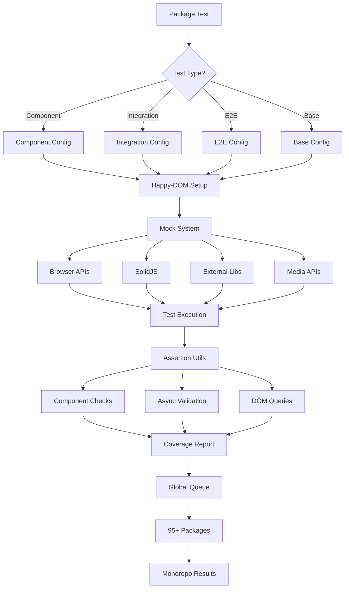

# reynard-testing

Unified testing framework for Reynard packages with comprehensive utilities, mocks, and configurations.

## Architecture

```mermaid
graph TB
    subgraph "🧪 Testing Framework"
        A[Test Utils] --> B[Config System]
        A --> C[Mock System]
        A --> D[Setup System]
        A --> E[Assertion Utils]

        subgraph "Configuration System"
            B --> B1[Vitest Base Config]
            B --> B2[Component Config]
            B --> B3[Integration Config]
            B --> B4[E2E Config]
            B --> B5[Package Configs]
        end

        subgraph "Mock System"
            C --> C1[Browser Mocks]
            C --> C2[SolidJS Mocks]
            C --> C3[External Mocks]
            C --> C4[Media Mocks]
            C --> C5[Canvas Mocks]
        end

        subgraph "Setup System"
            D --> D1[Base Setup]
            D --> D2[Component Setup]
            D --> D3[AI Setup]
            D --> D4[3D Setup]
            D --> D5[Media Setup]
            D --> D6[Gallery Setup]
        end

        subgraph "Assertion Utils"
            E --> E1[Component Assertions]
            E --> E2[Async Assertions]
            E --> E3[DOM Utils]
            E --> E4[Mock Utils]
        end
    end

    subgraph "🌍 Monorepo Integration"
        F[Vitest Workspace] --> G[95+ Packages]
        F --> H[Global Queue System]
        F --> I[Happy-DOM Environment]
        F --> J[Coverage Reports]
    end

    subgraph "🔧 i18n Testing"
        K[i18n Testing] --> L[Package Orchestrator]
        K --> M[ESLint Plugin]
        K --> N[CI Checks]
        K --> O[Validation]
    end

    A -->|Configures| F
    A -->|Supports| K
```



## Testing Workflow



## Features

- **Unified Configuration**: Standardized Vitest configs for all package types
- **Test Utilities**: Common testing helpers and custom render functions
- **Comprehensive Mocks**: Browser APIs, SolidJS, and external libraries
- **Assertion Utilities**: Custom assertions for common testing scenarios
- **TypeScript First**: Full type safety with excellent IntelliSense

## Installation

```bash
npm install reynard-testing --save-dev
```

## Quick Start

### 1. Use Pre-configured Vitest Configs

```typescript
// vitest.config.ts
import { createComponentTestConfig } from "reynard-testing/config";

export default createComponentTestConfig("my-package");
```

### 2. Use Test Utilities

```typescript
// my-component.test.tsx
import { renderWithProviders, expectComponentToRender } from 'reynard-testing';

test('renders without errors', () => {
  const MyComponent = () => <div>Hello World</div>;
  expectComponentToRender(MyComponent);
});
```

### 3. Use Mocks

```typescript
// my-test.ts
import { mockFetch, mockLocalStorage } from "reynard-testing/mocks";

test("uses fetch", async () => {
  mockFetch.mockResolvedValueOnce({
    ok: true,
    json: () => Promise.resolve({ data: "test" }),
  });

  const result = await fetch("/api/test");
  expect(result.ok).toBe(true);
});
```

## Configuration

### Base Configuration

```typescript
import { createBaseVitestConfig } from "reynard-testing/config";

export default createBaseVitestConfig({
  packageName: "my-package",
  setupFiles: ["./src/test-setup.ts"],
  coverageThresholds: {
    branches: 90,
    functions: 95,
    lines: 95,
    statements: 95,
  },
});
```

### Component Testing

```typescript
import { createComponentTestConfig } from "reynard-testing/config";

export default createComponentTestConfig("my-component-package");
```

### Integration Testing

```typescript
import { createIntegrationTestConfig } from "reynard-testing/config";

export default createIntegrationTestConfig("my-integration-package");
```

## Test Utilities

### Custom Render Functions

```typescript
import {
  renderWithProviders,
  renderWithTheme,
  renderWithRouter
} from 'reynard-testing/utils';

// Render with all providers
renderWithProviders(() => <MyComponent />);

// Render with theme
renderWithTheme(() => <MyComponent />, { name: 'dark' });

// Render with router
renderWithRouter(() => <MyComponent />, '/dashboard');
```

### Mock Utilities

```typescript
import { createMockFn, createMockResponse, createMockFile } from "reynard-testing/utils";

// Create mock function
const mockFn = createMockFn();

// Create mock response
const response = createMockResponse({ data: "test" });

// Create mock file
const file = createMockFile("test.txt", "content");
```

### Assertion Utilities

```typescript
import { expectComponentToRender, expectPromiseToResolve, expectElementToHaveClass } from "reynard-testing/utils";

// Component assertions
expectComponentToRender(MyComponent);

// Promise assertions
await expectPromiseToResolve(fetch("/api"));

// DOM assertions
expectElementToHaveClass(element, "active");
```

## Mocks

### Browser APIs

```typescript
import { mockFetch, mockLocalStorage, mockWebSocket } from "reynard-testing/mocks";

// Mock fetch
mockFetch.mockResolvedValueOnce({ ok: true });

// Mock localStorage
mockLocalStorage.getItem.mockReturnValue("value");

// Mock WebSocket
const ws = new mockWebSocket();
```

### External Libraries

```typescript
import { mockFabric, mockD3 } from "reynard-testing/mocks";

// Mock Fabric.js
const canvas = new mockFabric.Canvas();

// Mock D3.js
const selection = mockD3.select("body");
```

## Package Configuration Templates

### Component Package

```json
{
  "scripts": {
    "test": "vitest",
    "test:run": "vitest run",
    "test:coverage": "vitest run --coverage",
    "test:ui": "vitest --ui"
  },
  "devDependencies": {
    "reynard-testing": "workspace:*",
    "vitest": "^3.0.0"
  }
}
```

### Utility Package

```json
{
  "scripts": {
    "test": "vitest",
    "test:run": "vitest run",
    "test:coverage": "vitest run --coverage"
  },
  "devDependencies": {
    "reynard-testing": "workspace:*",
    "vitest": "^3.0.0"
  }
}
```

## Best Practices

### 1. Use Appropriate Config

- **Component packages**: Use `createComponentTestConfig`
- **Utility packages**: Use `createUtilityTestConfig`
- **Integration packages**: Use `createIntegrationTestConfig`

### 2. Leverage Test Utilities

```typescript
// Good: Use custom render functions
renderWithProviders(() => <MyComponent />);

// Avoid: Manual provider setup
render(() => (
  <ThemeProvider>
    <RouterProvider>
      <MyComponent />
    </RouterProvider>
  </ThemeProvider>
));
```

### 3. Use Comprehensive Mocks

```typescript
// Good: Use provided mocks
import { mockFetch } from "reynard-testing/mocks";

// Avoid: Manual fetch mocking
global.fetch = vi.fn();
```

### 4. Write Descriptive Tests

```typescript
// Good: Descriptive test names
test("should render component with correct theme colors", () => {
  // test implementation
});

// Avoid: Vague test names
test("works", () => {
  // test implementation
});
```

## 🧪 Advanced Testing Patterns

### Component Testing Patterns

#### 1. **Testing with Context Providers**

```typescript
import { renderWithProviders } from 'reynard-testing';
import { ReynardProvider } from 'reynard-themes';

describe('ThemedComponent', () => {
  test('renders with light theme', () => {
    renderWithProviders(
      () => <ThemedComponent />,
      {
        providers: [
          [ReynardProvider, { defaultTheme: 'light' }]
        ]
      }
    );

    expect(screen.getByTestId('component')).toHaveClass('theme-light');
  });

  test('switches theme on button click', async () => {
    const themeModule = createTheme({ defaultTheme: 'light' });

    renderWithProviders(
      () => <ThemeToggle />,
      {
        providers: [
          [ThemeProvider, { value: themeModule }]
        ]
      }
    );

    const toggleButton = screen.getByRole('button', { name: /toggle theme/i });
    await userEvent.click(toggleButton);

    expect(screen.getByTestId('component')).toHaveClass('theme-dark');
  });
});
```

#### 2. **Testing Async Operations**

```typescript
import { waitFor } from '@solidjs/testing-library';
import { mockFetch } from 'reynard-testing/mocks';

describe('AsyncComponent', () => {
  test('loads data and displays it', async () => {
    const mockData = { id: 1, name: 'Test Item' };
    mockFetch.mockResolvedValueOnce({
      ok: true,
      json: () => Promise.resolve(mockData)
    });

    render(() => <AsyncComponent />);

    // Wait for loading to complete
    await waitFor(() => {
      expect(screen.getByText('Test Item')).toBeInTheDocument();
    });

    expect(mockFetch).toHaveBeenCalledWith('/api/data');
  });

  test('handles loading states', () => {
    mockFetch.mockImplementation(() =>
      new Promise(resolve => setTimeout(resolve, 100))
    );

    render(() => <AsyncComponent />);

    expect(screen.getByText('Loading...')).toBeInTheDocument();
  });

  test('handles error states', async () => {
    mockFetch.mockRejectedValueOnce(new Error('Network error'));

    render(() => <AsyncComponent />);

    await waitFor(() => {
      expect(screen.getByText('Error loading data')).toBeInTheDocument();
    });
  });
});
```

#### 3. **Testing Form Interactions**

```typescript
import { userEvent } from '@testing-library/user-event';

describe('ContactForm', () => {
  test('submits form with valid data', async () => {
    const user = userEvent.setup();
    const mockSubmit = vi.fn();

    render(() => <ContactForm onSubmit={mockSubmit} />);

    await user.type(screen.getByLabelText(/name/i), 'John Doe');
    await user.type(screen.getByLabelText(/email/i), 'john@example.com');
    await user.type(screen.getByLabelText(/message/i), 'Hello world');

    await user.click(screen.getByRole('button', { name: /submit/i }));

    expect(mockSubmit).toHaveBeenCalledWith({
      name: 'John Doe',
      email: 'john@example.com',
      message: 'Hello world'
    });
  });

  test('shows validation errors', async () => {
    const user = userEvent.setup();

    render(() => <ContactForm />);

    await user.click(screen.getByRole('button', { name: /submit/i }));

    expect(screen.getByText('Name is required')).toBeInTheDocument();
    expect(screen.getByText('Email is required')).toBeInTheDocument();
  });
});
```

### Utility Testing Patterns

#### 1. **Testing Pure Functions**

```typescript
import { formatDate, validateEmail, sanitizeInput } from "reynard-core";

describe("formatDate", () => {
  test("formats date correctly", () => {
    const date = new Date("2024-01-15T10:30:00Z");

    expect(formatDate(date, "YYYY-MM-DD")).toBe("2024-01-15");
    expect(formatDate(date, "MM/DD/YYYY")).toBe("01/15/2024");
    expect(formatDate(date, "relative")).toBe("2 hours ago");
  });

  test("handles invalid dates", () => {
    expect(formatDate(new Date("invalid"), "YYYY-MM-DD")).toBe("Invalid Date");
  });
});

describe("validateEmail", () => {
  test.each([
    ["user@example.com", true],
    ["test.email@domain.co.uk", true],
    ["invalid-email", false],
    ["@domain.com", false],
    ["user@", false],
  ])("validates email %s as %s", (email, expected) => {
    expect(validateEmail(email)).toBe(expected);
  });
});
```

#### 2. **Testing Async Utilities**

```typescript
import { retryWithBackoff, batchExecute } from "reynard-core";

describe("retryWithBackoff", () => {
  test("retries failed operations", async () => {
    let attempts = 0;
    const failingOperation = async () => {
      attempts++;
      if (attempts < 3) throw new Error("Temporary failure");
      return "success";
    };

    const result = await retryWithBackoff(failingOperation, 3, 100);

    expect(result).toBe("success");
    expect(attempts).toBe(3);
  });

  test("fails after max retries", async () => {
    const failingOperation = async () => {
      throw new Error("Permanent failure");
    };

    await expect(retryWithBackoff(failingOperation, 2, 100)).rejects.toThrow("Permanent failure");
  });
});

describe("batchExecute", () => {
  test("executes operations in batches", async () => {
    const operations = [
      () => Promise.resolve("result1"),
      () => Promise.resolve("result2"),
      () => Promise.resolve("result3"),
      () => Promise.resolve("result4"),
    ];

    const results = await batchExecute(operations, 2);

    expect(results).toEqual(["result1", "result2", "result3", "result4"]);
  });
});
```

### Integration Testing Patterns

#### 1. **Testing Component Integration**

```typescript
describe('UserDashboard Integration', () => {
  test('complete user workflow', async () => {
    const user = userEvent.setup();

    // Mock API responses
    mockFetch
      .mockResolvedValueOnce({
        ok: true,
        json: () => Promise.resolve({ user: { id: 1, name: 'John' } })
      })
      .mockResolvedValueOnce({
        ok: true,
        json: () => Promise.resolve({ posts: [{ id: 1, title: 'Post 1' }] })
      });

    renderWithProviders(() => <UserDashboard />);

    // Wait for user data to load
    await waitFor(() => {
      expect(screen.getByText('Welcome, John')).toBeInTheDocument();
    });

    // Wait for posts to load
    await waitFor(() => {
      expect(screen.getByText('Post 1')).toBeInTheDocument();
    });

    // Test user interaction
    await user.click(screen.getByRole('button', { name: /create post/i }));

    await user.type(screen.getByLabelText(/title/i), 'New Post');
    await user.type(screen.getByLabelText(/content/i), 'Post content');
    await user.click(screen.getByRole('button', { name: /save/i }));

    // Verify post was created
    await waitFor(() => {
      expect(screen.getByText('New Post')).toBeInTheDocument();
    });
  });
});
```

#### 2. **Testing Error Boundaries**

```typescript
describe('ErrorBoundary', () => {
  test('catches and displays errors', () => {
    const ThrowError = () => {
      throw new Error('Test error');
    };

    render(() => (
      <ErrorBoundary fallback={<div>Something went wrong</div>}>
        <ThrowError />
      </ErrorBoundary>
    ));

    expect(screen.getByText('Something went wrong')).toBeInTheDocument();
  });

  test('recovers from errors', async () => {
    const [shouldThrow, setShouldThrow] = createSignal(true);

    const ConditionalError = () => {
      if (shouldThrow()) throw new Error('Test error');
      return <div>Recovered</div>;
    };

    render(() => (
      <ErrorBoundary fallback={<div>Error occurred</div>}>
        <ConditionalError />
      </ErrorBoundary>
    ));

    expect(screen.getByText('Error occurred')).toBeInTheDocument();

    setShouldThrow(false);

    await waitFor(() => {
      expect(screen.getByText('Recovered')).toBeInTheDocument();
    });
  });
});
```

### Performance Testing

#### 1. **Testing Component Performance**

```typescript
import { performance } from 'perf_hooks';

describe('Performance Tests', () => {
  test('component renders within time limit', () => {
    const start = performance.now();

    render(() => <LargeDataTable data={largeDataset} />);

    const end = performance.now();
    const renderTime = end - start;

    expect(renderTime).toBeLessThan(100); // Should render in under 100ms
  });

  test('handles large datasets efficiently', () => {
    const largeDataset = Array.from({ length: 10000 }, (_, i) => ({
      id: i,
      name: `Item ${i}`,
      value: Math.random()
    }));

    render(() => <VirtualizedList items={largeDataset} />);

    // Should only render visible items
    const renderedItems = screen.getAllByTestId(/list-item/);
    expect(renderedItems.length).toBeLessThan(100);
  });
});
```

#### 2. **Memory Leak Testing**

```typescript
describe('Memory Leak Tests', () => {
  test('cleans up event listeners', () => {
    const addEventListenerSpy = vi.spyOn(window, 'addEventListener');
    const removeEventListenerSpy = vi.spyOn(window, 'removeEventListener');

    const { unmount } = render(() => <ComponentWithListeners />);

    expect(addEventListenerSpy).toHaveBeenCalled();

    unmount();

    expect(removeEventListenerSpy).toHaveBeenCalled();
  });

  test('cleans up timers', () => {
    const setTimeoutSpy = vi.spyOn(global, 'setTimeout');
    const clearTimeoutSpy = vi.spyOn(global, 'clearTimeout');

    const { unmount } = render(() => <ComponentWithTimers />);

    expect(setTimeoutSpy).toHaveBeenCalled();

    unmount();

    expect(clearTimeoutSpy).toHaveBeenCalled();
  });
});
```

### Accessibility Testing

#### 1. **Testing ARIA Attributes**

```typescript
import { axe, toHaveNoViolations } from 'jest-axe';

expect.extend(toHaveNoViolations);

describe('Accessibility Tests', () => {
  test('has no accessibility violations', async () => {
    const { container } = render(() => <AccessibleComponent />);
    const results = await axe(container);
    expect(results).toHaveNoViolations();
  });

  test('supports keyboard navigation', async () => {
    const user = userEvent.setup();

    render(() => <KeyboardNavigableComponent />);

    const firstButton = screen.getByRole('button', { name: /first/i });
    firstButton.focus();

    await user.keyboard('{Tab}');

    expect(screen.getByRole('button', { name: /second/i })).toHaveFocus();
  });

  test('announces changes to screen readers', () => {
    render(() => <AnnouncingComponent />);

    const statusRegion = screen.getByRole('status');
    expect(statusRegion).toHaveAttribute('aria-live', 'polite');
  });
});
```

### Mock Strategies

#### 1. **Comprehensive Mocking**

```typescript
import {
  mockFetch,
  mockLocalStorage,
  mockWebSocket,
  mockIntersectionObserver
} from 'reynard-testing/mocks';

describe('Component with External Dependencies', () => {
  beforeEach(() => {
    // Reset all mocks
    vi.clearAllMocks();
    mockLocalStorage.clear();
  });

  test('works with mocked dependencies', async () => {
    // Setup fetch mock
    mockFetch.mockResolvedValueOnce({
      ok: true,
      json: () => Promise.resolve({ data: 'test' })
    });

    // Setup localStorage mock
    mockLocalStorage.setItem('user', JSON.stringify({ id: 1 }));

    // Setup WebSocket mock
    const mockWs = mockWebSocket.createMock();
    mockWs.onmessage({ data: JSON.stringify({ type: 'update' }) });

    render(() => <ComponentWithDependencies />);

    // Test interactions
    await waitFor(() => {
      expect(screen.getByText('test')).toBeInTheDocument();
    });
  });
});
```

#### 2. **Custom Mock Factories**

```typescript
import { createMockUser, createMockPost } from 'reynard-testing/fixtures';

describe('User Components', () => {
  test('renders user profile', () => {
    const mockUser = createMockUser({
      name: 'John Doe',
      email: 'john@example.com',
      role: 'admin'
    });

    render(() => <UserProfile user={mockUser} />);

    expect(screen.getByText('John Doe')).toBeInTheDocument();
    expect(screen.getByText('john@example.com')).toBeInTheDocument();
    expect(screen.getByText('Admin')).toBeInTheDocument();
  });

  test('renders user posts', () => {
    const mockPosts = [
      createMockPost({ title: 'Post 1', author: 'John' }),
      createMockPost({ title: 'Post 2', author: 'John' })
    ];

    render(() => <UserPosts posts={mockPosts} />);

    expect(screen.getByText('Post 1')).toBeInTheDocument();
    expect(screen.getByText('Post 2')).toBeInTheDocument();
  });
});
```

## Coverage Requirements

- **Components**: 85%+ branches, 90%+ functions/lines/statements
- **Utilities**: 90%+ branches, 95%+ functions/lines/statements
- **Integration**: 75%+ branches, 80%+ functions/lines/statements

## Troubleshooting

### Common Issues

1. **Mock not working**: Ensure mocks are imported before use
2. **Coverage too low**: Check if test files are excluded from coverage
3. **Type errors**: Ensure TypeScript types are properly configured

### Getting Help

- Check existing package configurations for examples
- Review test utilities documentation
- Consult Vitest documentation for advanced usage
