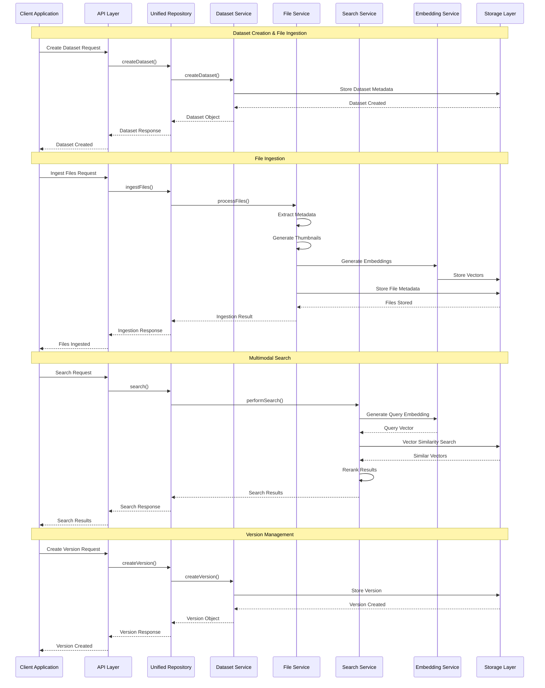
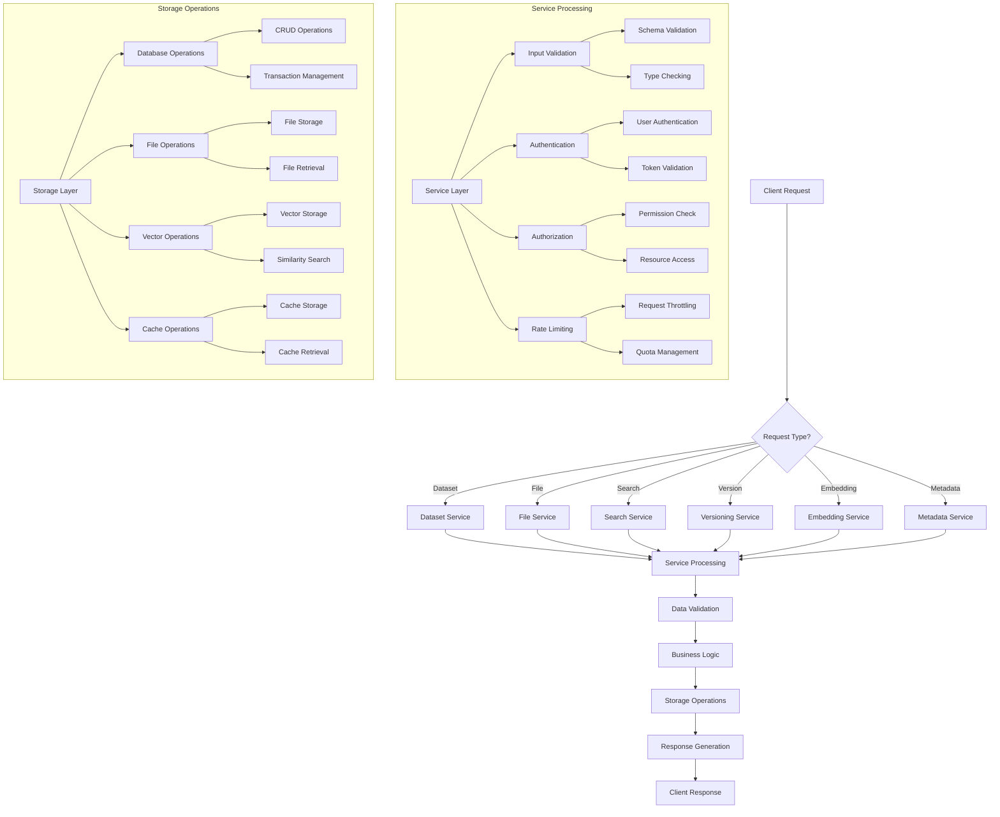
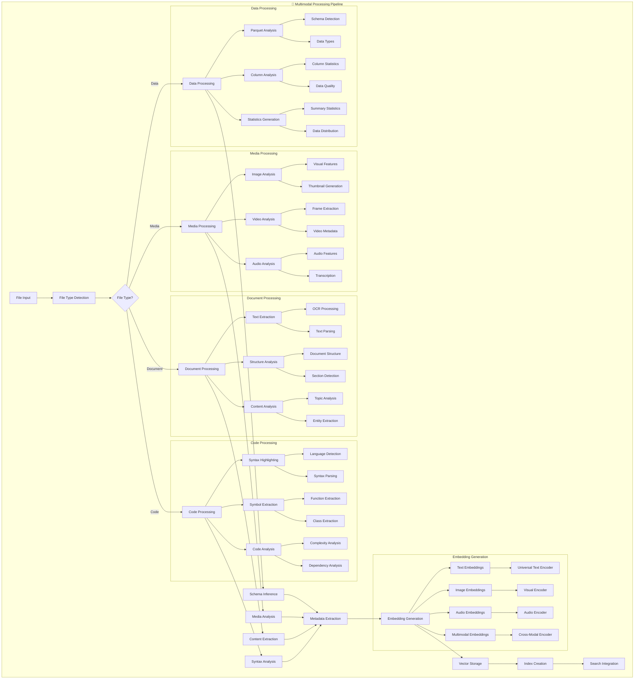

# reynard-unified-repository

> **The Apex Predator of Multimodal Dataset Management** 🦊

A comprehensive unified repository and
database system for managing multimodal datasets including parquet, video, audio, image, text, HTML, markdown, and
PDF files. Built on Reynard's modular architecture with advanced search, RAG integration, and vector embeddings.

## Architecture

```mermaid
graph TB
    subgraph "🗄️ Reynard Unified Repository System"
        A[Unified Repository] --> B[Dataset Management]
        A --> C[File Management]
        A --> D[Search System]
        A --> E[Versioning System]
        A --> F[Embedding System]
        A --> G[Metadata System]
        A --> H[API Layer]
        
        subgraph "📊 Dataset Management"
            B --> B1[Dataset Service]
            B --> B2[Dataset CRUD]
            B --> B3[Dataset Lifecycle]
            B --> B4[Dataset Statistics]
            B1 --> B1A[Create Dataset]
            B1 --> B1B[Update Dataset]
            B1 --> B1C[Delete Dataset]
            B1 --> B1D[List Datasets]
            B2 --> B2A[Dataset Operations]
            B2 --> B2B[Dataset Filtering]
            B3 --> B3A[Draft Status]
            B3 --> B3B[Active Status]
            B3 --> B3C[Archived Status]
            B4 --> B4A[File Counts]
            B4 --> B4B[Size Statistics]
            B4 --> B4C[Modality Counts]
        end
        
        subgraph "📁 File Management"
            C --> C1[File Service]
            C --> C2[File Processing]
            C --> C3[File Registry]
            C --> C4[File Types]
            C1 --> C1A[File Ingestion]
            C1 --> C1B[File Retrieval]
            C1 --> C1C[File Updates]
            C1 --> C1D[File Deletion]
            C2 --> C2A[File Processing Pipeline]
            C2 --> C2B[Metadata Extraction]
            C2 --> C2C[Thumbnail Generation]
            C3 --> C3A[Unified File Registry]
            C3 --> C3B[File Metadata]
            C4 --> C4A[Data Files]
            C4 --> C4B[Media Files]
            C4 --> C4C[Document Files]
            C4 --> C4D[Code Files]
        end
        
        subgraph "🔍 Search System"
            D --> D1[Search Service]
            D --> D2[Vector Search]
            D --> D3[Hybrid Search]
            D --> D4[Multimodal Search]
            D1 --> D1A[Semantic Search]
            D1 --> D1B[Keyword Search]
            D1 --> D1C[Filtered Search]
            D2 --> D2A[Vector Similarity]
            D2 --> D2B[Embedding Search]
            D2 --> D2C[Similarity Threshold]
            D3 --> D3A[Vector + Keyword]
            D3 --> D3B[Weighted Search]
            D3 --> D3C[Reranking]
            D4 --> D4A[Cross-Modal Search]
            D4 --> D4B[Modality Filtering]
            D4 --> D4C[Unified Results]
        end
        
        subgraph "📝 Versioning System"
            E --> E1[Versioning Service]
            E --> E2[Version Control]
            E --> E3[Lineage Tracking]
            E --> E4[Change Management]
            E1 --> E1A[Semantic Versioning]
            E1 --> E1B[Version Creation]
            E1 --> E1C[Version Comparison]
            E2 --> E2A[Version History]
            E2 --> E2B[Version Metadata]
            E3 --> E3A[Dependency Tracking]
            E3 --> E3B[Lineage Visualization]
            E4 --> E4A[Change Detection]
            E4 --> E4B[Change Logging]
        end
        
        subgraph "🧠 Embedding System"
            F --> F1[Embedding Service]
            F --> F2[Vector Generation]
            F --> F3[Vector Storage]
            F --> F4[Vector Search]
            F1 --> F1A[Multimodal Embeddings]
            F1 --> F1B[Universal Vectors]
            F2 --> F2A[Text Embeddings]
            F2 --> F2B[Image Embeddings]
            F2 --> F2C[Audio Embeddings]
            F3 --> F3A[Vector Database]
            F3 --> F3B[HNSW Indexes]
            F4 --> F4A[Similarity Search]
            F4 --> F4B[Vector Retrieval]
        end
        
        subgraph "📋 Metadata System"
            G --> G1[Metadata Service]
            G --> G2[Metadata Extraction]
            G --> G3[Metadata Storage]
            G --> G4[Metadata Search]
            G1 --> G1A[Metadata Management]
            G1 --> G1B[Metadata Validation]
            G2 --> G2A[File Metadata]
            G2 --> G2B[Content Metadata]
            G2 --> G2C[Technical Metadata]
            G3 --> G3A[Metadata Database]
            G3 --> G3B[Metadata Indexing]
            G4 --> G4A[Metadata Queries]
            G4 --> G4B[Metadata Filtering]
        end
        
        subgraph "🌐 API Layer"
            H --> H1[REST API]
            H --> H2[GraphQL API]
            H --> H3[WebSocket API]
            H --> H4[API Documentation]
            H1 --> H1A[RESTful Endpoints]
            H1 --> H1B[HTTP Methods]
            H2 --> H2A[GraphQL Schema]
            H2 --> H2B[Query/Mutation]
            H3 --> H3A[Real-time Updates]
            H3 --> H3B[Live Search]
            H4 --> H4A[OpenAPI Spec]
            H4 --> H4B[API Examples]
        end
        
        subgraph "🗃️ Data Storage"
            I[Storage Layer] --> I1[PostgreSQL]
            I --> I2[pgvector]
            I --> I3[File Storage]
            I --> I4[Cache Layer]
            I1 --> I1A[Relational Data]
            I1 --> I1B[Metadata Storage]
            I2 --> I2A[Vector Storage]
            I2 --> I2B[Similarity Search]
            I3 --> I3A[File System]
            I3 --> I3B[Object Storage]
            I4 --> I4A[Search Cache]
            I4 --> I4B[Metadata Cache]
        end
        
        subgraph "🔧 Service Integration"
            J[External Services] --> J1[File Processing]
            J --> J2[RAG System]
            J --> J3[Multimodal System]
            J --> J4[Repository Core]
            J1 --> J1A[File Processing Pipeline]
            J1 --> J1B[Content Analysis]
            J2 --> J2A[RAG Integration]
            J2 --> J2B[Retrieval System]
            J3 --> J3A[Multimodal Processing]
            J3 --> J3B[Cross-Modal Analysis]
            J4 --> J4A[Base Repository]
            J4 --> J4B[Core Services]
        end
        
        subgraph "📊 Supported Formats"
            K[File Formats] --> K1[Data Formats]
            K --> K2[Media Formats]
            K --> K3[Document Formats]
            K --> K4[Code Formats]
            K1 --> K1A[Parquet, Arrow, Feather]
            K1 --> K1B[HDF5, CSV, TSV]
            K2 --> K2A[Images: JPG, PNG, WebP]
            K2 --> K2B[Videos: MP4, WebM]
            K2 --> K2C[Audio: MP3, FLAC]
            K3 --> K3A[PDF, HTML, Markdown]
            K3 --> K3B[DOCX, EPUB]
            K4 --> K4A[All Programming Languages]
            K4 --> K4B[Syntax Highlighting]
        end
    end
    
    subgraph "🌐 External Integration"
        L[PostgreSQL + pgvector] --> L1[Vector Database]
        L --> L2[Relational Database]
        M[File Processing] --> M1[Content Analysis]
        M --> M2[Metadata Extraction]
        N[RAG System] --> N1[Retrieval]
        N --> N2[Generation]
        O[Multimodal System] --> O1[Cross-Modal Processing]
        O --> O2[Unified Representations]
    end
    
    A -->|Orchestrates| P[Multimodal Data Ecosystem]
    B -->|Manages| Q[Dataset Lifecycle]
    C -->|Handles| R[File Operations]
    D -->|Provides| S[Advanced Search]
    E -->|Tracks| T[Version History]
    F -->|Generates| U[Vector Embeddings]
    G -->|Extracts| V[Metadata]
    H -->|Exposes| W[API Interface]
```



## Data Flow Architecture



## Service Architecture Flow



## Multimodal Data Processing Flow



## ✨ Features

### 🎯 **Core Capabilities**

- **Unified Dataset Management**: Single interface for all multimodal data types
- **Advanced Search & RAG**: Vector-based semantic search with multimodal embeddings
- **Parquet Integration**: Native support for Apache Parquet datasets with schema inference
- **Multimodal Gallery**: Unified interface for browsing all media types
- **Version Control**: Semantic versioning and dataset lineage tracking
- **Metadata Management**: Comprehensive metadata extraction and indexing

### 🏗️ **Architecture**

Built on proven best practices from 2024-2025 research:

- **Multi-Model Database**: PostgreSQL + pgvector for unified storage
- **Knowledge Graphs**: Complex relationship modeling between data modalities
- **Universal Embeddings**: Cross-modal vector representations
- **Microservices Design**: Modular, scalable service architecture
- **API-First**: RESTful and GraphQL endpoints

### 🚀 **Supported Formats**

| **Category**  | **Formats**                                                          | **Capabilities**                       |
| ------------- | -------------------------------------------------------------------- | -------------------------------------- |
| **Data**      | Parquet, Arrow, Feather, HDF5, CSV, TSV                              | Schema inference, columnar analytics   |
| **Media**     | Images (JPG, PNG, WebP, AVIF), Videos (MP4, WebM), Audio (MP3, FLAC) | Thumbnails, metadata extraction        |
| **Documents** | PDF, HTML, Markdown, DOCX, EPUB                                      | Content extraction, OCR, text analysis |
| **Code**      | All programming languages                                            | Syntax highlighting, symbol extraction |

## 📦 Installation

```bash
pnpm install reynard-unified-repository
```

## 🎯 Quick Start

### Basic Repository Setup

```typescript
import { UnifiedRepository } from "reynard-unified-repository";

const repository = new UnifiedRepository({
  database: {
    host: "localhost",
    port: 5432,
    database: "multimodal_repo",
  },
  storage: {
    type: "local", // or "s3", "gcs"
    path: "./data",
  },
});

await repository.initialize();
```

### Dataset Management

```typescript
// Add a multimodal dataset
const dataset = await repository.createDataset({
  name: "research-papers",
  description: "Academic papers with figures and tables",
  version: "1.0.0",
  tags: ["research", "academic", "multimodal"],
});

// Ingest files
await repository.ingestFiles(dataset.id, ["papers/paper1.pdf", "papers/paper1_figures/", "papers/paper1_data.parquet"]);

// Search across all modalities
const results = await repository.search({
  query: "machine learning algorithms",
  modalities: ["text", "image", "data"],
  topK: 20,
});
```

### Advanced Multimodal Search

```typescript
import { MultimodalSearch } from "reynard-unified-repository";

const search = new MultimodalSearch(repository);

// Cross-modal search
const results = await search.query({
  text: "Find datasets about climate change",
  image: "climate_data_visualization.jpg", // Optional image query
  filters: {
    dateRange: { from: "2023-01-01", to: "2024-12-31" },
    fileTypes: ["parquet", "pdf", "png"],
  },
});
```

## 🏗️ Architecture

### Service Layer

```typescript
// Core services built on Reynard's modular architecture
import {
  DatasetService, // Dataset CRUD operations
  IngestionService, // File processing and indexing
  SearchService, // Multimodal search
  MetadataService, // Metadata extraction
  VersioningService, // Dataset versioning
  EmbeddingService, // Vector embeddings
} from "reynard-unified-repository";
```

### Database Schema

```sql
-- Core dataset management
CREATE TABLE datasets (
  id UUID PRIMARY KEY,
  name VARCHAR(255) NOT NULL,
  description TEXT,
  version VARCHAR(50) NOT NULL,
  metadata JSONB,
  created_at TIMESTAMPTZ DEFAULT NOW()
);

-- Unified file registry
CREATE TABLE files (
  id UUID PRIMARY KEY,
  dataset_id UUID REFERENCES datasets(id),
  path TEXT NOT NULL,
  file_type VARCHAR(50) NOT NULL,
  size BIGINT,
  hash VARCHAR(64),
  metadata JSONB,
  created_at TIMESTAMPTZ DEFAULT NOW()
);

-- Multimodal embeddings
CREATE TABLE embeddings (
  id UUID PRIMARY KEY,
  file_id UUID REFERENCES files(id),
  modality VARCHAR(20) NOT NULL, -- 'text', 'image', 'audio', 'data'
  embedding VECTOR(1536),
  model_id VARCHAR(100),
  created_at TIMESTAMPTZ DEFAULT NOW()
);
```

## 🔍 Search Capabilities

### Semantic Search

```typescript
// Text-based semantic search
const textResults = await repository.search({
  query: "neural network architectures",
  modality: "text",
  similarityThreshold: 0.7,
});

// Image-based search
const imageResults = await repository.search({
  query: "data visualization charts",
  modality: "image",
  topK: 10,
});

// Cross-modal search
const crossModalResults = await repository.search({
  query: "machine learning pipeline",
  modalities: ["text", "image", "data"],
  hybrid: true, // Combines vector + keyword search
});
```

### Parquet Analytics

```typescript
// Schema inference and analytics
const parquetFile = await repository.getFile("dataset.parquet");
const schema = await parquetFile.getSchema();
const stats = await parquetFile.getStatistics();

// Query parquet data
const data = await parquetFile.query({
  columns: ["temperature", "humidity"],
  filters: { date: { gte: "2024-01-01" } },
  limit: 1000,
});
```

## 🎨 UI Components

### Multimodal Gallery

```tsx
import { MultimodalGallery } from "reynard-unified-repository";

function DatasetBrowser() {
  return (
    <MultimodalGallery
      datasetId="research-papers"
      view="grid"
      filters={{
        fileTypes: ["pdf", "parquet", "png"],
        dateRange: { from: "2024-01-01" },
      }}
      onFileSelect={file => console.log("Selected:", file)}
    />
  );
}
```

### Search Interface

```tsx
import { UnifiedSearch } from "reynard-unified-repository";

function SearchInterface() {
  return (
    <UnifiedSearch
      repository={repository}
      enableMultimodal={true}
      showFilters={true}
      onResultClick={result => handleResultClick(result)}
    />
  );
}
```

## 🔧 Configuration

### Repository Configuration

```typescript
interface RepositoryConfig {
  database: {
    host: string;
    port: number;
    database: string;
    username?: string;
    password?: string;
  };
  storage: {
    type: "local" | "s3" | "gcs";
    path?: string;
    bucket?: string;
    region?: string;
  };
  embeddings: {
    textModel: string;
    imageModel: string;
    dimensions: number;
  };
  processing: {
    maxFileSize: number;
    supportedFormats: string[];
    thumbnailSize: [number, number];
  };
}
```

## 🧪 Testing

```bash
# Run tests
pnpm test

# Run with coverage
pnpm test:coverage

# Test specific modality
pnpm test -- --grep "parquet"
```

## 📚 Examples

Check out the examples directory:

- **Basic Dataset Management**: Create and manage datasets
- **Multimodal Search**: Advanced search across modalities
- **Parquet Analytics**: Schema inference and data analysis
- **API Integration**: REST and GraphQL endpoints
- **UI Components**: Gallery and search interfaces

## 🤝 Contributing

Contributions welcome! This package leverages Reynard's modular architecture:

- **File Processing**: Built on `reynard-file-processing`
- **Search & RAG**: Powered by `reynard-rag`
- **Multimodal UI**: Uses `reynard-multimodal`
- **Service Management**: Orchestrated by `reynard-service-manager`

## 📄 License

MIT License - see LICENSE file for details.

## 🦊 Why This Architecture is Magnificent

### ✅ **Best Practices Integration**

- **Multi-Model Database**: PostgreSQL + pgvector for unified storage
- **Knowledge Graphs**: Complex relationship modeling
- **Universal Embeddings**: Cross-modal vector representations
- **Semantic Versioning**: Dataset lineage and reproducibility
- **Microservices Design**: Scalable, modular architecture

### 🎯 **Reynard Ecosystem Integration**

- **Zero Duplication**: Leverages existing packages
- **Consistent APIs**: Follows Reynard patterns
- **Type Safety**: Full TypeScript support
- **Performance**: Optimized for large-scale datasets

_Built with the cunning of a fox, the thoroughness of an otter, and the relentless determination of a wolf!_ 🦊🦦🐺
