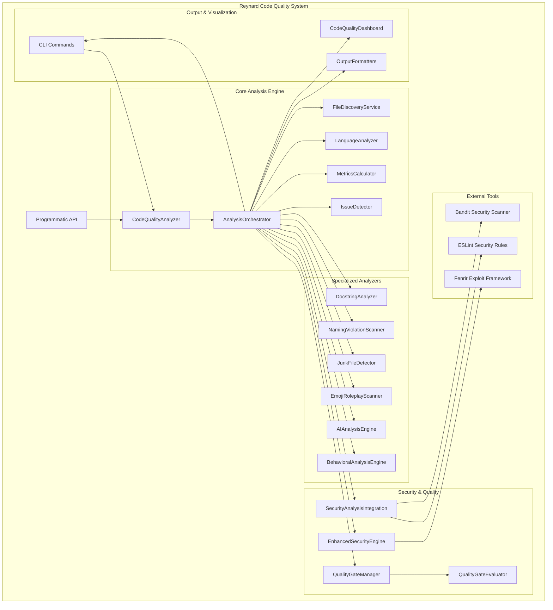
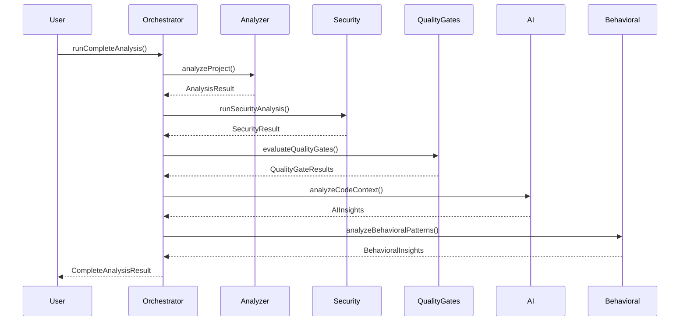
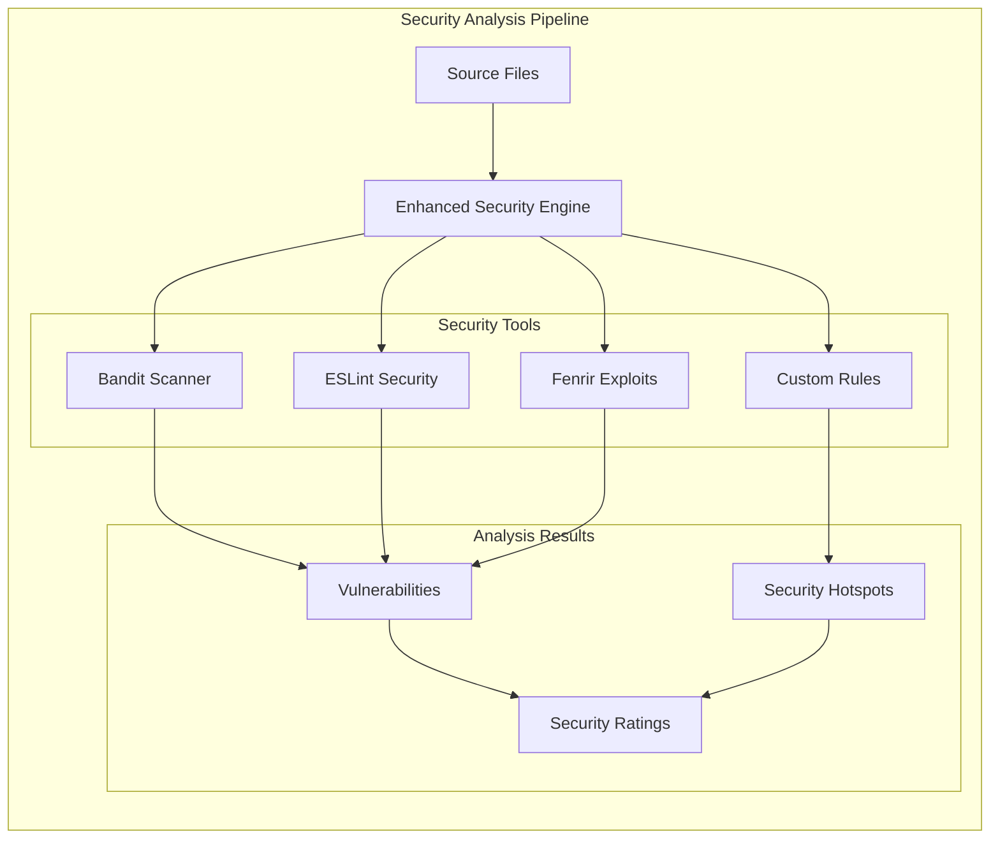
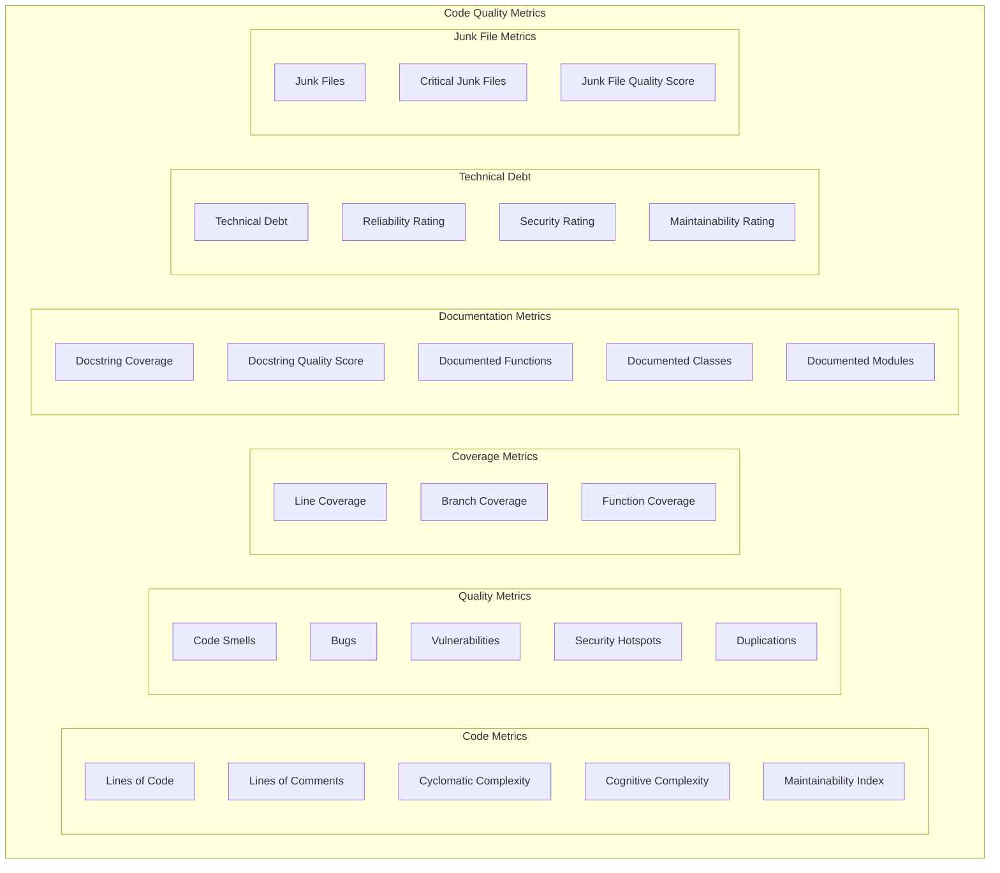
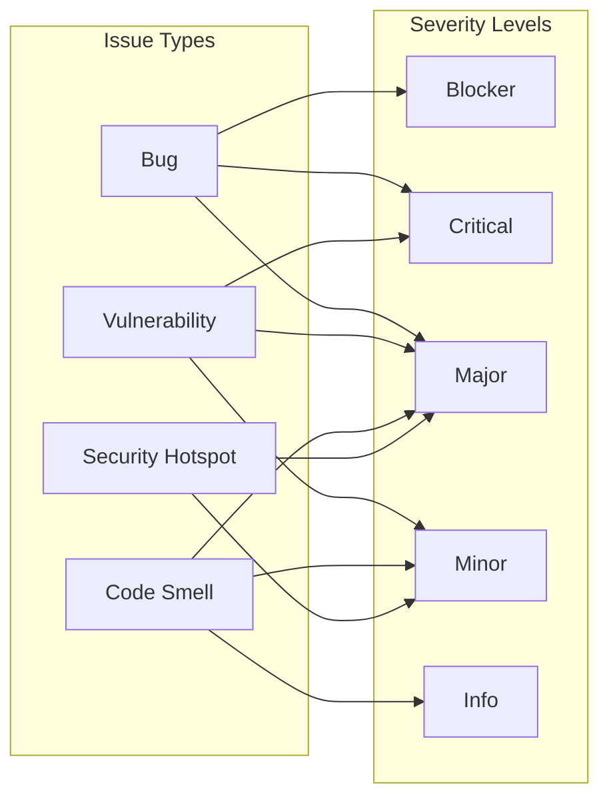

# 🦊 Reynard Code Quality Analysis System

A comprehensive SonarQube-like code quality analysis system for the Reynard framework, providing multi-language static analysis, security vulnerability detection, quality gate enforcement, and advanced behavioral insights.

## 🎯 Overview

The Reynard Code Quality Analysis System provides enterprise-grade code quality monitoring with:

- **Multi-Language Support**: TypeScript, JavaScript, Python, Shell, Markdown, YAML, JSON
- **Security Integration**: Leverages existing Fenrir security tools (Bandit, ESLint Security, custom exploits)
- **Quality Gates**: Configurable thresholds and environment-specific rules
- **Real-Time Dashboard**: Web-based visualization of code quality metrics
- **CI/CD Integration**: GitHub Actions workflow for continuous monitoring
- **Comprehensive Reporting**: Trend analysis and detailed quality metrics
- **Documentation Analysis**: Docstring coverage and quality assessment
- **Naming Standards**: Enforcement of Reynard naming guidelines
- **Junk File Detection**: Identification of Git-tracked development artifacts
- **AI-Powered Analysis**: Advanced behavioral insights and code context analysis

## 🏗️ System Architecture



## 🚀 Quick Start

### Installation

```bash
# Install dependencies
pnpm install

# Build the package
pnpm build
```

### Basic Usage

```typescript
import { createCodeQualitySystem } from "reynard-code-quality";

// Create analysis system
const system = createCodeQualitySystem("/path/to/project");

// Initialize with default configuration
await system.initialize();

// Run complete analysis
const results = await system.runCompleteAnalysis("development");

console.log("Analysis Results:", results);
```

### CLI Usage

```bash
# Run comprehensive analysis
npx reynard-code-quality analyze --project . --environment development

# Run security analysis only
npx reynard-code-quality security --project . --format summary

# Evaluate quality gates
npx reynard-code-quality quality-gate --project . --environment production

# Detect Git-tracked junk files
npx reynard-code-quality junk-detection --project . --format report

# Watch for file changes
npx reynard-code-quality watch --project . --interval 5000

# Analyze docstring coverage
npx reynard-code-quality docstring --project . --min-coverage 80

# Scan for naming violations
npx reynard-code-quality naming-violations --project . --severity error
```

## 🛠️ Core Components

### CodeQualityAnalyzer

The central analysis engine that orchestrates all quality checks:

```typescript
import { CodeQualityAnalyzer } from "reynard-code-quality";

const analyzer = new CodeQualityAnalyzer("/path/to/project");
const result = await analyzer.analyzeProject();

console.log("Lines of Code:", result.metrics.linesOfCode);
console.log("Issues Found:", result.issues.length);
console.log("Complexity:", result.metrics.cyclomaticComplexity);
```

**Features:**

- File discovery and language detection
- Code metrics calculation (LOC, complexity, maintainability)
- Issue detection using existing linting tools
- Multi-language support
- Real-time analysis with event emission

### AnalysisOrchestrator

Coordinates multiple analysis engines for comprehensive results:



### Quality Gates System

The `QualityGateManager` enforces quality standards:

```typescript
import { QualityGateManager } from "reynard-code-quality";

const manager = new QualityGateManager("/path/to/project");
await manager.loadConfiguration();

// Create custom quality gate
await manager.addQualityGate({
  id: "custom-gate",
  name: "Custom Quality Gate",
  environment: "production",
  enabled: true,
  conditions: [
    {
      metric: "bugs",
      operator: "EQ",
      threshold: 0,
      description: "No bugs allowed in production",
    },
  ],
});

// Evaluate quality gates
const results = manager.evaluateQualityGates(metrics, "production");
```

**Features:**

- Configurable quality gates with conditions
- Environment-specific rules (development, staging, production)
- Multiple operators (GT, LT, EQ, NE, GTE, LTE)
- JSON configuration persistence
- Validation and error handling

## 📊 Specialized Analysis Components

### 🦦 Docstring Analysis System

Comprehensive docstring coverage and quality analysis for Python and TypeScript:

```typescript
import { DocstringAnalyzer } from "reynard-code-quality";

const analyzer = new DocstringAnalyzer();

// Analyze a single file
const analysis = await analyzer.analyzeFile("./src/utils.py");

// Analyze multiple files
const analyses = await analyzer.analyzeFiles(["./src/utils.py", "./src/components.ts"]);

// Get overall metrics
const metrics = analyzer.getOverallMetrics(analyses);
console.log(`Coverage: ${metrics.coveragePercentage}%`);
console.log(`Quality Score: ${metrics.qualityScore}/100`);
```

**Quality Assessment Levels:**

- **Excellent**: Comprehensive documentation with parameters, returns, and examples
- **Good**: Adequate documentation with most required elements
- **Poor**: Minimal documentation missing key elements
- **Missing**: No documentation present

**Quality Indicators:**

- Length requirements (functions: 10 chars, classes: 15 chars, modules: 30 chars)
- Parameter documentation (`@param` tags)
- Return documentation (`@return` or `@returns`)
- Example usage (`@example` tags)
- Meaningful descriptions

**Predefined Quality Gates:**

```typescript
import { getDocstringQualityGates, createCustomDocstringGate } from "reynard-code-quality";

// Use predefined gates
const standardGates = getDocstringQualityGates("standard"); // 80% coverage, 70% quality
const strictGates = getDocstringQualityGates("strict"); // 95% coverage, 85% quality
const relaxedGates = getDocstringQualityGates("relaxed"); // 60% coverage, 50% quality

// Create custom gates
const customGate = createCustomDocstringGate(
  "enterprise-standards",
  "Enterprise Documentation Standards",
  95, // coverage threshold
  85, // quality threshold
  0.95, // function coverage
  1.0, // class coverage
  1.0 // module coverage
);
```

### 🦊 Naming Violation Scanner

Enforces critical naming guidelines across the Reynard codebase:

```typescript
import { NamingViolationScanner } from "reynard-code-quality";

const scanner = new NamingViolationScanner();

// Scan a directory
const result = await scanner.scanDirectory("/path/to/project");

// Scan a single file
const violations = await scanner.scanFile("/path/to/file.ts");

// Add custom rules
scanner.addRule({
  pattern: /CustomPattern/g,
  forbidden: ["Custom"],
  suggestion: "Use a different name",
  severity: "warning",
  description: "Custom naming rule",
});
```

**❌ Forbidden Prefixes:**

- "Unified", "Enhanced", "Advanced", "Super", "Ultra", "Mega", "Ultimate"
- "Comprehensive", "Complete", "Full-Featured", "Enterprise-Grade"
- "Intelligent", "Smart", "AI-Powered", "Next-Gen", "Revolutionary"

**✅ Approved Naming Patterns:**

- **Simple & Clear**: `MetricsEngine`, `PerformanceCollector`, `TimeSeriesStore`
- **Descriptive**: `QueryEngine`, `AlertRuleEngine`, `DashboardEngine`
- **Functional**: `DataIngestionPipeline`, `NotificationSystem`, `ThemeSystem`

**Naming Principles:**

1. **Name things exactly what they are** - nothing more, nothing less
2. **Use clear, descriptive terms** that explain the component's purpose
3. **Avoid marketing language** - this is technical documentation, not a sales pitch
4. **Be humble and precise** - let the functionality speak for itself
5. **Follow existing Reynard patterns** - maintain consistency with the codebase

### 🗑️ Junk File Detection

Identifies Git-tracked files that appear to be development artifacts:

```typescript
import { JunkFileDetector } from "reynard-code-quality";

const detector = new JunkFileDetector("/path/to/project");
const analysis = await detector.detectJunkFiles();

console.log("Total junk files:", analysis.totalFiles);
console.log("Quality score:", analysis.qualityScore);
console.log("Critical issues:", analysis.criticalIssues);
```

**Detection Categories:**

- **Python Artifacts**: pyc, pyo, **pycache**, virtual environments, build artifacts
- **TypeScript/JavaScript Artifacts**: source maps, node_modules, build directories, cache files
- **Reynard-Specific Artifacts**: generated files, MCP logs, ECS cache, agent files
- **General Artifacts**: log files, temporary files, system files

**Severity Classification:**

- **Critical**: Core system files, security-sensitive artifacts
- **High**: Build artifacts, cache files, temporary files
- **Medium**: Log files, backup files, IDE artifacts
- **Low**: Documentation artifacts, minor temporary files

### 🤖 AI Analysis Engine

Advanced AI-powered code analysis and behavioral insights:

```typescript
import { AIAnalysisEngine } from "reynard-code-quality";

const aiEngine = new AIAnalysisEngine();

// Analyze code context and patterns
const result = await aiEngine.analyzeCodeContext(files, {
  includeComplexityAnalysis: true,
  includePatternRecognition: true,
  includeSecurityInsights: true,
});

console.log("AI Insights:", result.insights);
console.log("Code Patterns:", result.patterns);
console.log("Security Recommendations:", result.securityRecommendations);
```

**AI Analysis Features:**

- **Code Pattern Recognition**: Identifies common patterns and anti-patterns
- **Complexity Analysis**: Advanced complexity metrics beyond cyclomatic complexity
- **Security Insights**: AI-powered security vulnerability detection
- **Code Quality Predictions**: Predictive analysis of code maintainability
- **Refactoring Suggestions**: Intelligent refactoring recommendations

### 🧠 Behavioral Analysis Engine

Analyzes code behavior patterns and development practices:

```typescript
import { BehavioralAnalysisEngine } from "reynard-code-quality";

const behavioralEngine = new BehavioralAnalysisEngine("/path/to/project");

// Analyze behavioral patterns
const result = await behavioralEngine.analyzeBehavioralPatterns(files);

console.log("Code Hotspots:", result.hotspots);
console.log("Behavioral Insights:", result.insights);
console.log("Development Patterns:", result.patterns);
```

**Behavioral Analysis Features:**

- **Code Hotspot Detection**: Identifies frequently modified or complex areas
- **Development Pattern Analysis**: Analyzes coding patterns and practices
- **Technical Debt Identification**: Identifies areas of accumulated technical debt
- **Maintainability Predictions**: Predicts future maintenance challenges

## 🔒 Security Analysis Integration

### Enhanced Security Engine

Advanced security analysis with Fenrir integration:



```typescript
import { EnhancedSecurityEngine } from "reynard-code-quality";

const security = new EnhancedSecurityEngine("/path/to/project");
const result = await security.runSecurityAnalysis(files);

console.log("Vulnerabilities:", result.summary.totalVulnerabilities);
console.log("Security Rating:", result.summary.securityRating);
console.log("Security Hotspots:", result.hotspots.length);
```

**Supported Security Tools:**

- **Bandit**: Python security vulnerability scanner
- **ESLint Security**: JavaScript/TypeScript security rules
- **Fenrir Fuzzing**: Custom exploit testing framework
- **Fenrir LLM Exploits**: AI/ML specific vulnerability detection

**Security Analysis Features:**

- Multi-tool integration
- Vulnerability classification (CRITICAL, HIGH, MEDIUM, LOW)
- Security hotspot detection
- Duplicate removal and deduplication
- Confidence scoring

## 📊 Metrics and Reporting

### Code Quality Metrics



**Quality Ratings:**

- **Reliability Rating**: A (0 bugs) to E (many bugs)
- **Security Rating**: A (0 vulnerabilities) to E (many vulnerabilities)
- **Maintainability Rating**: A (high maintainability) to E (low maintainability)

### Issue Classification



## 🎨 Dashboard Features

### Real-Time Monitoring

```typescript
import { CodeQualityDashboard } from 'reynard-code-quality/dashboard';

// Use in your React/SolidJS application
<CodeQualityDashboard
  projectRoot="/path/to/project"
  autoRefresh={true}
  refreshInterval={300000}
/>
```

**Dashboard Features:**

- Real-time metrics display
- Quality gate status visualization
- Security analysis results
- Issue tracking and filtering
- Language breakdown
- Responsive design

### Interactive Features

- Issue filtering and sorting
- File-level analysis
- Language breakdown
- Security vulnerability details
- Quality gate condition details

## 🔧 Configuration

### Quality Gates Configuration

Create `.reynard/quality-gates.json`:

```json
{
  "gates": [
    {
      "id": "reynard-development",
      "name": "Reynard Development Quality Gate",
      "description": "Quality standards for development environment",
      "environment": "development",
      "enabled": true,
      "conditions": [
        {
          "metric": "bugs",
          "operator": "EQ",
          "threshold": 0,
          "description": "No bugs allowed in development"
        },
        {
          "metric": "vulnerabilities",
          "operator": "EQ",
          "threshold": 0,
          "description": "No security vulnerabilities allowed"
        },
        {
          "metric": "codeSmells",
          "operator": "LT",
          "threshold": 50,
          "description": "Keep code smells under 50"
        },
        {
          "metric": "docstringCoverage",
          "operator": "GT",
          "threshold": 80,
          "description": "Maintain 80% docstring coverage"
        }
      ],
      "createdAt": "2025-01-15T10:00:00.000Z",
      "updatedAt": "2025-01-15T10:00:00.000Z"
    }
  ],
  "defaultGate": "reynard-development",
  "environments": {
    "development": "reynard-development",
    "staging": "reynard-development",
    "production": "reynard-production"
  }
}
```

### Security Tools Configuration

```typescript
const security = new SecurityAnalysisIntegration(projectRoot);

// Enable/disable specific tools
await security.configureSecurityTool("bandit", true);
await security.configureSecurityTool("eslint-security", true);
await security.configureSecurityTool("fenrir-fuzzing", false);
```

## 🚀 CI/CD Integration

### GitHub Actions

The system includes a comprehensive GitHub Actions workflow:

```yaml
name: 🦊 Reynard Code Quality Analysis

on:
  push:
    branches: [main, develop]
  pull_request:
    branches: [main, develop]
  schedule:
    - cron: "0 2 * * *" # Daily at 2 AM UTC

jobs:
  code-quality-analysis:
    runs-on: ubuntu-latest
    steps:
      - uses: actions/checkout@v4
      - name: 🦊 Run Code Quality Analysis
        run: |
          cd packages/code-quality
          node dist/cli.js analyze --project ../../ --environment development
      - name: 🦦 Check Docstring Coverage
        run: |
          node dist/cli.js docstring --min-coverage 80 --min-quality 70
      - name: 🦊 Check Naming Guidelines
        run: |
          node dist/cli.js naming-violations --severity error
      - name: 🗑️ Check for Junk Files
        run: |
          node dist/cli.js junk-detection --severity critical
```

**Features:**

- Automated analysis on push/PR
- Scheduled daily analysis
- Quality gate enforcement
- Security vulnerability detection
- PR comments with results
- Artifact upload for results
- Workflow failure on critical issues

### Pre-commit Hook

```bash
#!/bin/bash
# .git/hooks/pre-commit

echo "🦊 Checking code quality..."
npx reynard-code-quality analyze --environment development

echo "🦦 Checking documentation coverage..."
npx reynard-code-quality docstring --min-coverage 70

echo "🦊 Checking naming guidelines..."
npx reynard-code-quality naming-violations --severity error

echo "🗑️ Checking for junk files..."
npx reynard-code-quality junk-detection --severity critical

if [ $? -ne 0 ]; then
  echo "❌ Code quality checks failed!"
  echo "Please fix issues before committing"
  exit 1
fi
```

## 📚 API Reference

### Core Classes

#### CodeQualityAnalyzer

- `analyzeProject()`: Run comprehensive analysis
- `getAnalysisHistory()`: Get analysis history
- `getLatestAnalysis()`: Get latest analysis results

#### QualityGateManager

- `addQualityGate(gate)`: Add new quality gate
- `updateQualityGate(id, updates)`: Update existing gate
- `removeQualityGate(id)`: Remove quality gate
- `evaluateQualityGates(metrics, environment)`: Evaluate gates

#### DocstringAnalyzer

- `analyzeFile(filePath)`: Analyze single file
- `analyzeFiles(filePaths)`: Analyze multiple files
- `getOverallMetrics(analyses)`: Get aggregated metrics
- `validateDocstringQuality(docstring)`: Validate docstring quality

#### NamingViolationScanner

- `scanDirectory(path)`: Scan directory for violations
- `scanFile(filePath)`: Scan single file
- `addRule(rule)`: Add custom naming rule
- `getViolationsBySeverity(severity)`: Filter violations by severity

#### JunkFileDetector

- `detectJunkFiles()`: Run comprehensive junk file detection
- `generateReport(analysis)`: Generate detailed report
- `getJunkFileMetrics()`: Get metrics for quality gates
- `generateFixCommands(analysis)`: Generate git commands to remove files

#### SecurityAnalysisIntegration

- `runSecurityAnalysis(files)`: Run security analysis
- `configureSecurityTool(name, enabled)`: Configure tool
- `getSecurityTools()`: Get available tools

### CLI Commands

#### Analyze Command

```bash
npx reynard-code-quality analyze [options]
```

**Options:**

- `-p, --project <path>`: Project root path (default: current directory)
- `-o, --output <file>`: Output file for results (JSON)
- `-f, --format <format>`: Output format (json, table, summary)
- `--security`: Enable security analysis
- `--no-quality-gates`: Skip quality gate evaluation
- `--environment <env>`: Environment for quality gates
- `--ai`: Enable AI-powered analysis
- `--behavioral`: Enable behavioral analysis
- `--enhanced-security`: Enable enhanced security analysis

#### Docstring Command

```bash
npx reynard-code-quality docstring [options]
```

**Options:**

- `-p, --project <path>`: Project root path
- `--min-coverage <number>`: Minimum coverage percentage
- `--min-quality <number>`: Minimum quality score
- `--format <format>`: Output format (json, table, summary)
- `--include-files <pattern>`: Include specific file patterns
- `--exclude-files <pattern>`: Exclude specific directories

#### Naming Violations Command

```bash
npx reynard-code-quality naming-violations [options]
```

**Options:**

- `-p, --project <path>`: Project root path
- `--severity <level>`: Filter by severity (error, warning)
- `--type <type>`: Filter by type (class, function, variable)
- `--format <format>`: Output format (json, table, report)
- `--fix`: Generate fix suggestions

#### Junk Detection Command

```bash
npx reynard-code-quality junk-detection [options]
```

**Options:**

- `-p, --project <path>`: Project root path
- `--severity <level>`: Filter by severity (critical, high, medium, low)
- `--category <category>`: Filter by category (python, typescript, general)
- `--format <format>`: Output format (json, table, report)
- `--fix`: Generate fix commands

## 🎯 Best Practices

### Python Docstrings

```python
def calculate_total(items: List[Item], tax_rate: float) -> float:
    """
    Calculate the total cost including tax for a list of items.

    Args:
        items: List of items to calculate total for
        tax_rate: Tax rate as a decimal (e.g., 0.08 for 8%)

    Returns:
        Total cost including tax

    Raises:
        ValueError: If tax_rate is negative

    Example:
        >>> items = [Item(price=10.0), Item(price=20.0)]
        >>> total = calculate_total(items, 0.08)
        >>> print(f"Total: ${total:.2f}")
        Total: $32.40
    """
    if tax_rate < 0:
        raise ValueError("Tax rate cannot be negative")

    subtotal = sum(item.price for item in items)
    return subtotal * (1 + tax_rate)
```

### TypeScript JSDoc

````typescript
/**
 * Calculate the total cost including tax for a list of items.
 *
 * @param items - List of items to calculate total for
 * @param taxRate - Tax rate as a decimal (e.g., 0.08 for 8%)
 * @returns Total cost including tax
 * @throws {Error} If taxRate is negative
 *
 * @example
 * ```typescript
 * const items = [new Item(10.0), new Item(20.0)];
 * const total = calculateTotal(items, 0.08);
 * console.log(`Total: $${total.toFixed(2)}`);
 * // Output: Total: $32.40
 * ```
 */
export function calculateTotal(items: Item[], taxRate: number): number {
  if (taxRate < 0) {
    throw new Error("Tax rate cannot be negative");
  }

  const subtotal = items.reduce((sum, item) => sum + item.price, 0);
  return subtotal * (1 + taxRate);
}
````

### Naming Conventions

**✅ Good Names:**

```typescript
// Clear and descriptive
class MetricsEngine {}
class SecuritySystem {}
class AnalyticsPlatform {}
class DataProcessor {}
class SolutionFramework {}

// Specific and purposeful
class DataCoordinator {}
class RequestProcessor {}
class FileValidator {}
class UserAuthenticator {}
class AuthProvider {}
```

**❌ Bad Names:**

```typescript
// Forbidden prefixes
class UnifiedMetricsEngine {}
class EnhancedSecuritySystem {}
class AdvancedAnalyticsPlatform {}
class SuperFastProcessor {}
class UltimateSolutionFramework {}

// Generic patterns
class DataManager {}
class RequestHandler {}
class FileProcessor {}
class UserController {}
class AuthService {}
```

## 🐛 Troubleshooting

### Common Issues

**Analysis fails with permission errors:**

```bash
# Ensure proper file permissions
chmod -R 755 /path/to/project
```

**Security tools not found:**

```bash
# Install required tools
pip install bandit
npm install -g eslint-plugin-security
```

**Quality gates not loading:**

```bash
# Check configuration file
cat .reynard/quality-gates.json
```

**Dashboard not updating:**

```bash
# Check auto-refresh settings
# Ensure proper event listeners are set up
```

### Debug Mode

```bash
# Enable debug logging
DEBUG=reynard-code-quality:* npx reynard-code-quality analyze
```

## 🤝 Contributing

1. Fork the repository
2. Create a feature branch
3. Make your changes
4. Add tests
5. Run quality analysis
6. Submit a pull request

### Development Setup

```bash
# Clone repository
git clone https://github.com/your-org/reynard.git
cd reynard/packages/code-quality

# Install dependencies
pnpm install

# Run tests
pnpm test

# Run linting
pnpm lint

# Build package
pnpm build
```

## 📄 License

MIT License - see [LICENSE](../../../LICENSE.md) for details.

## 🦊 Reynard Integration

This package is part of the Reynard framework and follows the Reynard coding standards:

- **140-line axiom**: Maximum 140 lines per source file
- **Modular architecture**: Self-contained packages
- **Animal spirit principles**: Fox cunning, Otter thoroughness, Wolf security
- **Quality first**: Comprehensive testing and validation

---

_red fur gleams with pride_ Built with the cunning of a fox, the thoroughness of an otter, and the security focus of a wolf. Welcome to the apex predators of code quality! 🦊🦦🐺
