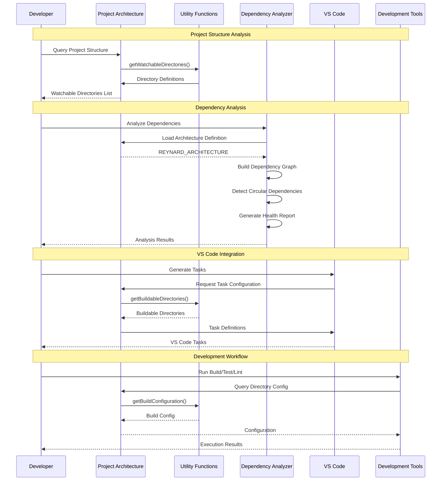
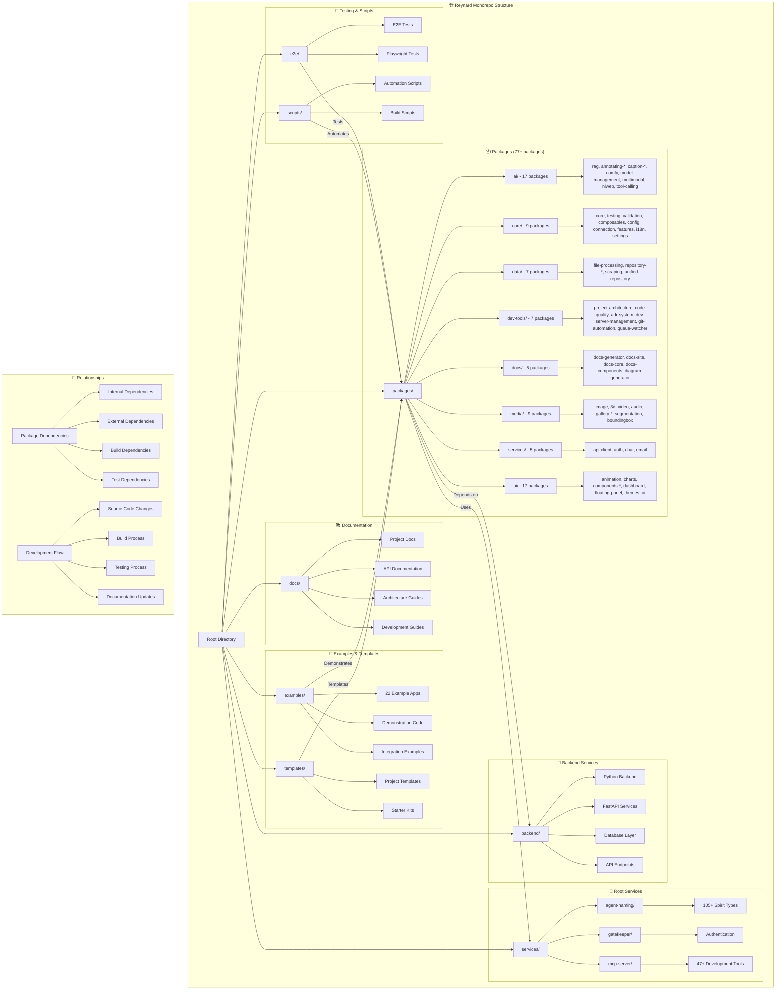
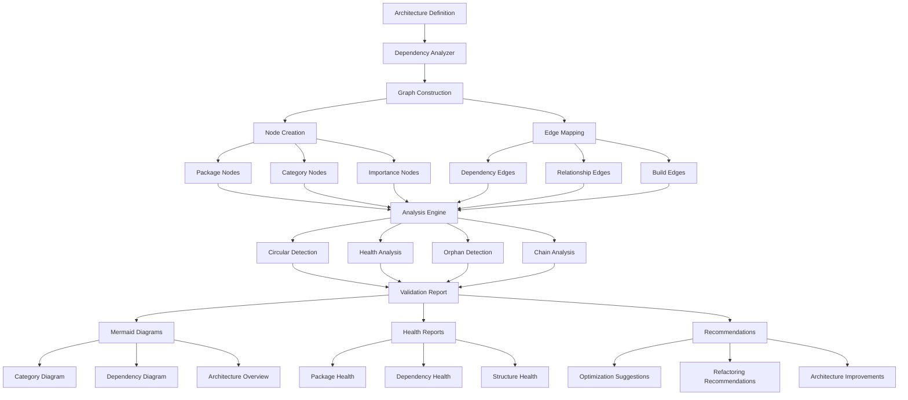

# 🦊 Reynard Project Architecture

**Centralized project structure definition with semantic and syntactic pathing**

[](https://www.npmjs.com/package/reynard-project-architecture)
[](https://opensource.org/licenses/MIT)
[](http://www.typescriptlang.org/)

## Architecture

```mermaid
graph TB
    subgraph "🏗️ Reynard Project Architecture System"
        A[Project Architecture Core] --> B[Architecture Definition]
        A --> C[Utility Functions]
        A --> D[Dependency Analyzer]
        A --> E[VS Code Integration]
        A --> F[Diagram Generator]

        subgraph "📋 Architecture Definition"
            B --> B1[REYNARD_ARCHITECTURE]
            B --> B2[Directory Definitions]
            B --> B3[Relationship Mapping]
            B --> B4[File Pattern System]
            B2 --> B5[77+ Package Definitions]
            B2 --> B6[8 Category Classifications]
            B2 --> B7[Importance Levels]
            B3 --> B8[Dependency Relationships]
            B3 --> B9[Build Dependencies]
            B3 --> B10[Test Dependencies]
        end

        subgraph "🛠️ Utility Functions"
            C --> C1[Path Resolution]
            C --> C2[Directory Queries]
            C --> C3[File Filtering]
            C --> C4[Structure Validation]
            C --> C5[Health Monitoring]
            C1 --> C6[resolvePath]
            C1 --> C7[directoryExists]
            C2 --> C8[queryDirectories]
            C2 --> C9[getDirectoriesByCategory]
            C3 --> C10[shouldIncludeFile]
            C3 --> C11[shouldExcludeFile]
            C4 --> C12[validateProjectStructure]
            C4 --> C13[generateProjectStructureReport]
        end

        subgraph "🔍 Dependency Analyzer"
            D --> D1[Dependency Graph]
            D --> D2[Circular Detection]
            D --> D3[Relationship Analysis]
            D --> D4[Mermaid Generation]
            D --> D5[Health Reports]
            D1 --> D6[Node Construction]
            D1 --> D7[Edge Mapping]
            D2 --> D8[Cycle Detection]
            D2 --> D9[Longest Chain Analysis]
            D3 --> D10[Orphan Detection]
            D3 --> D11[Relationship Validation]
            D4 --> D12[Category Diagrams]
            D4 --> D13[Dependency Diagrams]
        end

        subgraph "💻 VS Code Integration"
            E --> E1[Task Generation]
            E --> E2[Workspace Config]
            E --> E3[Queue Watcher]
            E --> E4[Build Tasks]
            E --> E5[Test Tasks]
            E --> E6[Lint Tasks]
            E1 --> E7[generateVSCodeTasksConfig]
            E2 --> E8[generateVSCodeWorkspaceConfig]
            E3 --> E9[generateQueueWatcherTask]
            E4 --> E10[generateBuildTasks]
            E5 --> E11[generateTestTasks]
            E6 --> E12[generateLintTasks]
        end

        subgraph "📊 Diagram Generator"
            F --> F1[Simplified Diagrams]
            F --> F2[Category Visualization]
            F --> F3[Dependency Visualization]
            F --> F4[Architecture Overview]
            F1 --> F5[SimplifiedDiagramGenerator]
            F2 --> F6[Category-based Layout]
            F3 --> F7[Relationship Mapping]
            F4 --> F8[High-level Structure]
        end

        subgraph "📁 Directory Categories"
            G[Category System] --> G1[Source Code]
            G --> G2[Documentation]
            G --> G3[Configuration]
            G --> G4[Tools]
            G --> G5[Tests]
            G --> G6[Data]
            G --> G7[Build Output]
            G --> G8[Third Party]
            G1 --> G9[77+ Packages]
            G1 --> G10[8 Semantic Categories]
            G2 --> G11[Project Docs]
            G2 --> G12[API Docs]
            G3 --> G13[Environment Config]
            G3 --> G14[Build Config]
            G4 --> G15[Dev Tools]
            G4 --> G16[Build Tools]
        end

        subgraph "🎯 Importance Levels"
            H[Importance System] --> H1[Critical]
            H --> H2[Important]
            H --> H3[Optional]
            H --> H4[Excluded]
            H1 --> H5[Core Packages]
            H1 --> H6[Build Systems]
            H2 --> H7[Feature Packages]
            H2 --> H8[Documentation]
            H3 --> H9[Examples]
            H3 --> H10[Optional Tools]
            H4 --> H11[Third Party]
            H4 --> H12[Generated Files]
        end
    end

    subgraph "🌐 External Integration"
        I[Development Tools] --> I1[TSConfig Generator]
        I --> I2[Queue Watcher]
        I --> I3[Build System]
        I --> I4[Test Runner]
        I --> I5[Linter]
        J[VS Code] --> J1[Task Runner]
        J --> J2[Workspace Management]
        J --> J3[File Watching]
    end

    A -->|Provides| K[Project Structure API]
    B -->|Defines| L[Monorepo Organization]
    C -->|Enables| M[Structure Operations]
    D -->|Analyzes| N[Dependency Health]
    E -->|Integrates| O[Development Workflow]
    F -->|Visualizes| P[Architecture Understanding]
```



## Project Structure Flow



## Monorepo Organization



## Dependency Analysis Flow



## Overview

The `reynard-project-architecture` package serves as the **single source of truth** for all project structure information in the Reynard monorepo. It provides comprehensive definitions of directories, their relationships, file patterns, and operational characteristics, enabling consistent behavior across all development tools, watchers, and build systems.

## Features

- 🏗️ **Centralized Architecture Definition**: Single source of truth for all project structure
- 🔍 **Semantic Directory Classification**: Categorizes directories by purpose and importance
- 📁 **Relationship Mapping**: Defines how directories relate to each other
- 🎯 **Pattern-Based Filtering**: Global and directory-specific include/exclude patterns
- ⚡ **Query System**: Advanced filtering and querying capabilities
- 🛠️ **VS Code Integration**: Generates VS Code task configurations
- 📊 **Validation & Reporting**: Project structure validation and detailed reports
- 🔧 **Utility Functions**: Comprehensive helper functions for common operations
- 📝 **Detailed Package Descriptions**: Precise descriptions for 77+ packages across 8 categories
- 🔗 **Dependency Mapping**: Clear relationships between packages and their dependencies

## Installation

```bash
pnpm add reynard-project-architecture
```

## Quick Start

```typescript
import {
  REYNARD_ARCHITECTURE,
  getWatchableDirectories,
  getBuildableDirectories,
  queryDirectories,
  shouldIncludeFile,
} from "reynard-project-architecture";

// Get all watchable directories
const watchableDirs = getWatchableDirectories();
console.log("Watchable directories:", watchableDirs);

// Query directories by category
const sourceDirs = queryDirectories({ category: "source" });
console.log("Source directories:", sourceDirs.directories);

// Check if a file should be included
const shouldInclude = shouldIncludeFile("packages/components/src/Button.tsx");
console.log("Should include file:", shouldInclude);
```

## Architecture Definition

The package defines a comprehensive project architecture with the following components:

### Directory Categories

- **`source`**: Source code directories (packages, backend)
- **`documentation`**: Documentation and guides (docs, .cursor/docs)
- **`configuration`**: Configuration files and settings (.cursor/rules, nginx)
- **`build`**: Build artifacts and outputs
- **`testing`**: Test files and test data (e2e)
- **`scripts`**: Automation and utility scripts
- **`data`**: Data files and datasets
- **`templates`**: Project templates and examples
- **`services`**: Microservices and standalone services
- **`third-party`**: External dependencies and third-party code
- **`cache`**: Cache and temporary files
- **`tools`**: Development tools and utilities

### Importance Levels

- **`critical`**: Essential for project operation
- **`important`**: Important for development workflow
- **`optional`**: Optional but useful
- **`excluded`**: Should be excluded from most operations

### Directory Properties

Each directory definition includes:

- **Basic Info**: Name, path, category, importance
- **File Types**: Primary file types in the directory
- **Operational Flags**: watchable, buildable, testable, lintable, documentable
- **Relationships**: How directories relate to each other
- **Patterns**: Include/exclude patterns for file filtering
- **Metadata**: Optional, generated, third-party flags

## Detailed Package Descriptions

The architecture definition now includes precise, detailed descriptions for **77+ packages** across **8 major categories**. Each package has been analyzed and documented with:

### 🤖 AI & Machine Learning (17 packages)

- **ai-shared**: Shared AI/ML utilities and base classes for all AI packages
- **rag**: Retrieval-Augmented Generation system with semantic search and vector embeddings
- **annotating-core**: Core annotation system with base functionality and data structures
- **annotating-florence2**: Florence2 model integration for image annotation
- **annotating-joy**: Joy model integration for document annotation
- **annotating-jtp2**: JTP2 model integration for specialized annotation tasks
- **annotating-wdv3**: WDV3 model integration for advanced annotation workflows
- **annotating-ui**: User interface components for annotation tools
- **caption-core**: Core caption generation system with base functionality
- **caption-multimodal**: Multimodal caption generation for images and videos
- **caption-ui**: User interface components for caption systems
- **comfy**: ComfyUI integration for AI workflow automation
- **model-management**: AI model lifecycle management and deployment
- **multimodal**: Multimodal AI processing capabilities
- **nlweb**: Natural language web processing and analysis
- **tool-calling**: AI tool calling and function execution framework

### 🏗️ Core Framework (9 packages)

- **core**: Core utilities, security, image processing, and fundamental framework capabilities
- **testing**: Testing utilities and shared test infrastructure used across all packages
- **validation**: Data validation utilities, schemas, and validation frameworks
- **composables**: Reusable logic, state management, and composable functions
- **config**: Environment configuration, settings management, and configuration utilities
- **connection**: HTTP/WebSocket connection pooling, management, and communication
- **features**: Feature flags, conditional functionality, and feature management
- **i18n**: Internationalization, localization, and multi-language support
- **settings**: User preferences, application settings, and configuration management

### 🎨 User Interface (17 packages)

- **components-core**: Core UI primitives, navigation, and layout components
- **charts**: Chart and data visualization components with comprehensive charting capabilities
- **games**: Game engine and ECS (Entity Component System) with spatial hash and collision detection
- **fluent-icons**: Microsoft Fluent Icons integration with comprehensive icon system
- **animation**: Transitions, effects, and animation utilities
- **colors**: Color system, palette management, and design tokens
- **dashboard**: Admin interface and dashboard components
- **themes**: Design system, theming capabilities, and style management
- **monaco**: Code editor integration and syntax highlighting
- **error-boundaries**: Error handling, recovery components, and error management
- **floating-panel**: Overlay UI, floating components, and modal systems
- **components-charts**: Chart-specific UI components and visualizations
- **components-dashboard**: Dashboard-specific UI components and layouts
- **components-themes**: Theme-specific UI components and styling
- **components-utils**: Utility UI components and helper functions
- **ui**: Main UI package with core UI utilities and components

### 📊 Data Processing (7 packages)

- **repository-core**: Core repository system with data persistence and 3D data handling
- **file-processing**: File upload, conversion, metadata extraction, and format detection
- **repository-multimodal**: Multimodal data repository for complex data types
- **repository-search**: Search and indexing capabilities for data repositories
- **repository-storage**: Storage abstraction layer and data persistence
- **scraping**: Web scraping utilities and data extraction tools
- **unified-repository**: Unified repository abstraction layer

### 🛠️ Development Tools (7 packages)

- **project-architecture**: This package - centralized project structure definitions
- **code-quality**: Linting, formatting, and code quality tools
- **adr-system**: Architecture Decision Records management and documentation
- **dev-server-management**: Development server orchestration and management
- **git-automation**: Git workflow automation and repository management
- **humility-parser**: Documentation parsing utilities and content processing
- **queue-watcher**: Build queue monitoring, management, and optimization

### 📚 Documentation (5 packages)

- **docs-generator**: Automated documentation generation and content processing
- **docs-site**: Static site generation for documentation websites
- **docs-core**: Documentation engine, processing, and content management
- **docs-components**: UI components specifically designed for documentation
- **diagram-generator**: Mermaid and flowchart generation for technical documentation

### 🎬 Media Processing (9 packages)

- **image**: Image processing, display, manipulation, and gallery systems
- **3d**: 3D rendering and visualization with Three.js integration
- **video**: Video processing, playback, and manipulation capabilities
- **audio**: Audio processing, playback, and audio manipulation
- **gallery**: Gallery systems with AI-powered features and download capabilities
- **gallery-ai**: AI-powered gallery features and intelligent organization
- **gallery-dl**: Download capabilities and gallery management
- **segmentation**: Image and video segmentation tools and processing
- **boundingbox**: Bounding box annotation, processing, and manipulation

### 🔧 Services (5 packages)

- **api-client**: HTTP client, API communication utilities, and request handling
- **auth**: Authentication, authorization services, and security management
- **chat**: Messaging, communication services, and real-time chat
- **email**: Email service integration and email processing
- **service-manager**: Service orchestration, management, and coordination

### 🐍 Python Microservices (3 packages)

- **agent-naming**: Agent naming system with 105+ spirit types and personality generation
- **gatekeeper**: Authentication and authorization microservice
- **mcp-server**: MCP server with 47+ comprehensive development tools

## API Reference

### Core Architecture

#### `REYNARD_ARCHITECTURE`

The main architecture definition object containing all directory definitions and global configuration.

```typescript
import { REYNARD_ARCHITECTURE } from "reynard-project-architecture";

console.log(REYNARD_ARCHITECTURE.name); // "Reynard"
console.log(REYNARD_ARCHITECTURE.directories.length); // 17
```

#### Directory Filter Functions

```typescript
import {
  getWatchableDirectories,
  getBuildableDirectories,
  getTestableDirectories,
  getLintableDirectories,
  getDocumentableDirectories,
} from "reynard-project-architecture";

// Get directories by operational type
const watchable = getWatchableDirectories(); // ["packages", "backend", "docs", ...]
const buildable = getBuildableDirectories(); // ["packages", "backend", "examples", ...]
const testable = getTestableDirectories(); // ["packages", "backend", "e2e", ...]
```

#### Global Patterns

```typescript
import { getGlobalExcludePatterns, getGlobalIncludePatterns } from "reynard-project-architecture";

const excludePatterns = getGlobalExcludePatterns(); // ["**/node_modules/**", "**/dist/**", ...]
const includePatterns = getGlobalIncludePatterns(); // ["**/*.ts", "**/*.py", ...]
```

### Utility Functions

#### Directory Queries

```typescript
import { queryDirectories, getDirectoryPaths } from "reynard-project-architecture";

// Query with multiple filters
const result = queryDirectories({
  category: "source",
  importance: "critical",
  watchable: true,
});

console.log(result.directories); // Matching directories
console.log(result.count); // Number of matches
console.log(result.executionTime); // Query execution time

// Get just the paths
const paths = getDirectoryPaths({ category: "source" });
```

#### Directory Information

```typescript
import {
  getDirectoryDefinition,
  getDirectoryDefinitionByPath,
  getDirectoriesByCategory,
  getDirectoriesByImportance,
  getRelatedDirectories,
} from "reynard-project-architecture";

// Get directory by name
const packages = getDirectoryDefinition("packages");
console.log(packages?.description); // "Main source code packages..."

// Get directory by path
const backend = getDirectoryDefinitionByPath("backend");

// Get directories by category
const sourceDirs = getDirectoriesByCategory("source");
const criticalDirs = getDirectoriesByImportance("critical");

// Get related directories
const relatedToPackages = getRelatedDirectories("packages");
```

#### File Pattern Matching

```typescript
import {
  shouldExcludeFile,
  shouldIncludeFile,
  getFileTypeFromExtension,
  getDirectoryForFilePath,
} from "reynard-project-architecture";

// Check file inclusion/exclusion
const shouldExclude = shouldExcludeFile("node_modules/react/index.js"); // true
const shouldInclude = shouldIncludeFile("packages/components/src/Button.tsx"); // true

// Get file type from extension
const fileType = getFileTypeFromExtension("Button.tsx"); // "typescript"

// Get directory for file path
const directory = getDirectoryForFilePath("packages/components/src/Button.tsx");
console.log(directory?.name); // "packages"
```

#### Project Validation

```typescript
import { validateProjectStructure, generateProjectStructureReport } from "reynard-project-architecture";

// Validate project structure
const validation = validateProjectStructure();
console.log(validation.valid); // true/false
console.log(validation.errors); // Array of error messages

// Generate comprehensive report
const report = generateProjectStructureReport();
console.log(report); // Markdown-formatted report
```

### VS Code Integration

```typescript
import {
  generateVSCodeTasksConfig,
  generateVSCodeWorkspaceConfig,
  generateQueueWatcherTask,
} from "reynard-project-architecture";

// Generate complete VS Code tasks configuration
const tasksConfig = generateVSCodeTasksConfig();

// Generate workspace configuration
const workspaceConfig = generateVSCodeWorkspaceConfig();

// Generate specific task
const watcherTask = generateQueueWatcherTask();
```

## Example Usage

Here's a comprehensive example demonstrating the package's capabilities:

```typescript
import {
  REYNARD_ARCHITECTURE,
  getWatchableDirectories,
  queryDirectories,
  shouldIncludeFile,
  getDirectoryDefinition,
  validateProjectStructure,
} from "reynard-project-architecture";

// 1. Basic architecture information
console.log(`Project: ${REYNARD_ARCHITECTURE.name}`);
console.log(`Total directories: ${REYNARD_ARCHITECTURE.directories.length}`);

// 2. Get watchable directories for file watchers
const watchableDirs = getWatchableDirectories();
console.log("Watchable directories:", watchableDirs);

// 3. Query critical source directories
const criticalSource = queryDirectories({
  category: "source",
  importance: "critical",
});
console.log("Critical source directories:", criticalSource.directories);

// 4. Check file patterns
const testFiles = [
  "packages/components/src/Button.tsx",
  "node_modules/react/index.js",
  "dist/build.js",
  "docs/README.md",
];

testFiles.forEach(file => {
  const shouldInclude = shouldIncludeFile(file);
  console.log(`${file}: ${shouldInclude ? "Include" : "Exclude"}`);
});

// 5. Get directory information
const packages = getDirectoryDefinition("packages");
if (packages) {
  console.log(`Packages directory: ${packages.description}`);
  console.log(`Relationships: ${packages.relationships.length}`);
}

// 6. Validate project structure
const validation = validateProjectStructure();
console.log(`Project structure valid: ${validation.valid}`);
```

## Directory Structure

The package defines the following directory structure for the Reynard project:

```text
reynard/
├── packages/           # Main source code packages (critical)
│   ├── ai/            # AI and machine learning packages (17 packages)
│   ├── core/          # Core framework packages (9 packages)
│   ├── data/          # Data processing packages (7 packages)
│   ├── dev-tools/     # Development tools (7 packages)
│   ├── docs/          # Documentation generation (5 packages)
│   ├── media/         # Media processing packages (9 packages)
│   ├── services/      # Frontend service packages (5 packages)
│   └── ui/            # User interface packages (17 packages)
├── backend/           # Python backend services (critical)
├── services/          # Root-level Python microservices (critical)
│   ├── agent-naming/  # Agent naming system with 105+ spirit types
│   ├── gatekeeper/    # Authentication and authorization
│   └── mcp-server/    # MCP server with 47+ development tools
├── docs/              # Project documentation (critical)
├── examples/          # Example applications (22 packages)
├── templates/         # Project templates (1 package)
├── e2e/               # End-to-end tests (1 package)
├── scripts/           # Automation scripts (2 packages)
├── data/              # Data files and datasets (optional)
├── nginx/             # Nginx configuration (optional)
├── fenrir/            # Development tools (optional)
├── third_party/       # Third-party dependencies (excluded)
└── .cursor/           # Cursor IDE configuration
    ├── docs/          # IDE-specific documentation
    ├── prompts/       # Prompt templates
    └── rules/         # Coding standards
```

## File Pattern System

The package includes a comprehensive file pattern system for filtering:

### Global Exclude Patterns

- `**/node_modules/**` - Node.js dependencies
- `**/dist/**` - Build outputs
- `**/build/**` - Build artifacts
- `**/coverage/**` - Test coverage reports
- `**/.git/**` - Git repository files
- `**/third_party/**` - Third-party code
- And many more...

### Global Include Patterns

- `**/*.ts` - TypeScript files
- `**/*.tsx` - TypeScript React files
- `**/*.js` - JavaScript files
- `**/*.py` - Python files
- `**/*.md` - Markdown files
- `**/*.json` - JSON files
- `**/*.toml` - TOML configuration files
- `**/*.sh` - Shell script files
- And more...

### Directory-Specific Patterns

Each directory can have its own include/exclude patterns that override or supplement the global patterns.

## Relationship System

Directories can have relationships with each other:

- **`parent`**: Parent directory
- **`child`**: Child directory
- **`sibling`**: Sibling directory
- **`dependency`**: Dependency relationship
- **`generated`**: Generated from this directory
- **`configures`**: Configures this directory
- **`tests`**: Tests this directory
- **`documents`**: Documents this directory

Example relationships:

- `packages` → `examples` (sibling: "Examples use packages")
- `packages` → `e2e` (tests: "E2E tests test packages")
- `docs` → `packages` (documents: "Documents package APIs")

## Configuration Options

The package supports various configuration options for queries:

```typescript
interface PathResolutionOptions {
  absolute?: boolean; // Resolve to absolute paths
  includeOptional?: boolean; // Include optional directories
  includeGenerated?: boolean; // Include generated directories
  includeThirdParty?: boolean; // Include third-party directories
  category?: DirectoryCategory; // Filter by category
  importance?: ImportanceLevel; // Filter by importance
  watchable?: boolean; // Filter by watchable flag
  buildable?: boolean; // Filter by buildable flag
  testable?: boolean; // Filter by testable flag
  lintable?: boolean; // Filter by lintable flag
  documentable?: boolean; // Filter by documentable flag
}
```

## Testing

The package includes comprehensive tests covering:

- Architecture definition validation
- Directory filtering functions
- File pattern matching
- Query system functionality
- Utility functions
- Edge cases and error handling

Run tests with:

```bash
pnpm test
```

## Development

### Building

```bash
pnpm build
```

### Linting

```bash
pnpm lint
pnpm lint:fix
```

### Type Checking

```bash
pnpm type-check
```

### Validation

```bash
pnpm validate
```

## Contributing

When contributing to this package:

1. **Update Architecture**: Modify `src/architecture.ts` to reflect structural changes
2. **Add Tests**: Ensure new functionality is thoroughly tested
3. **Update Types**: Add new types to `src/types.ts` if needed
4. **Document Changes**: Update this README for significant changes
5. **Validate**: Run `pnpm validate` before submitting

## License

MIT License - see [LICENSE](../../../LICENSE.md) file for details.

## Related Packages

- `reynard-queue-watcher` - File watching system that uses this architecture
- `reynard-build-system` - Build system that uses this architecture
- `reynard-testing` - Testing utilities that use this architecture

---

_🦊 Part of the Reynard Framework - Cunning agile development tools_
