# 🦊 TypeScript Configuration Generator

A modular TypeScript tool that generates TypeScript configurations from the Reynard project architecture.

## Architecture

```mermaid
graph TB
    subgraph "⚙️ TSConfig Generator"
        A[CLI Interface] --> B[TSConfigGenerator]
        B --> C[Architecture Integration]
        B --> D[Config Generation]
        B --> E[Validation System]

        subgraph "Architecture Integration"
            C --> C1[Project Architecture]
            C --> C2[Buildable Directories]
            C --> C3[TypeScript Directories]
            C --> C4[Package Metadata]
        end

        subgraph "Config Generation"
            D --> D1[Root Configuration]
            D --> D2[Package References]
            D --> D3[Compiler Options]
            D --> D4[File Patterns]
            D --> D5[Individual Configs]
        end

        subgraph "Validation System"
            E --> E1[Config Validation]
            E --> E2[Error Handling]
            E --> E3[Backup Support]
            E --> E4[Warning System]
        end
    end

    subgraph "🏗️ Project Architecture"
        F[Architecture Definition] --> G[95+ Packages]
        F --> H[Directory Structure]
        F --> I[Build Configurations]
        F --> J[File Patterns]
    end

    subgraph "📦 Generated Outputs"
        K[Root tsconfig.json] --> L[Package References]
        K --> M[Compiler Settings]
        K --> N[Include/Exclude Patterns]
        O[Individual Configs] --> P[Package-specific Settings]
    end

    C1 -->|Reads| F
    D1 -->|Generates| K
    D5 -->|Generates| O
```



## Generation Process


## Overview

This tool automatically generates comprehensive TypeScript configurations by analyzing the project architecture, eliminating the need for manual configuration of 95+ buildable packages in a monorepo.

## Features

- **Architecture-Driven**: Uses project architecture definitions to generate configurations
- **Modern Paths**: Correctly generates `packages/core/core` instead of `packages/core`
- **Modular Design**: Clean separation of concerns with TypeScript modules
- **Flexible Configuration**: Customizable compiler options, project inclusion, and references
- **Validation**: Built-in configuration validation and error handling
- **Backup Support**: Automatically backs up existing configurations
- **CLI Interface**: Command-line interface with comprehensive options

## Installation

```bash
cd packages/dev-tools/tsconfig-generator
pnpm install
pnpm build
```

## Usage

### Basic Usage

```bash
# Generate default configuration
node dist/cli.js

# Generate with verbose output
node dist/cli.js --verbose

# Generate to specific file
node dist/cli.js --output tsconfig.json
```

### Advanced Options

```bash
# Include/exclude project types
node dist/cli.js --include-examples --include-templates --include-scripts

# Generate individual package configs
node dist/cli.js --generate-individual

# Include package references
node dist/cli.js --include-references

# Backup and validate
node dist/cli.js --backup --validate
```

### CLI Options

| Option                  | Description                         | Default                   |
| ----------------------- | ----------------------------------- | ------------------------- |
| `-v, --verbose`         | Enable verbose output               | `false`                   |
| `-o, --output <path>`   | Output file path                    | `tsconfig.generated.json` |
| `--include-packages`    | Include source packages             | `true`                    |
| `--include-examples`    | Include example projects            | `true`                    |
| `--include-templates`   | Include template projects           | `true`                    |
| `--include-scripts`     | Include scripts                     | `false`                   |
| `--include-references`  | Include package references          | `true`                    |
| `--generate-individual` | Generate individual package configs | `false`                   |
| `--backup`              | Backup existing configuration       | `false`                   |
| `--validate`            | Validate generated configuration    | `false`                   |

## Architecture Integration

This generator uses the Reynard project architecture system to:

- **Discover Packages**: Automatically finds all 95+ buildable packages
- **Correct Paths**: Uses the modern categorized layout (`packages/core/core`)
- **Rich Metadata**: Leverages build configurations and file patterns
- **Dependencies**: Generates proper package references based on relationships
- **Filtering**: Supports filtering by category, importance, and file types

## Generated Configuration

The generator creates TypeScript configurations that include:

- **Root Configuration**: Global TypeScript settings for the monorepo
- **Package References**: Proper references between packages
- **Build Settings**: Optimized for the Reynard architecture
- **File Patterns**: Correct include/exclude patterns from architecture
- **Compiler Options**: Modern TypeScript settings with strict mode

## Example Output

```json
{
  "compilerOptions": {
    "target": "ES2022",
    "module": "ESNext",
    "moduleResolution": "bundler",
    "strict": true,
    "composite": true
  },
  "include": ["**/*.ts", "**/*.tsx", "**/*.js", "**/*.jsx"],
  "exclude": ["node_modules", "dist", "build", "coverage"],
  "references": [
    { "path": "packages/core/core" },
    { "path": "packages/ai/ai-shared" },
    { "path": "packages/ui/components-core" }
  ]
}
```

## Development

```bash
# Build the project
pnpm build

# Run in development mode
pnpm dev

# Run tests
pnpm test

# Lint code
pnpm lint

# Fix linting issues
pnpm lint:fix
```

## Integration

This tool integrates seamlessly with the Reynard project architecture system and works alongside:

- **Vitest Config Generator**: For test configuration
- **Project Architecture**: For package discovery and metadata
- **Build System**: For optimized TypeScript compilation
- **VS Code**: For proper IntelliSense and type checking
