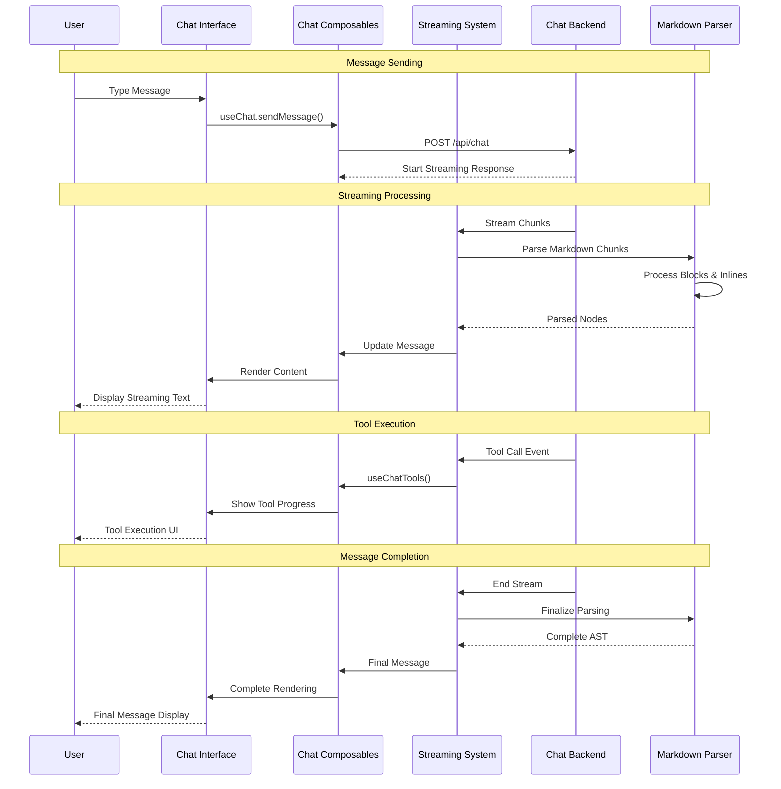
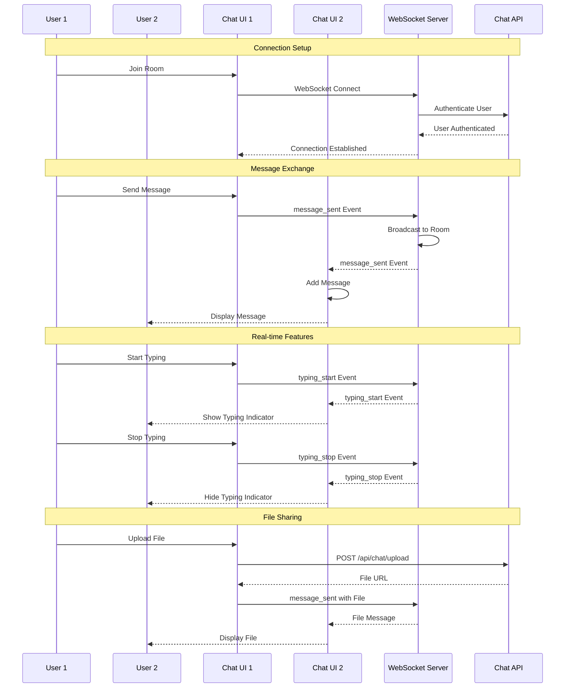
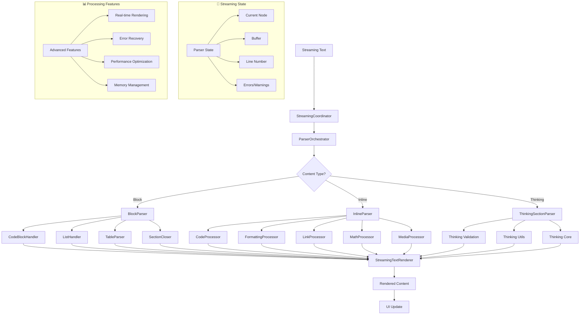

# Reynard Chat System 🦊💬

A comprehensive, production-ready chat messaging system for SolidJS applications with streaming capabilities,
markdown parsing, thinking sections, and tool integration.

## Architecture

```mermaid
graph TB
    subgraph "💬 Reynard Chat System"
        A[Chat Container] --> B[Chat Components]
        A --> C[Chat Composables]
        A --> D[Streaming System]
        A --> E[P2P System]
        
        subgraph "🎯 Core Components"
            B --> B1[ChatMessage]
            B --> B2[MessageInput]
            B --> B3[MarkdownRenderer]
            B --> B4[ThinkingIndicator]
            B --> B5[ToolCallDisplay]
            B --> B6[P2PChatContainer]
            B --> B7[RoomList]
            B --> B8[UserList]
        end
        
        subgraph "⚡ Chat Composables"
            C --> C1[useChat]
            C --> C2[useChatMessages]
            C --> C3[useChatStreaming]
            C --> C4[useChatTools]
            C --> C5[useP2PChat]
            C --> C6[useP2PConnection]
            C --> C7[useP2PMessages]
            C --> C8[useP2PRooms]
        end
        
        subgraph "🌊 Streaming System"
            D --> D1[StreamingMarkdownParser]
            D --> D2[StreamingCoordinator]
            D --> D3[ParserOrchestrator]
            D --> D4[BlockParser]
            D --> D5[InlineParser]
            D --> D6[StreamingTextRenderer]
            D1 --> D7[ThinkingSectionParser]
            D1 --> D8[CodeBlockHandler]
            D1 --> D9[TableParser]
        end
        
        subgraph "🔗 P2P Features"
            E --> E1[Real-time Messaging]
            E --> E2[Room Management]
            E --> E3[User Presence]
            E --> E4[File Uploads]
            E --> E5[Typing Indicators]
            E --> E6[Read Receipts]
            E --> E7[Message Reactions]
            E --> E8[Message Threads]
        end
        
        subgraph "🛠️ Markdown Processing"
            F[Markdown Utils] --> F1[BaseMarkdownParser]
            F --> F2[Block Handlers]
            F --> F3[Inline Processors]
            F --> F4[Streaming Helpers]
            F2 --> F5[CodeBlockHandler]
            F2 --> F6[ListHandler]
            F2 --> F7[SectionCloser]
            F3 --> F8[CodeProcessor]
            F3 --> F9[FormattingProcessor]
            F3 --> F10[LinkProcessor]
            F3 --> F11[MathProcessor]
            F3 --> F12[MediaProcessor]
        end
        
        subgraph "🔧 Tool Integration"
            G[Tool System] --> G1[Tool Definitions]
            G --> G2[Tool Execution]
            G --> G3[Tool Progress]
            G --> G4[Tool Results]
            G1 --> G5[Function Tools]
            G1 --> G6[API Tools]
            G1 --> G7[Custom Tools]
        end
        
        subgraph "📊 State Management"
            H[Chat State] --> H1[Message History]
            H --> H2[Connection State]
            H --> H3[Streaming State]
            H --> H4[Tool State]
            H --> H5[P2P State]
            H --> H6[User State]
        end
    end
    
    subgraph "🌐 Backend Integration"
        I[Chat Backend] --> I1[WebSocket Server]
        I --> I2[Message API]
        I --> I3[File Upload API]
        I --> I4[User Management]
        I --> I5[Room Management]
    end
    
    A -->|Manages| J[Chat Interface]
    C1 -->|Orchestrates| K[Chat Operations]
    D1 -->|Processes| L[Streaming Content]
    E1 -->|Enables| M[Real-time Communication]
```



## Chat Flow



## P2P Chat Flow



## Streaming Markdown Processing



## ✨ Features

### 🚀 **Core Capabilities**

- **Real-time Streaming**: Advanced streaming text processing with real-time markdown rendering
- **Thinking Sections**: Support for AI assistant thinking process visualization
- **Tool Integration**: Complete tool calling system with progress tracking
- **Markdown Parsing**: Full markdown support including tables, code blocks, and math
- **TypeScript First**: Complete type safety with excellent IntelliSense

### 🎨 **UI/UX Excellence**

- **Responsive Design**: Mobile-first with adaptive layouts
- **Accessibility**: Full WCAG 2.1 compliance with keyboard navigation
- **Theming**: Seamless integration with Reynard's theming system
- **Animations**: Smooth transitions and engaging micro-interactions
- **Dark Mode**: Built-in dark mode support

### ⚡ **Performance**

- **Optimized Streaming**: Efficient chunk processing and buffering
- **Memory Management**: Smart history limiting and cleanup
- **Lazy Loading**: Progressive content loading
- **Tree Shakable**: Import only what you need

## 📦 Installation

```bash
npm install reynard-components solid-js
```

## 🎯 Quick Start

### Basic Chat Implementation

```tsx
import { ChatContainer } from "reynard-components";
import "reynard-components/styles";

function App() {
  return (
    <ChatContainer
      endpoint="/api/chat"
      height="600px"
      config={{
        enableThinking: true,
        enableTools: true,
        showTimestamps: true,
      }}
      onMessageSent={message => console.log("Sent:", message)}
      onMessageReceived={message => console.log("Received:", message)}
    />
  );
}
```

### Advanced Usage with Custom Components

```tsx
import { ChatContainer, ChatMessage, MessageInput, useChat } from "reynard-components";

function CustomChatApp() {
  const { messages, sendMessage, isStreaming } = useChat({
    endpoint: "/api/chat",
    config: {
      enableThinking: true,
      enableTools: true,
      showTimestamps: true,
    },
  });

  return (
    <div class="custom-chat">
      <div class="messages">
        <For each={messages()}>
          {message => (
            <ChatMessage message={message} showTimestamp={true} showThinking={message.type === "assistant"} />
          )}
        </For>
      </div>
      <MessageInput onSend={sendMessage} disabled={isStreaming()} placeholder="Type your message..." />
    </div>
  );
}
```

### Real-time Streaming Chat

```tsx
import { ChatContainer, useStreamingChat } from "reynard-components";

function StreamingChatApp() {
  const { messages, sendMessage, isStreaming, streamStatus, thinkingContent } = useStreamingChat({
    endpoint: "/api/chat/stream",
    config: {
      enableThinking: true,
      enableTools: true,
      streamMode: "real-time",
      bufferSize: 1024,
    },
    onStreamStart: () => console.log("Stream started"),
    onStreamEnd: () => console.log("Stream ended"),
    onThinkingUpdate: content => console.log("Thinking:", content),
  });

  return (
    <div class="streaming-chat">
      <div class="chat-header">
        <h3>AI Assistant</h3>
        <div class="status">
          {isStreaming() && <span class="streaming">Streaming...</span>}
          {streamStatus() && <span class="status">{streamStatus()}</span>}
        </div>
      </div>

      <div class="messages-container">
        <For each={messages()}>
          {message => (
            <div class={`message ${message.role}`}>
              <div class="message-content">{message.content}</div>
              {message.timestamp && <div class="timestamp">{new Date(message.timestamp).toLocaleTimeString()}</div>}
            </div>
          )}
        </For>

        {thinkingContent() && (
          <div class="thinking-section">
            <div class="thinking-header">🤔 Thinking...</div>
            <div class="thinking-content">{thinkingContent()}</div>
          </div>
        )}
      </div>

      <div class="input-area">
        <MessageInput
          onSend={sendMessage}
          disabled={isStreaming()}
          placeholder="Ask me anything..."
          showSendButton={true}
        />
      </div>
    </div>
  );
}
```

### P2P Chat Implementation

```tsx
import { P2PChatContainer, useP2PChat } from "reynard-components";

function P2PChatApp() {
  const { messages, sendMessage, isConnected, connectionStatus, participants, joinRoom, leaveRoom } = useP2PChat({
    signalingServer: "wss://signaling.example.com",
    iceServers: [
      { urls: "stun:stun.l.google.com:19302" },
      { urls: "turn:turn.example.com", username: "user", credential: "pass" },
    ],
    config: {
      enableFileSharing: true,
      enableScreenSharing: true,
      enableVoiceChat: false,
      maxParticipants: 10,
    },
    onConnectionChange: status => console.log("Connection:", status),
    onParticipantJoin: user => console.log("User joined:", user),
    onParticipantLeave: user => console.log("User left:", user),
  });

  const handleJoinRoom = async (roomId: string) => {
    try {
      await joinRoom(roomId);
      console.log("Joined room:", roomId);
    } catch (error) {
      console.error("Failed to join room:", error);
    }
  };

  return (
    <div class="p2p-chat">
      <div class="chat-header">
        <h3>P2P Chat Room</h3>
        <div class="connection-status">
          Status: <span class={connectionStatus()}>{connectionStatus()}</span>
        </div>
        <div class="participants">Participants: {participants().length}</div>
      </div>

      <div class="room-controls">
        <input type="text" placeholder="Room ID" id="roomId" />
        <button onClick={() => handleJoinRoom(document.getElementById("roomId")?.value || "")}>Join Room</button>
        <button onClick={leaveRoom}>Leave Room</button>
      </div>

      <div class="messages-container">
        <For each={messages()}>
          {message => (
            <div class={`message ${message.senderId === "me" ? "own" : "other"}`}>
              <div class="sender">{message.senderName}</div>
              <div class="content">{message.content}</div>
              <div class="timestamp">{new Date(message.timestamp).toLocaleTimeString()}</div>
            </div>
          )}
        </For>
      </div>

      <div class="input-area">
        <MessageInput
          onSend={sendMessage}
          disabled={!isConnected()}
          placeholder={isConnected() ? "Type a message..." : "Not connected"}
        />
      </div>
    </div>
  );
}
```

### Tool Integration Example

```tsx
import { ChatContainer, useChatWithTools } from "reynard-components";

function ChatWithToolsApp() {
  const { messages, sendMessage, isStreaming, activeTools, toolResults } = useChatWithTools({
    endpoint: "/api/chat/tools",
    tools: [
      {
        name: "search_web",
        description: "Search the web for information",
        parameters: {
          type: "object",
          properties: {
            query: { type: "string", description: "Search query" },
            limit: {
              type: "number",
              description: "Number of results",
              default: 5,
            },
          },
          required: ["query"],
        },
      },
      {
        name: "get_weather",
        description: "Get current weather for a location",
        parameters: {
          type: "object",
          properties: {
            location: { type: "string", description: "City name" },
            units: {
              type: "string",
              enum: ["celsius", "fahrenheit"],
              default: "celsius",
            },
          },
          required: ["location"],
        },
      },
      {
        name: "calculate",
        description: "Perform mathematical calculations",
        parameters: {
          type: "object",
          properties: {
            expression: {
              type: "string",
              description: "Mathematical expression",
            },
          },
          required: ["expression"],
        },
      },
    ],
    config: {
      enableToolExecution: true,
      showToolProgress: true,
      allowToolSelection: true,
    },
    onToolStart: (toolName, parameters) => {
      console.log(`Tool started: ${toolName}`, parameters);
    },
    onToolComplete: (toolName, result) => {
      console.log(`Tool completed: ${toolName}`, result);
    },
    onToolError: (toolName, error) => {
      console.error(`Tool error: ${toolName}`, error);
    },
  });

  return (
    <div class="chat-with-tools">
      <div class="chat-header">
        <h3>AI Assistant with Tools</h3>
        <div class="active-tools">
          {activeTools().length > 0 && (
            <div class="tools-status">
              Active tools:{" "}
              {activeTools()
                .map(t => t.name)
                .join(", ")}
            </div>
          )}
        </div>
      </div>

      <div class="messages-container">
        <For each={messages()}>
          {message => (
            <div class={`message ${message.role}`}>
              <div class="message-content">{message.content}</div>

              {message.toolCalls && (
                <div class="tool-calls">
                  <For each={message.toolCalls}>
                    {toolCall => (
                      <div class="tool-call">
                        <div class="tool-name">🔧 {toolCall.name}</div>
                        <div class="tool-parameters">{JSON.stringify(toolCall.parameters, null, 2)}</div>
                        {toolCall.result && <div class="tool-result">{toolCall.result}</div>}
                      </div>
                    )}
                  </For>
                </div>
              )}
            </div>
          )}
        </For>
      </div>

      <div class="input-area">
        <MessageInput
          onSend={sendMessage}
          disabled={isStreaming()}
          placeholder="Ask me to search, calculate, or get weather..."
          showToolSuggestions={true}
        />
      </div>
    </div>
  );
}
```

### Custom Chat Styling

```css
/* Custom chat styles */
.streaming-chat {
  display: flex;
  flex-direction: column;
  height: 600px;
  border: 1px solid var(--border-color);
  border-radius: 8px;
  background: var(--bg-color);
}

.chat-header {
  display: flex;
  justify-content: space-between;
  align-items: center;
  padding: 1rem;
  border-bottom: 1px solid var(--border-color);
  background: var(--secondary-bg);
}

.status {
  display: flex;
  gap: 0.5rem;
  font-size: 0.875rem;
  color: var(--text-secondary);
}

.streaming {
  color: var(--accent);
  animation: pulse 1.5s ease-in-out infinite;
}

.messages-container {
  flex: 1;
  overflow-y: auto;
  padding: 1rem;
  display: flex;
  flex-direction: column;
  gap: 1rem;
}

.message {
  display: flex;
  flex-direction: column;
  max-width: 80%;
}

.message.user {
  align-self: flex-end;
  background: var(--accent);
  color: white;
  padding: 0.75rem;
  border-radius: 1rem 1rem 0.25rem 1rem;
}

.message.assistant {
  align-self: flex-start;
  background: var(--card-bg);
  color: var(--text-primary);
  padding: 0.75rem;
  border-radius: 1rem 1rem 1rem 0.25rem;
  border: 1px solid var(--border-color);
}

.thinking-section {
  background: var(--secondary-bg);
  border: 1px solid var(--border-color);
  border-radius: 8px;
  padding: 1rem;
  margin: 0.5rem 0;
}

.thinking-header {
  font-weight: 600;
  color: var(--accent);
  margin-bottom: 0.5rem;
}

.thinking-content {
  color: var(--text-secondary);
  font-style: italic;
}

.tool-call {
  background: var(--secondary-bg);
  border: 1px solid var(--border-color);
  border-radius: 6px;
  padding: 0.75rem;
  margin: 0.5rem 0;
}

.tool-name {
  font-weight: 600;
  color: var(--accent);
  margin-bottom: 0.5rem;
}

.tool-parameters {
  background: var(--card-bg);
  padding: 0.5rem;
  border-radius: 4px;
  font-family: monospace;
  font-size: 0.875rem;
  margin-bottom: 0.5rem;
}

.tool-result {
  background: var(--success);
  color: white;
  padding: 0.5rem;
  border-radius: 4px;
  font-size: 0.875rem;
}

@keyframes pulse {
  0%,
  100% {
    opacity: 1;
  }
  50% {
    opacity: 0.5;
  }
}
```

### Advanced Configuration

```tsx
import { ChatContainer } from "reynard-components";

function AdvancedChatApp() {
  return (
    <ChatContainer
      endpoint="/api/chat"
      height="600px"
      config={{
        // Streaming configuration
        enableStreaming: true,
        streamBufferSize: 2048,
        streamTimeout: 30000,

        // Thinking configuration
        enableThinking: true,
        thinkingDelay: 1000,
        maxThinkingTime: 10000,

        // Tool configuration
        enableTools: true,
        toolTimeout: 15000,
        maxConcurrentTools: 3,

        // UI configuration
        showTimestamps: true,
        showTypingIndicator: true,
        showMessageStatus: true,
        enableMarkdown: true,
        enableCodeHighlighting: true,

        // Performance configuration
        maxMessages: 100,
        messageRetention: "session",
        enableVirtualization: true,

        // Accessibility configuration
        enableKeyboardNavigation: true,
        announceMessages: true,
        highContrastMode: false,
      }}
      onMessageSent={(message) => {
        console.log("Message sent:", message);
        analytics.track("chat_message_sent", { length: message.length });
      }}
      onMessageReceived={(message) => {
        console.log("Message received:", message);
        analytics.track("chat_message_received", {
          type: message.type,
          hasTools: !!message.toolCalls
        });
      }}
      onStreamStart={() => {
        console.log("Stream started");
        analytics.track("chat_stream_started");
      }}
      onStreamEnd={() => {
        console.log("Stream ended");
        analytics.track("chat_stream_ended");
      }}
      onToolExecution={(toolName, parameters) => {
        console.log("Tool execution:", toolName, parameters);
        analytics.track("chat_tool_executed", { tool: toolName });
      }}
      onError={(error) => {
        console.error("Chat error:", error);
        analytics.track("chat_error", { error: error.message });
      }}
    />
  );
}
  const chat = useChat({
    endpoint: "/api/chat",
    authHeaders: { Authorization: "Bearer token" },
    tools: [
      {
        name: "calculator",
        description: "Perform mathematical calculations",
        parameters: {
          expression: { type: "string", description: "Math expression" },
        },
      },
    ],
    config: {
      enableThinking: true,
      maxHistoryLength: 50,
      autoScroll: true,
    },
  });

  return (
    <div class="custom-chat">
      <div class="messages">
        <For each={chat.messages()}>
          {(message) => (
            <ChatMessage
              message={message}
              showTimestamp={true}
              showTokenCount={true}
              onToolAction={(action, toolCall) => {
                console.log("Tool action:", action, toolCall);
              }}
            />
          )}
        </For>
      </div>

      <MessageInput
        onSubmit={chat.actions.sendMessage}
        disabled={chat.isStreaming()}
        multiline={true}
        placeholder="Ask me anything..."
      />
    </div>
  );
}
```

## 🧩 Core Components

### ChatContainer

The main orchestrator component that provides a complete chat experience.

```tsx
import { ChatContainer } from "reynard-components";

<ChatContainer
  endpoint="/api/chat"
  authHeaders={{ Authorization: "Bearer token" }}
  height="100vh"
  variant="default" // 'default' | 'compact' | 'detailed'
  config={{
    enableThinking: true,
    enableTools: true,
    autoScroll: true,
    showTimestamps: true,
    showTokenCounts: false,
    maxHistoryLength: 100,
  }}
  tools={[
    {
      name: "search",
      description: "Search the web",
      parameters: {
        query: { type: "string", description: "Search query" },
      },
    },
  ]}
  onMessageSent={message => console.log("Sent:", message)}
  onMessageReceived={message => console.log("Received:", message)}
  onError={error => console.error("Chat error:", error)}
  onStreamingStart={() => console.log("Streaming started")}
  onStreamingEnd={() => console.log("Streaming ended")}
/>;
```

### ChatMessage

Individual message display with rich formatting and interactivity.

```tsx
<ChatMessage
  message={message}
  isLatest={true}
  showTimestamp={true}
  showTokenCount={true}
  avatar={<CustomAvatar />}
  customRenderer={(content, message) => <CustomContent content={content} />}
  onToolAction={(action, toolCall) => {
    if (action === "retry") {
      retryTool(toolCall);
    }
  }}
/>
```

### MessageInput

Advanced input component with smart features.

```tsx
<MessageInput
  placeholder="Type your message..."
  multiline={true}
  autoResize={true}
  maxLength={4000}
  showCounter={true}
  variant="default" // 'default' | 'compact'
  onSubmit={content => sendMessage(content)}
  onChange={content => setDraft(content)}
  submitButton={<CustomButton />}
/>
```

### MarkdownRenderer

Powerful markdown rendering with streaming support.

```tsx
<MarkdownRenderer
  content={markdownContent}
  streaming={isStreaming}
  enableMath={true}
  enableDiagrams={true}
  codeTheme="github-dark"
  onLinkClick={(url, event) => {
    event.preventDefault();
    openExternalLink(url);
  }}
  imageConfig={{
    lazy: true,
    placeholder: "/loading.gif",
    errorFallback: "/error.png",
  }}
/>
```

### ThinkingIndicator

Visualize AI thinking process with smooth animations.

```tsx
<ThinkingIndicator
  content="Let me think about this carefully..."
  isActive={isThinking}
  showContent={showThinkingDetails}
  variant="pulse" // 'dots' | 'pulse' | 'typing'
  label="Analyzing..."
/>
```

## 🔧 Composables

### useChat

Complete state management for chat functionality.

```tsx
const chat = useChat({
  endpoint: "/api/chat",
  authHeaders: { Authorization: "Bearer token" },
  config: {
    enableThinking: true,
    enableTools: true,
    autoScroll: true,
    showTimestamps: true,
    maxHistoryLength: 100,
  },
  tools: [], // Available tools
  initialMessages: [], // Pre-populate conversation
  autoConnect: true,
  reconnection: {
    enabled: true,
    maxAttempts: 3,
    delay: 1000,
    backoff: 2,
  },
});

// State
chat.messages(); // Current conversation
chat.isStreaming(); // Streaming status
chat.isThinking(); // Thinking status
chat.connectionState(); // 'connected' | 'connecting' | 'disconnected' | 'error'
chat.error(); // Current error if any

// Actions
await chat.actions.sendMessage("Hello!");
chat.actions.cancelStreaming();
chat.actions.clearConversation();
await chat.actions.retryLastMessage();
chat.actions.updateConfig({ enableThinking: false });
await chat.actions.connect();
chat.actions.disconnect();

// Export/Import
const json = chat.actions.exportConversation("json");
const markdown = chat.actions.exportConversation("markdown");
const text = chat.actions.exportConversation("txt");
chat.actions.importConversation(jsonData, "json");
```

## 🎨 Theming & Styling

The chat system integrates seamlessly with Reynard's theming system:

```css
:root {
  /* Chat-specific theme variables */
  --reynard-chat-bg: var(--bg-color);
  --reynard-chat-surface: var(--card-bg);
  --reynard-chat-border: var(--border-color);

  /* Message role colors */
  --reynard-chat-user-bg: var(--accent);
  --reynard-chat-assistant-bg: var(--card-bg);
  --reynard-chat-system-bg: #fef3c7;
  --reynard-chat-tool-bg: #ecfdf5;

  /* State colors */
  --reynard-chat-error: #ef4444;
  --reynard-chat-success: #10b981;
  --reynard-chat-warning: #f59e0b;
}
```

### Custom Styling

```css
/* Override specific components */
.reynard-chat-message--user {
  --reynard-chat-user-bg: #your-brand-color;
}

.reynard-chat-container--compact {
  font-size: 0.875rem;
}

/* Custom animations */
.reynard-chat-message {
  animation: custom-slide-in 0.3s ease-out;
}
```

## 🔌 API Integration

### Backend Requirements

Your chat endpoint should support streaming responses:

```javascript
// Express.js example
app.post("/api/chat", async (req, res) => {
  res.setHeader("Content-Type", "text/plain");
  res.setHeader("Transfer-Encoding", "chunked");

  const { message, conversationHistory, tools } = req.body;

  // Send start chunk
  res.write(`data: ${JSON.stringify({ type: "start" })}\n\n`);

  // Send thinking chunks
  res.write(
    `data: ${JSON.stringify({
      type: "thinking",
      content: "Let me think about this...",
    })}\n\n`
  );

  // Send content chunks
  for (const chunk of responseChunks) {
    res.write(
      `data: ${JSON.stringify({
        type: "content",
        content: chunk,
      })}\n\n`
    );
  }

  // Send completion
  res.write(
    `data: ${JSON.stringify({
      type: "complete",
      done: true,
    })}\n\n`
  );

  res.end();
});
```

### Tool Integration

```javascript
// Tool execution example
const tools = {
  calculator: async args => {
    const result = eval(args.expression); // Don't use eval in production!
    return { result, type: "number" };
  },

  search: async args => {
    const results = await searchAPI(args.query);
    return { results, type: "search_results" };
  },
};

// During streaming
res.write(
  `data: ${JSON.stringify({
    type: "tool_call",
    toolExecution: {
      toolName: "calculator",
      callId: "tool-123",
      parameters: { expression: "2 + 2" },
      status: "running",
    },
  })}\n\n`
);

// After execution
res.write(
  `data: ${JSON.stringify({
    type: "tool_result",
    toolExecution: {
      toolName: "calculator",
      callId: "tool-123",
      status: "completed",
      result: 4,
    },
  })}\n\n`
);
```

## 🧪 Testing

The chat system includes comprehensive tests:

```bash
# Run all tests
npm test

# Run specific test suites
npm test StreamingMarkdownParser
npm test useChat
npm test ChatMessage
```

### Testing Your Implementation

```tsx
import { render, screen, fireEvent } from "@solidjs/testing-library";
import { ChatContainer } from "reynard-components";

test("sends message correctly", async () => {
  const onMessageSent = vi.fn();

  render(() => <ChatContainer endpoint="/api/chat" onMessageSent={onMessageSent} />);

  const input = screen.getByLabelText("Message input");
  const sendButton = screen.getByRole("button", { name: /send/i });

  fireEvent.input(input, { target: { value: "Hello!" } });
  fireEvent.click(sendButton);

  expect(onMessageSent).toHaveBeenCalledWith(
    expect.objectContaining({
      content: "Hello!",
      role: "user",
    })
  );
});
```

## 🚀 Performance Optimization

### Streaming Optimization

```tsx
// Use batched parsing for large content
import { parseMarkdownBatched } from "reynard-components";

const result = parseMarkdownBatched(largeContent, 1024); // 1KB chunks
```

### Memory Management

```tsx
const chat = useChat({
  config: {
    maxHistoryLength: 50, // Limit conversation history
    autoScroll: true, // Reduce DOM queries
  },
});
```

### Code Splitting

```tsx
// Lazy load chat components
const ChatContainer = lazy(() =>
  import("reynard-components").then(m => ({
    default: m.ChatContainer,
  }))
);

function App() {
  return (
    <Suspense fallback={<ChatSkeleton />}>
      <ChatContainer endpoint="/api/chat" />
    </Suspense>
  );
}
```

## 🔧 Advanced Customization

### Custom Message Types

```tsx
// Extend message types
interface CustomMessage extends ChatMessage {
  customData?: {
    priority: "high" | "normal" | "low";
    tags: string[];
  };
}

// Custom renderer
const CustomMessageRenderer = (props: { message: CustomMessage }) => {
  return (
    <div class={`message priority-${props.message.customData?.priority}`}>
      <ChatMessage message={props.message} />
      <div class="tags">
        <For each={props.message.customData?.tags}>{tag => <span class="tag">{tag}</span>}</For>
      </div>
    </div>
  );
};
```

### Custom Streaming Parser

```tsx
import { StreamingMarkdownParser } from "reynard-components";

class CustomParser extends StreamingMarkdownParser {
  protected processCustomBlock(line: string): boolean {
    // Add custom block processing
    if (line.startsWith(":::")) {
      // Handle custom callout blocks
      return true;
    }
    return false;
  }
}
```

## 📱 Mobile Considerations

The chat system is fully responsive and mobile-optimized:

```css
@media (max-width: 768px) {
  .reynard-chat-container {
    height: 100vh; /* Full viewport on mobile */
    border-radius: 0; /* Remove border radius */
  }

  .reynard-message-input {
    /* Optimize input for mobile keyboards */
    font-size: 16px; /* Prevent zoom on iOS */
  }
}
```

## 🔐 Security Considerations

### Content Sanitization

The markdown renderer automatically sanitizes HTML:

```tsx
import { MarkdownRenderer } from "reynard-components";

// Content is automatically escaped
<MarkdownRenderer content="<script>alert('xss')</script>" />;
// Renders as: &lt;script&gt;alert('xss')&lt;/script&gt;
```

### Authentication

```tsx
const chat = useChat({
  authHeaders: {
    Authorization: `Bearer ${getAuthToken()}`,
    "X-CSRF-Token": getCsrfToken(),
  },
});
```

## 🤝 Contributing

1. Fork the repository
2. Create a feature branch: `git checkout -b feature/new-feature`
3. Make your changes with tests
4. Run the test suite: `npm test`
5. Submit a pull request

## 📄 License

MIT License - see LICENSE file for details.

## 🆘 Support

- 📖 [Documentation](https://docs.reynard.dev)
- 🐛 [Issue Tracker](https://github.com/reynard/issues)
- 💬 [Community Discord](https://discord.gg/reynard)
- 📧 [Email Support](mailto:acsipont@gmail.com)

---

**Built with ❤️ using SolidJS and modern web standards** 🦊
