# 🦊 Reynard Animation Package

Unified animation system for Reynard - consolidates all animation functionality from across the codebase with intelligent fallback systems, performance optimization, and accessibility compliance.

## 🏗️ **Architecture Overview**

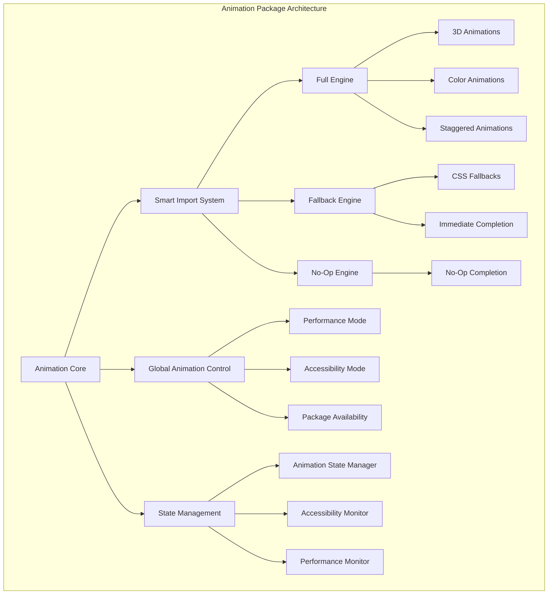

## 🚀 **Core Animation Engines**

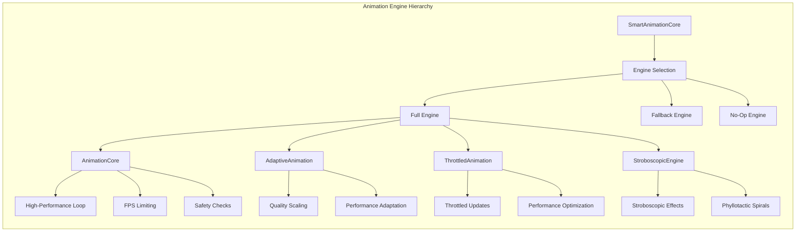

### **Engine Types**

- **SmartAnimationCore** - Intelligent engine selection based on package availability and global settings
- **AnimationCore** - High-performance animation loop with FPS limiting and safety checks
- **AdaptiveAnimation** - Quality-adaptive engine that scales based on performance metrics
- **ThrottledAnimation** - Throttled engine for performance optimization
- **StroboscopicEngine** - Advanced stroboscopic effects for phyllotactic spirals
- **NoOpAnimationEngine** - Immediate completion engine for disabled animations
- **FallbackAnimationEngine** - CSS-based fallback animations

## 🎨 **Rich Easing System**

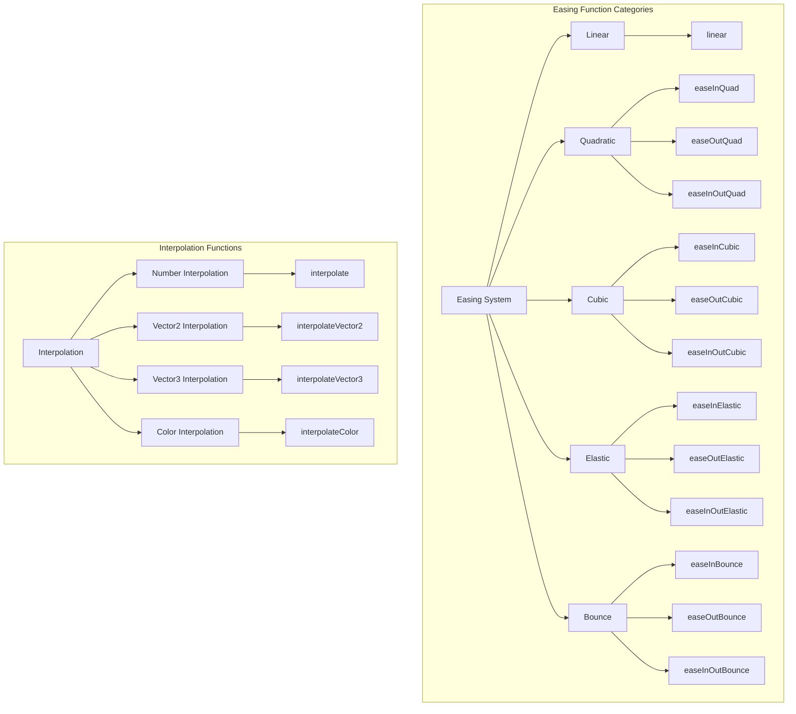

### **Easing Features**

- **12+ Easing Functions** - Linear, quadratic, cubic, elastic, and bounce variations
- **Custom Easing Creation** - Create custom easing functions from mathematical expressions
- **Vector Interpolation** - 2D and 3D vector interpolation with easing
- **Color Interpolation** - RGB color interpolation with easing support
- **Easing Combination** - Combine and reverse easing functions
- **Type Safety** - Full TypeScript support with EasingType validation

## 🎯 **SolidJS Composables**

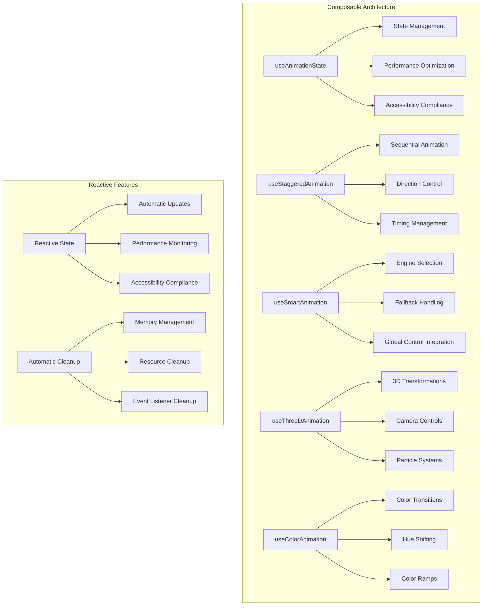

### **Composable Features**

- **useAnimationState** - Advanced animation state management with global control integration
- **useStaggeredAnimation** - Sequential animation orchestration with multiple direction options
- **useSmartAnimation** - Intelligent animation with automatic engine selection
- **useThreeDAnimation** - 3D animation support with Three.js integration
- **useColorAnimation** - Color animation system with OKLCH support
- **Reactive Controls** - Automatic state updates and cleanup
- **Performance Integration** - Built-in performance monitoring and optimization
- **Accessibility Support** - Automatic accessibility compliance checking

## 📊 **Performance Monitoring**

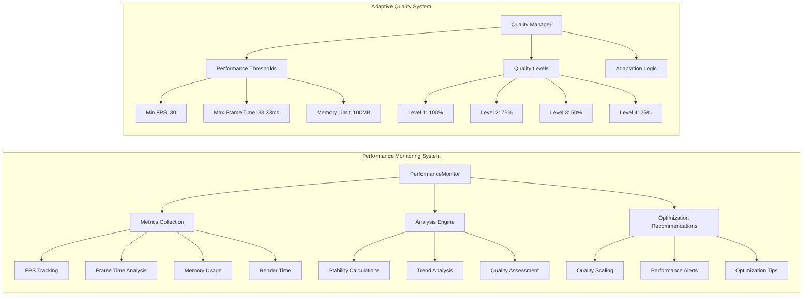

### **Performance Features**

- **Real-time FPS Tracking** - Continuous frame rate monitoring with rolling averages
- **Performance Trend Analysis** - Direction analysis (improving/degrading/stable)
- **Quality Level Recommendations** - Automatic quality scaling based on performance
- **Memory Usage Monitoring** - Real-time memory consumption tracking
- **Stability Calculations** - Coefficient of variation for performance stability
- **Adaptive Quality Scaling** - Automatic quality reduction when performance drops
- **Performance Alerts** - Configurable alerts for performance issues
- **Optimization Recommendations** - Actionable suggestions for performance improvement

## 🛠️ **Animation Utilities**

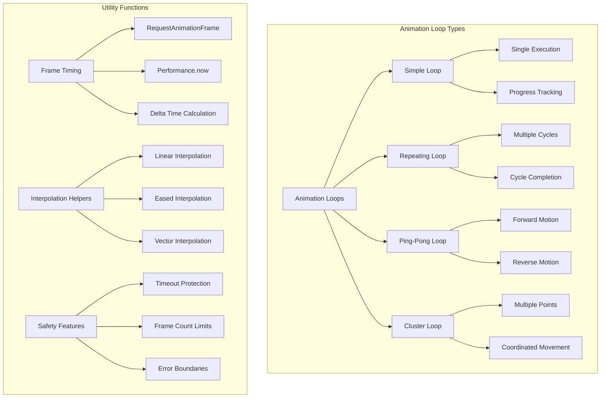

### **Utility Features**

- **Animation Loops** - Simple, repeating, ping-pong, and cluster animation loops
- **Frame Timing Utilities** - Precise timing with requestAnimationFrame and performance.now
- **Interpolation Helpers** - Linear and eased interpolation for various data types
- **Safety Features** - Timeout protection, frame count limits, and error boundaries
- **Memory Management** - Automatic cleanup and resource management
- **Error Handling** - Comprehensive error handling with graceful degradation

## 🔧 **Smart Import System**

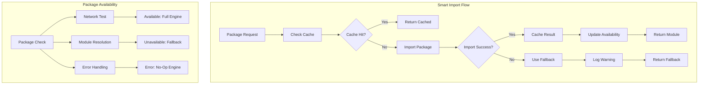

### **Smart Import Features**

- **Dynamic Import** - Runtime package loading with timeout protection
- **Caching System** - Intelligent caching of import results
- **Fallback Handling** - Graceful degradation when packages unavailable
- **Availability Detection** - Real-time package availability checking
- **Error Recovery** - Comprehensive error handling and recovery
- **Performance Optimization** - Optimized import timing and caching

## 🌐 **Global Animation Control**

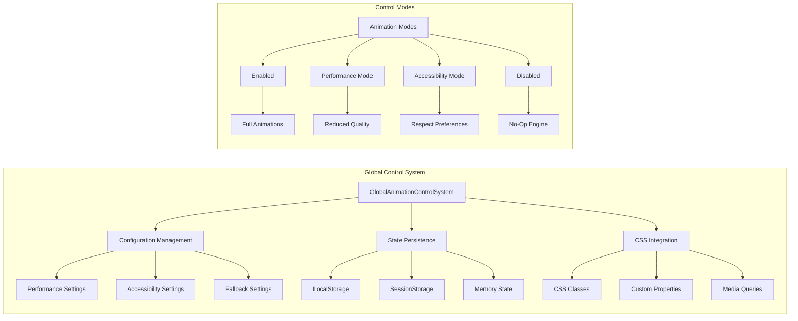

### **Global Control Features**

- **Configuration Management** - Centralized animation configuration
- **State Persistence** - Automatic state persistence across sessions
- **CSS Integration** - Automatic CSS class management
- **Performance Mode** - Global performance optimization settings
- **Accessibility Mode** - Automatic accessibility compliance
- **Package Integration** - Seamless integration with all animation packages

## 🎨 **3D Animation System**

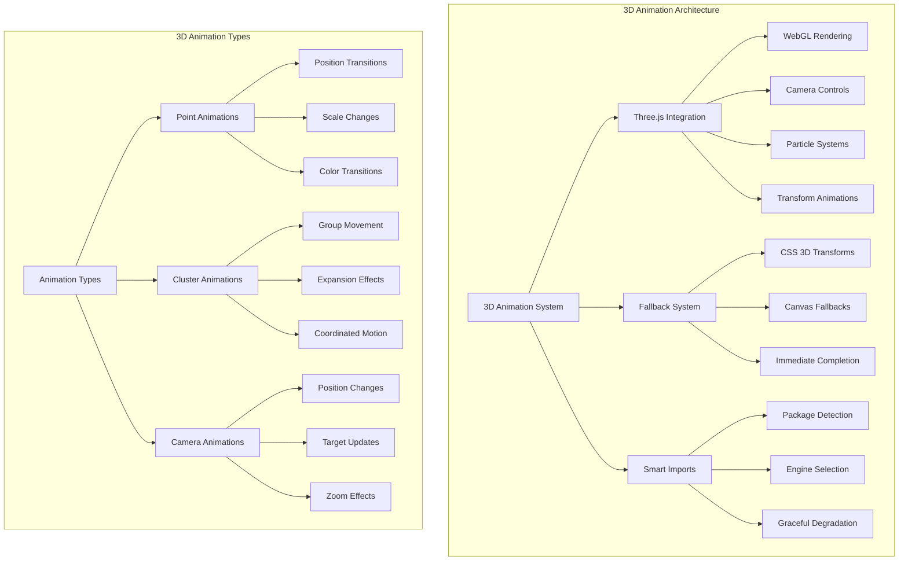

### **3D Animation Features**

- **Three.js Integration** - Full WebGL rendering with Three.js
- **Smart Fallbacks** - CSS 3D transforms when Three.js unavailable
- **Point Animations** - Individual point position, scale, and color transitions
- **Cluster Animations** - Coordinated group animations with expansion effects
- **Camera Animations** - Smooth camera position and target transitions
- **Performance Optimization** - Automatic quality scaling for 3D content
- **Accessibility Support** - Respects reduced motion preferences

## 🎨 **Color Animation System**

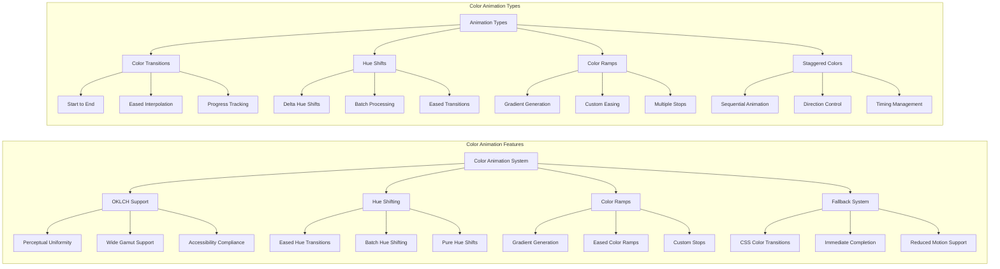

### **Color Animation Features**

- **OKLCH Support** - Perceptually uniform color space with wide gamut
- **Hue Shifting** - Smooth hue transitions with easing support
- **Color Ramps** - Generated color gradients with custom easing
- **Batch Processing** - Efficient processing of multiple color animations
- **Fallback System** - CSS color transitions when package unavailable
- **Accessibility Support** - Respects high contrast and reduced motion preferences

## Installation

```bash
pnpm add reynard-animation
```

## Quick Start

### Basic Animation with Smart Engine Selection

```typescript
import { useSmartAnimation } from "reynard-animation";

const smartAnimation = useSmartAnimation({
  config: {
    useFallback: true,
    respectGlobalControl: true,
    performanceMode: false,
    respectAccessibility: true,
    importTimeout: 5000,
    enableLogging: false,
  },
  autoInitialize: true,
});

// Animate element with automatic engine selection
await smartAnimation.animate(
  element,
  {
    transform: "scale(1.2)",
    opacity: "0.8",
  },
  {
    duration: 500,
    easing: "easeOutCubic",
  }
);
```

### Advanced Staggered Animation

```typescript
import { useStaggeredAnimation } from "reynard-animation";

const staggeredAnimation = useStaggeredAnimation({
  duration: 500,
  delay: 100,
  stagger: 50,
  easing: "easeOutCubic",
  direction: "center", // forward, reverse, center, random
  onStart: () => console.log("Animation started"),
  onComplete: () => console.log("Animation completed"),
  onItemStart: index => console.log(`Item ${index} started`),
  onItemComplete: index => console.log(`Item ${index} completed`),
});

// Start animation for 5 items
await staggeredAnimation.start(5);

// Check animation status
console.log("Is animating:", staggeredAnimation.isAnimating());
console.log("Items:", staggeredAnimation.items());
```

### 3D Animation with Fallback Support

```typescript
import { useThreeDAnimation } from "reynard-animation";

const threeDAnimation = useThreeDAnimation({
  duration: 800,
  easing: "easeOutElastic",
  useFallback: true,
  respectGlobalControl: true,
  performanceMode: false,
});

// Create cluster animation
await threeDAnimation.createClusterAnimation({
  points: embeddingPoints,
  center: [0, 0, 0],
  expansionRadius: 100,
  duration: 1000,
  easing: "easeOutCubic",
  useFallback: true,
  respectGlobalControl: true,
});

// Create point animation
await threeDAnimation.createPointAnimation({
  point: embeddingPoint,
  startPosition: [0, 0, 0],
  endPosition: [100, 100, 100],
  startSize: 5,
  endSize: 10,
  startColor: [255, 0, 0],
  endColor: [0, 255, 0],
  duration: 600,
  easing: "easeInOutCubic",
});
```

### Color Animation with OKLCH Support

```typescript
import { useColorAnimation } from "reynard-animation";

const colorAnimation = useColorAnimation({
  baseColor: { l: 0.7, c: 0.15, h: 200 },
  duration: 500,
  easing: "easeOutCubic",
  useFallback: true,
  respectGlobalControl: true,
});

// Animate to new color
await colorAnimation.animateToColor(
  { l: 0.8, c: 0.2, h: 250 },
  {
    duration: 800,
    easing: "easeInOutElastic",
    useFallback: true,
    respectGlobalControl: true,
  }
);

// Create hue shift animation
await colorAnimation.createHueShift({
  deltaH: 60,
  duration: 1000,
  easing: "easeOutBounce",
  useFallback: true,
});
```

### Performance Monitoring

```typescript
import { PerformanceMonitor } from "reynard-animation";

const monitor = new PerformanceMonitor({
  minFPS: 30,
  maxFrameTime: 33.33,
  maxMemoryUsage: 100 * 1024 * 1024,
  stabilityFrames: 60,
});

monitor.start();

// Record frame metrics
monitor.recordFrame({
  fps: 60,
  frameTime: 16.67,
  memoryUsage: 50 * 1024 * 1024,
  renderTime: 8.5,
  updateTime: 3.2,
  isStable: true,
  qualityLevel: 1,
});

// Get performance status
const status = monitor.getStatus();
console.log("Performance healthy:", status.isHealthy);
console.log("Average FPS:", status.averageFPS);
console.log("Stability:", status.stability);
console.log("Issues:", status.issues);
console.log("Recommendations:", status.recommendations);

// Get performance trend
const trend = monitor.getTrend();
console.log("Trend direction:", trend.direction);
console.log("Change percentage:", trend.change);
console.log("Confidence:", trend.confidence);
```

### Global Animation Control

```typescript
import { GlobalAnimationControlSystem } from "reynard-animation";

const globalControl = new GlobalAnimationControlSystem({
  enabled: true,
  performance: {
    enabled: false,
    maxFPS: 60,
    reducedQuality: false,
    disableComplex: false,
  },
  accessibility: {
    respectReducedMotion: true,
    respectHighContrast: true,
    respectColorScheme: true,
    highContrast: false,
  },
  fallback: {
    useCSSFallbacks: true,
    immediateCompletion: true,
    reducedMotionFallback: true,
  },
  packages: {
    useSmartImports: true,
    checkAvailability: true,
    gracefulDegradation: true,
  },
});

// Enable performance mode
globalControl.enablePerformanceMode();

// Enable accessibility mode
globalControl.enableAccessibilityMode();

// Disable animations globally
globalControl.disableAnimations();

// Check current state
console.log("Animations enabled:", globalControl.isAnimationsEnabled());
console.log("Performance mode:", globalControl.isPerformanceMode());
console.log("Accessibility mode:", globalControl.isAccessibilityMode());
```

## 📦 **Package Structure**

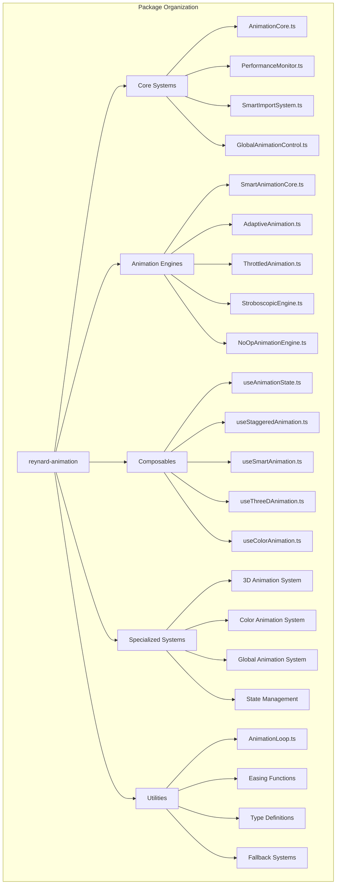

### **Directory Structure**

```
reynard-animation/
├── core/                    # Core animation systems
│   ├── AnimationCore.ts     # High-performance animation loop
│   └── PerformanceMonitor.ts # Performance monitoring and optimization
├── engines/                 # Animation engine implementations
│   ├── SmartAnimationCore.ts # Intelligent engine selection
│   ├── AdaptiveAnimation.ts  # Quality-adaptive engine
│   ├── ThrottledAnimation.ts # Performance-optimized engine
│   ├── StroboscopicEngine.ts # Advanced stroboscopic effects
│   └── NoOpAnimationEngine.ts # Immediate completion engine
├── composables/             # SolidJS composables
│   ├── useAnimationState.ts # Advanced state management
│   ├── useStaggeredAnimation.ts # Sequential animations
│   ├── useSmartAnimation.ts # Intelligent animation composable
│   ├── useThreeDAnimation.ts # 3D animation support
│   └── useColorAnimation.ts # Color animation system
├── 3d/                     # 3D animation system
│   ├── ThreeDAnimationSystem.ts # 3D animation orchestration
│   ├── ThreeDAnimationUtils.ts # 3D animation utilities
│   ├── ThreeDFallbackUtils.ts # 3D fallback implementations
│   └── useThreeDAnimation.ts # 3D animation composable
├── color/                  # Color animation system
│   ├── ColorAnimationSystem.ts # Color animation orchestration
│   ├── ColorAnimations.ts # Color animation functions
│   ├── ColorFallbackUtils.ts # Color fallback implementations
│   └── useColorAnimation.ts # Color animation composable
├── global/                 # Global animation control
│   ├── GlobalAnimationControlSystem.ts # Global control system
│   ├── GlobalAnimationConfig.ts # Configuration management
│   ├── GlobalAnimationTypes.ts # Type definitions
│   └── GlobalAnimationIntegration.ts # CSS integration
├── smart-imports/          # Smart import system
│   ├── SmartImportSystem.ts # Dynamic import with fallbacks
│   └── useSmartImport.ts # Smart import composable
├── state/                  # State management
│   ├── AnimationStateManager.ts # Advanced state management
│   └── AccessibilityComplianceMonitor.ts # Accessibility monitoring
├── easing/                 # Easing functions
│   └── easing.ts # Comprehensive easing system
├── utils/                  # Animation utilities
│   └── AnimationLoop.ts # Animation loop implementations
├── types/                  # TypeScript definitions
│   └── index.ts # Comprehensive type definitions
└── index.ts               # Main package exports
```

## 🔧 **API Reference**

### **Core Animation Engines**

#### `SmartAnimationCore`

Intelligent animation engine with automatic engine selection.

```typescript
interface SmartAnimationConfig {
  useFallback: boolean;
  respectGlobalControl: boolean;
  performanceMode: boolean;
  respectAccessibility: boolean;
  importTimeout: number;
  enableLogging: boolean;
}

const smartCore = new SmartAnimationCore({
  useFallback: true,
  respectGlobalControl: true,
  performanceMode: false,
  respectAccessibility: true,
  importTimeout: 5000,
  enableLogging: false,
});
```

#### `AnimationCore`

High-performance animation loop with FPS limiting and safety checks.

```typescript
interface AnimationConfig {
  frameRate: number;
  maxFPS: number;
  enableVSync: boolean;
  enablePerformanceMonitoring: boolean;
}

const engine = createAnimationCore({
  frameRate: 60,
  maxFPS: 120,
  enableVSync: true,
  enablePerformanceMonitoring: true,
});
```

#### `AdaptiveAnimation`

Quality-adaptive engine that scales based on performance metrics.

```typescript
const adaptiveEngine = createAdaptiveAnimationEngine({
  targetFPS: 60,
  qualityLevels: [1, 0.75, 0.5, 0.25],
  adaptationThreshold: 5,
  minFPS: 30,
  maxFrameTime: 33.33,
});
```

#### `ThrottledAnimation`

Performance-optimized engine with throttled updates.

```typescript
const throttledEngine = createThrottledAnimationEngine({
  frameRate: 60,
  maxFPS: 120,
  enableVSync: true,
  enablePerformanceMonitoring: true,
  throttleInterval: 16, // ~60fps
});
```

### **SolidJS Composables**

#### `useAnimationState`

Advanced animation state management with global control integration.

```typescript
interface UseAnimationStateOptions {
  config?: Partial<AnimationStateConfig>;
  smartAnimationCore?: SmartAnimationCore;
  autoInitialize?: boolean;
}

const animationState = useAnimationState({
  config: {
    integrateGlobalControl: true,
    enablePerformanceMode: true,
    enableAccessibilityChecks: true,
    enableImmediateCompletion: true,
    enableStatePersistence: true,
    enableLogging: false,
    debounceDelay: 100,
  },
  autoInitialize: true,
});
```

#### `useStaggeredAnimation`

Sequential animation orchestration with multiple direction options.

```typescript
interface UseStaggeredAnimationOptions {
  duration?: number;
  delay?: number;
  stagger?: number;
  easing?: EasingType;
  direction?: "forward" | "reverse" | "center" | "random";
  onStart?: () => void;
  onComplete?: () => void;
  onItemStart?: (index: number) => void;
  onItemComplete?: (index: number) => void;
}

const staggeredAnimation = useStaggeredAnimation({
  duration: 500,
  delay: 100,
  stagger: 50,
  easing: "easeOutCubic",
  direction: "center",
});
```

#### `useSmartAnimation`

Intelligent animation with automatic engine selection and fallback handling.

```typescript
interface UseSmartAnimationOptions {
  config?: Partial<SmartAnimationConfig>;
  autoInitialize?: boolean;
}

const smartAnimation = useSmartAnimation({
  config: {
    useFallback: true,
    respectGlobalControl: true,
    performanceMode: false,
    respectAccessibility: true,
    importTimeout: 5000,
    enableLogging: false,
  },
  autoInitialize: true,
});
```

#### `useThreeDAnimation`

3D animation support with Three.js integration and fallback systems.

```typescript
interface UseThreeDAnimationOptions {
  duration?: number;
  easing?: EasingType;
  useFallback?: boolean;
  respectGlobalControl?: boolean;
  performanceMode?: boolean;
}

const threeDAnimation = useThreeDAnimation({
  duration: 800,
  easing: "easeOutElastic",
  useFallback: true,
  respectGlobalControl: true,
  performanceMode: false,
});
```

#### `useColorAnimation`

Color animation system with OKLCH support and fallback implementations.

```typescript
interface UseColorAnimationOptions {
  baseColor?: OKLCHColor;
  duration?: number;
  easing?: EasingType;
  useFallback?: boolean;
  respectGlobalControl?: boolean;
}

const colorAnimation = useColorAnimation({
  baseColor: { l: 0.7, c: 0.15, h: 200 },
  duration: 500,
  easing: "easeOutCubic",
  useFallback: true,
  respectGlobalControl: true,
});
```

### **Easing System**

#### Available Easing Types

```typescript
type EasingType =
  | "linear"
  | "easeInQuad"
  | "easeOutQuad"
  | "easeInOutQuad"
  | "easeInCubic"
  | "easeOutCubic"
  | "easeInOutCubic"
  | "easeInElastic"
  | "easeOutElastic"
  | "easeInOutElastic"
  | "easeInBounce"
  | "easeOutBounce"
  | "easeInOutBounce";
```

#### Interpolation Functions

```typescript
// Number interpolation
const value = interpolate(0, 100, 0.5, "easeInOutCubic");

// 2D vector interpolation
const position2D = interpolateVector2([0, 0], [100, 100], 0.5, "easeOutCubic");

// 3D vector interpolation
const position3D = interpolateVector3([0, 0, 0], [100, 100, 100], 0.5, "easeOutElastic");

// Color interpolation
const color = interpolateColor([255, 0, 0], [0, 255, 0], 0.5, "easeInOutBounce");
```

### **Performance Monitoring**

#### `PerformanceMonitor`

Advanced performance monitoring with trend analysis and optimization recommendations.

```typescript
interface PerformanceThresholds {
  minFPS: number;
  maxFrameTime: number;
  maxMemoryUsage: number;
  stabilityFrames: number;
}

const monitor = new PerformanceMonitor({
  minFPS: 30,
  maxFrameTime: 33.33,
  maxMemoryUsage: 100 * 1024 * 1024,
  stabilityFrames: 60,
});
```

### **Global Animation Control**

#### `GlobalAnimationControlSystem`

Centralized animation control with configuration management and state persistence.

```typescript
interface GlobalAnimationConfig {
  enabled: boolean;
  performance: {
    enabled: boolean;
    maxFPS: number;
    reducedQuality: boolean;
    disableComplex: boolean;
  };
  accessibility: {
    respectReducedMotion: boolean;
    respectHighContrast: boolean;
    respectColorScheme: boolean;
    highContrast: boolean;
  };
  fallback: {
    useCSSFallbacks: boolean;
    immediateCompletion: boolean;
    reducedMotionFallback: boolean;
  };
  packages: {
    useSmartImports: boolean;
    checkAvailability: boolean;
    gracefulDegradation: boolean;
  };
}

const globalControl = new GlobalAnimationControlSystem({
  enabled: true,
  performance: {
    enabled: false,
    maxFPS: 60,
    reducedQuality: false,
    disableComplex: false,
  },
  accessibility: {
    respectReducedMotion: true,
    respectHighContrast: true,
    respectColorScheme: true,
    highContrast: false,
  },
  fallback: {
    useCSSFallbacks: true,
    immediateCompletion: true,
    reducedMotionFallback: true,
  },
  packages: {
    useSmartImports: true,
    checkAvailability: true,
    gracefulDegradation: true,
  },
});
```

## 🚀 **Performance Features**

### **Automatic Quality Scaling**

The adaptive engine automatically reduces quality when performance drops:

- **Real-time FPS Monitoring** - Continuous frame rate tracking with rolling averages
- **Quality Level Scaling** - Automatic quality reduction (100% → 75% → 50% → 25%)
- **Performance Thresholds** - Configurable thresholds for quality adaptation
- **Smooth Degradation** - Gradual quality reduction for better user experience

### **Memory Management**

- **Automatic Cleanup** - Automatic cleanup on component unmount
- **Optimized FPS Calculations** - Efficient FPS calculation with rolling averages
- **Memory Leak Prevention** - Comprehensive memory leak prevention
- **Resource Management** - Automatic resource cleanup and management

### **Error Handling**

- **Try-Catch Blocks** - Comprehensive error handling around all callbacks
- **Graceful Error Recovery** - Automatic error recovery and fallback systems
- **Performance Monitoring Integration** - Error tracking in performance metrics
- **Fallback Systems** - Multiple fallback levels for maximum reliability

## 🔄 **Migration Guide**

### **From Legacy Animation Systems**

1. **Replace Direct Engine Usage**:

   ```typescript
   // Old
   const engine = createAnimationCore(config);

   // New
   const smartAnimation = useSmartAnimation({ config });
   ```

2. **Update Composable Usage**:

   ```typescript
   // Old
   const animation = useAnimationState();

   // New
   const animation = useAnimationState({
     config: { integrateGlobalControl: true },
   });
   ```

3. **Migrate to Smart Imports**:

   ```typescript
   // Old
   import { createAnimationCore } from "reynard-animation";

   // New
   import { useSmartAnimation } from "reynard-animation";
   ```

### **Breaking Changes**

- **Engine Selection** - Now automatic via SmartAnimationCore
- **Global Control** - Automatic integration with global animation control
- **Fallback Systems** - Enhanced fallback systems with better error handling
- **Performance Monitoring** - Integrated performance monitoring by default

## 📚 **Examples**

Check the `examples/animation-demo/` directory for comprehensive usage examples:

- **Basic Animation Loops** - Simple animation examples with performance monitoring
- **Staggered Animations** - Sequential animation effects with multiple directions
- **3D Animations** - Three.js integration with fallback systems
- **Color Animations** - OKLCH color transitions with hue shifting
- **Performance Optimization** - Performance monitoring and quality scaling
- **Custom Easing Functions** - Custom easing creation and combination
- **Transformer Dance Club** - Interactive neural network visualization

## 🤝 **Contributing**

1. **Follow Code Style** - Adhere to existing code style and patterns
2. **Add Tests** - Include comprehensive tests for new features
3. **Update Documentation** - Keep documentation current and comprehensive
4. **Ensure Compatibility** - Maintain backward compatibility where possible
5. **Performance Considerations** - Consider performance impact of changes
6. **Accessibility Compliance** - Ensure accessibility compliance for all features

## 📄 **License**

MIT License - see LICENSE file for details.

---

**🦊 Built with Reynard Framework** - The unified animation system for modern web applications with intelligent fallback systems, performance optimization, and accessibility compliance.
