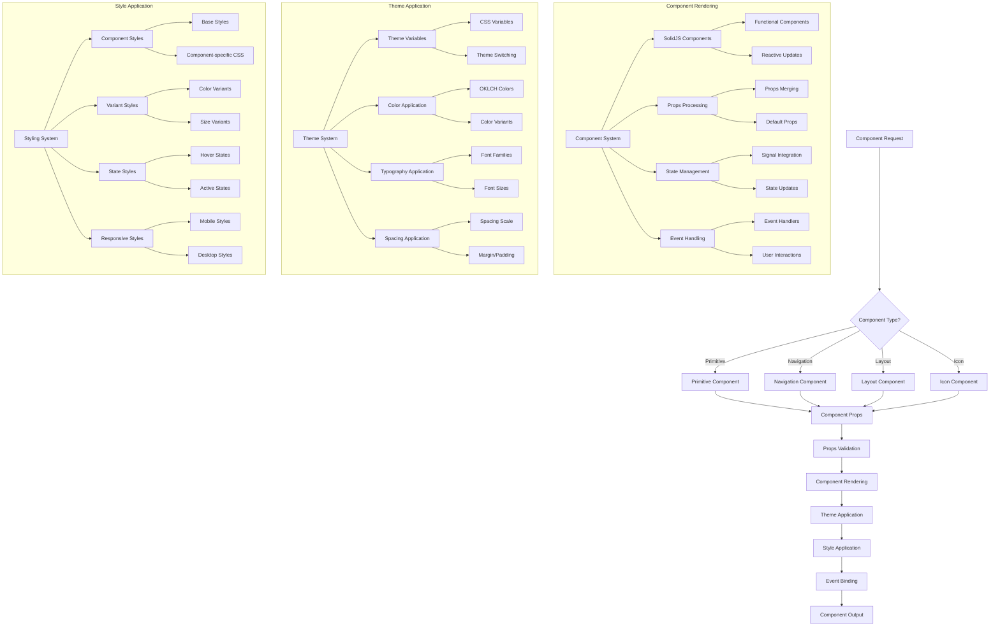
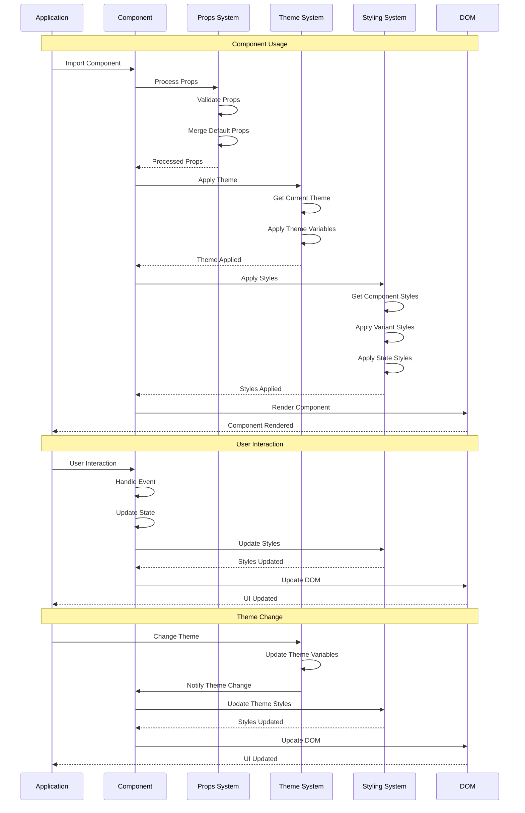

# reynard-components-core

Higher-level UI components, navigation, and layout components for Reynard. Built on top of `reynard-primitives` for fundamental UI elements.

## 🏗️ Recent Architectural Changes

**September 2025**: This package has been refactored to resolve circular dependencies:

- **✅ Moved Primitives**: Basic components (Button, Card, TextField) moved to `reynard-primitives`
- **✅ Focused Scope**: Now contains only higher-level components with dependencies
- **✅ Clean Imports**: Imports basic components from `reynard-primitives`
- **✅ Resolved Dependencies**: No more circular import issues

### Migration Guide

```typescript
// ❌ Old imports (no longer available)
import { Button, Card, TextField } from "reynard-components-core";

// ✅ New imports
import { Button, Card, TextField } from "reynard-primitives";
import { Modal, Tooltip, IconButton } from "reynard-components-core";
```

## Architecture

```mermaid
graph TB
    subgraph "🎨 Reynard Components Core System"
        A[Components Core] --> B[Primitives]
        A --> C[Navigation]
        A --> D[Layout]
        A --> E[Icons]
        A --> F[Styling System]
        A --> G[Theme Integration]

        subgraph "🧱 Higher-Level Components"
            B --> B1[IconButton]
            B --> B2[SidebarButton]
            B --> B3[Modal]
            B --> B4[Tooltip]
            B --> B5[Dropdown]
            B --> B6[Form Components]
            B --> B7[Navigation]
            B --> B8[Layout Components]
            B1 --> B1A[Multiple Variants]
            B1 --> B1B[Loading States]
            B1 --> B1C[Icon Support]
            B2 --> B2A[Status Badges]
            B2 --> B2B[Color Variants]
            B3 --> B3A[Content Cards]
            B3 --> B3B[Interactive Cards]
            B4 --> B4A[Form Controls]
            B4 --> B4B[Accessibility]
            B5 --> B5A[Icon-only Buttons]
            B5 --> B5B[Tooltip Support]
            B6 --> B6A[Dropdown Selection]
            B6 --> B6B[Search Support]
            B7 --> B7A[Sidebar Navigation]
            B7 --> B7B[Active States]
            B8 --> B8A[Range Input]
            B8 --> B8B[Value Display]
            B9 --> B9A[Tab Navigation]
            B9 --> B9B[Content Panels]
            B10 --> B10A[Text Input]
            B10 --> B10B[Validation States]
            B11 --> B11A[Toggle Switch]
            B11 --> B11B[On/Off States]
        end

        subgraph "🧭 Navigation"
            C --> C1[BreadcrumbButton]
            C --> C2[BreadcrumbActionButton]
            C1 --> C1A[Navigation Path]
            C1 --> C1B[Clickable Breadcrumbs]
            C2 --> C2A[Action Buttons]
            C2 --> C2B[Dropdown Actions]
        end

        subgraph "📐 Layout"
            D --> D1[AppHeader]
            D --> D2[AppFooter]
            D --> D3[HeroSection]
            D --> D4[GettingStarted]
            D1 --> D1A[Application Header]
            D1 --> D1B[Navigation Bar]
            D2 --> D2A[Application Footer]
            D2 --> D2B[Footer Content]
            D3 --> D3A[Hero Banner]
            D3 --> D3B[Call-to-Action]
            D4 --> D4A[Getting Started Guide]
            D4 --> D4B[Onboarding Content]
        end

        subgraph "🎯 Icons"
            E --> E1[Icon Component]
            E --> E2[Icon System]
            E --> E3[Icon Features]
            E1 --> E1A[SVG Icons]
            E1 --> E1B[Icon Registry]
            E2 --> E2A[Fluent Icons]
            E2 --> E2B[Icon Packages]
            E3 --> E3A[Multiple Sizes]
            E3 --> E3B[Color Variants]
            E3 --> E3C[Interactive States]
            E3 --> E3D[Progress Support]
            E3 --> E3E[Glow Effects]
            E3 --> E3F[Tooltip Support]
        end

        subgraph "🎨 Styling System"
            F --> F1[CSS Variables]
            F --> F2[Component Styles]
            F --> F3[Theme Variables]
            F --> F4[Responsive Design]
            F1 --> F1A[Spacing Variables]
            F1 --> F1B[Size Variables]
            F1 --> F1C[Radius Variables]
            F1 --> F1D[Shadow Variables]
            F1 --> F1E[Typography Variables]
            F1 --> F1F[Z-index Variables]
            F2 --> F2A[Component-specific Styles]
            F2 --> F2B[State Styles]
            F2 --> F2C[Variant Styles]
            F3 --> F3A[Theme Integration]
            F3 --> F3B[Color Variables]
            F4 --> F4A[Mobile-first Design]
            F4 --> F4B[Breakpoint Support]
        end

        subgraph "🌈 Theme Integration"
            G --> G1[Theme System]
            G --> G2[Color System]
            G --> G3[Typography System]
            G --> G4[Spacing System]
            G1 --> G1A[8 Built-in Themes]
            G1 --> G1B[Theme Switching]
            G2 --> G2A[OKLCH Colors]
            G2 --> G2B[Color Variants]
            G3 --> G3A[Font Families]
            G3 --> G3B[Font Sizes]
            G4 --> G4A[Spacing Scale]
            G4 --> G4B[Component Spacing]
        end

        subgraph "📦 Component Categories"
            H[Component Types] --> H1[Form Controls]
            H --> H2[Display Components]
            H --> H3[Navigation Components]
            H --> H4[Layout Components]
            H --> H5[Interactive Components]
            H1 --> H1A[Button, Checkbox, Select, TextField, Toggle, Slider]
            H2 --> H2A[Badge, Card, Icon]
            H3 --> H3A[BreadcrumbButton, SidebarButton]
            H4 --> H4A[AppHeader, AppFooter, HeroSection]
            H5 --> H5A[IconButton, Tabs, Modal]
        end

        subgraph "🔧 Component Features"
            I[Features] --> I1[Accessibility]
            I --> I2[Responsive Design]
            I --> I3[Theme Support]
            I --> I4[TypeScript Support]
            I --> I5[SolidJS Integration]
            I1 --> I1A[ARIA Attributes]
            I1 --> I1B[Keyboard Navigation]
            I1 --> I1C[Screen Reader Support]
            I2 --> I2A[Mobile Responsive]
            I2 --> I2B[Breakpoint Support]
            I3 --> I3A[Theme Variables]
            I3 --> I3B[Color Variants]
            I4 --> I4A[Type Safety]
            I4 --> I4B[IntelliSense Support]
            I5 --> I5A[Reactive Components]
            I5 --> I5B[Signal Integration]
        end

        subgraph "📚 Component Props"
            J[Props System] --> J1[Base Props]
            J --> J2[Variant Props]
            J --> J3[Size Props]
            J --> J4[State Props]
            J --> J5[Event Props]
            J1 --> J1A[HTML Attributes]
            J1 --> J1B[CSS Classes]
            J2 --> J2A[Color Variants]
            J2 --> J2B[Style Variants]
            J3 --> J3A[Size Options]
            J3 --> J3B[Responsive Sizes]
            J4 --> J4A[Loading States]
            J4 --> J4B[Disabled States]
            J5 --> J5A[Click Handlers]
            J5 --> J5B[Change Handlers]
        end
    end

    subgraph "🌐 External Dependencies"
        K[Reynard Core] --> K1[Core Utilities]
        K --> K2[Shared Types]
        L[Reynard Themes] --> L1[Theme System]
        L --> L2[Color System]
        M[Reynard Fluent Icons] --> M1[Icon Registry]
        M --> M2[Icon Components]
        N[SolidJS] --> N1[Reactive System]
        N --> N2[Component System]
    end

    A -->|Provides| O[UI Component Library]
    B -->|Offers| P[Primitive Components]
    C -->|Provides| Q[Navigation Components]
    D -->|Offers| R[Layout Components]
    E -->|Provides| S[Icon System]
    F -->|Manages| T[Component Styling]
    G -->|Integrates| U[Theme System]
```



## Component Architecture Flow



## Component Usage Flow



## Component Export Structure

```mermaid
graph TB
    subgraph "📦 Package Exports"
        A[reynard-components-core] --> B[Main Export]
        A --> C[Primitives Export]
        A --> D[Navigation Export]
        A --> E[Layout Export]
        A --> F[Icons Export]
        A --> G[Styles Export]

        subgraph "🧱 Primitives Export"
            C --> C1[Button]
            C --> C2[Badge]
            C --> C3[Card]
            C --> C4[Checkbox]
            C --> C5[IconButton]
            C --> C6[Select]
            C --> C7[SidebarButton]
            C --> C8[Slider]
            C --> C9[Tabs]
            C --> C10[TextField]
            C --> C11[Toggle]
        end

        subgraph "🧭 Navigation Export"
            D --> D1[BreadcrumbButton]
            D --> D2[BreadcrumbActionButton]
        end

        subgraph "📐 Layout Export"
            E --> E1[AppHeader]
            E --> E2[AppFooter]
            E --> E3[HeroSection]
            E --> E4[GettingStarted]
        end

        subgraph "🎯 Icons Export"
            F --> F1[Icon]
            F --> F2[Icon Props]
        end

        subgraph "🎨 Styles Export"
            G --> G1[styles.css]
            G --> G2[theme.css]
        end
    end

    subgraph "🔧 Import Examples"
        H[Import Examples] --> H1[Full Import]
        H --> H2[Selective Import]
        H --> H3[Style Import]

        H1 --> H1A[import { Button, Card } from "reynard-components-core"]
        H2 --> H2A[import { Button } from "reynard-components-core/primitives"]
        H3 --> H3A[import "reynard-components-core/styles"]
    end

    subgraph "📚 TypeScript Support"
        I[TypeScript] --> I1[Component Props]
        I --> I2[Type Exports]
        I --> I3[IntelliSense Support]

        I1 --> I1A[ButtonProps, CardProps, etc.]
        I2 --> I2A[Exported Types]
        I3 --> I3A[Auto-completion]
        I3 --> I3B[Type Checking]
    end
```

## Features

### 🧱 Primitives

- **Button**: Versatile button component with multiple variants, sizes, and states
- **Badge**: Status badges with color variants and accessibility support
- **Card**: Content cards with interactive states and theme integration
- **Checkbox**: Form control with accessibility and validation support
- **IconButton**: Icon-only buttons with tooltip and interactive features
- **Select**: Dropdown selection with search and accessibility features
- **SidebarButton**: Navigation buttons for sidebar layouts
- **Slider**: Range input with value display and accessibility
- **Tabs**: Tab navigation with content panels
- **TextField**: Text input with validation states and accessibility
- **Toggle**: Toggle switch with on/off states

### 🧭 Navigation

- **BreadcrumbButton**: Clickable breadcrumb navigation
- **BreadcrumbActionButton**: Action buttons for breadcrumb navigation

### 📐 Layout

- **AppHeader**: Application header with navigation bar
- **AppFooter**: Application footer with content
- **HeroSection**: Hero banner with call-to-action
- **GettingStarted**: Getting started guide and onboarding

### 🎯 Icons

- **Icon Component**: SVG icons with multiple sizes, colors, and interactive states
- **Icon System**: Integration with Fluent Icons and icon registry
- **Advanced Features**: Progress support, glow effects, and tooltip integration

### 🎨 Styling System

- **CSS Variables**: Comprehensive variable system for spacing, sizes, colors, and typography
- **Theme Integration**: Full integration with Reynard's 8 built-in themes
- **Responsive Design**: Mobile-first design with breakpoint support
- **Component Styles**: Component-specific styling with variant and state support

## Installation

```bash
npm install reynard-components-core
```

## Quick Start

```tsx
import { Button, Card, Badge } from "reynard-components-core";
import "reynard-components-core/styles";

function App() {
  return (
    <div>
      <Button variant="primary" size="md">
        Click me
      </Button>
      <Card>
        <h3>Card Title</h3>
        <p>Card content</p>
      </Card>
      <Badge variant="success">Success</Badge>
    </div>
  );
}
```

## TypeScript Support

Full TypeScript support with comprehensive type definitions and IntelliSense support for all components and their props.
