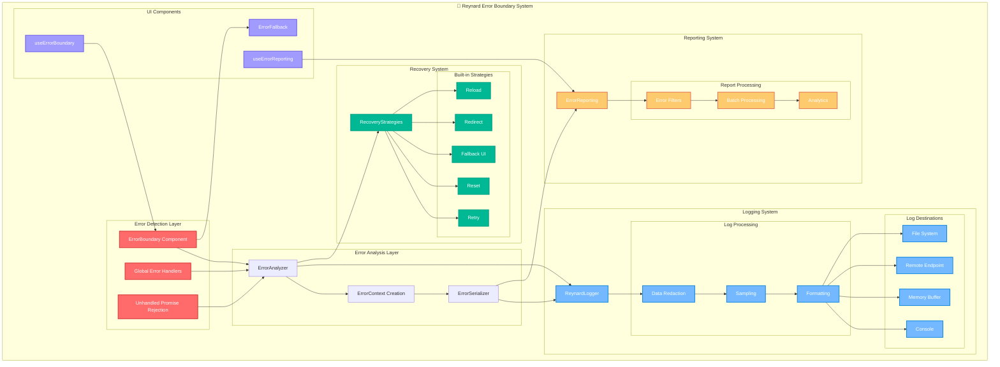
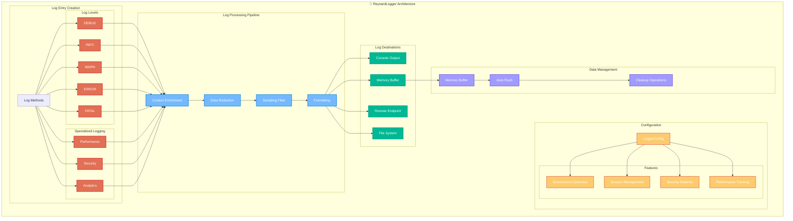
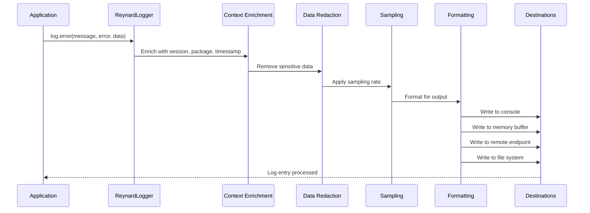
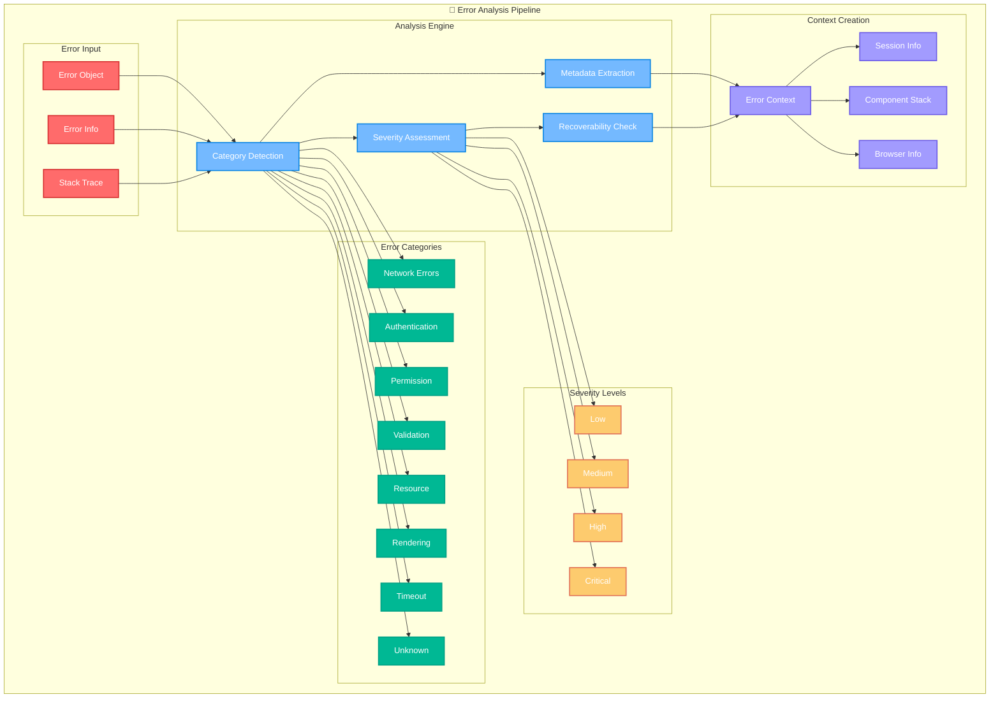
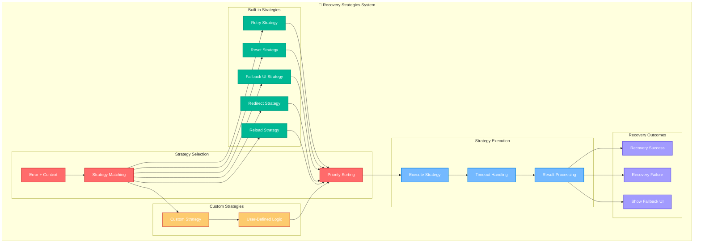
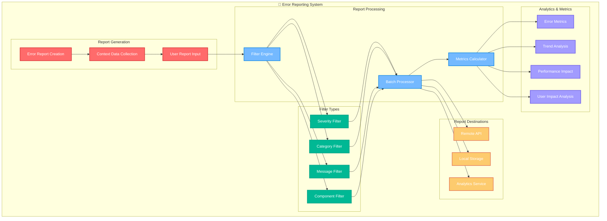
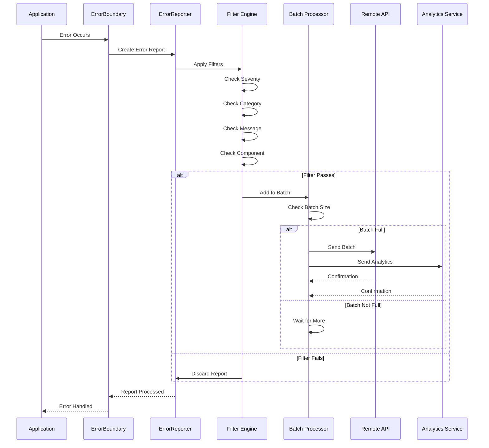

# reynard-error-boundaries

> **Comprehensive Error Boundary System for Reynard Framework** 🦊

An error boundary system that provides graceful error handling, recovery mechanisms, logging, and
comprehensive error reporting for SolidJS applications built with Reynard.

## 🏗️ System Architecture

The Reynard Error Boundary System is built on a multi-layered architecture that provides comprehensive error handling, intelligent analysis, structured logging, and automated recovery mechanisms.



## 🔍 ReynardLogger System

The ReynardLogger is a comprehensive logging system designed specifically for the Reynard ecosystem. It provides structured logging, context-aware tracking, performance monitoring, and security features.

### Logging Architecture



### Logging Flow Process



### Key Features

- **Structured Logging**: JSON-formatted log entries with consistent schema
- **Context Awareness**: Automatic package, component, and session tracking
- **Data Redaction**: Automatic removal of sensitive information (passwords, tokens, API keys)
- **Performance Monitoring**: Built-in performance metrics and memory usage tracking
- **Security Logging**: Dedicated security event logging with pattern matching
- **Analytics Integration**: User behavior and application analytics
- **Configurable Destinations**: Console, memory, remote endpoints, and file system
- **Sampling Control**: Configurable sampling rates for high-volume logging
- **Memory Management**: Automatic buffer management with configurable limits
- **Environment Detection**: Automatic development/production environment detection

## 🔬 Error Analysis & Classification

The error analysis system provides intelligent error classification, severity assessment, and recovery recommendations through a sophisticated analysis pipeline.

### Error Analysis Flow



### Error Classification Rules

```mermaid
flowchart TD
    START[Error Occurs] --> CHECK_NAME{Check Error Name}
    CHECK_NAME -->|network, fetch, timeout| NETWORK[Network Error]
    CHECK_NAME -->|auth, unauthorized, 401, 403| AUTH[Authentication Error]
    CHECK_NAME -->|permission, access denied| PERM[Permission Error]
    CHECK_NAME -->|validation, invalid, required| VAL[Validation Error]
    CHECK_NAME -->|not found, 404, file not found| RES[Resource Error]
    CHECK_NAME -->|render, component| RENDER[Rendering Error]
    CHECK_NAME -->|timeout, timed out| TIMEOUT[Timeout Error]
    CHECK_NAME -->|other| UNKNOWN[Unknown Error]

    NETWORK --> SEVERITY_CHECK{Severity Assessment}
    AUTH --> SEVERITY_CHECK
    PERM --> SEVERITY_CHECK
    VAL --> SEVERITY_CHECK
    RES --> SEVERITY_CHECK
    RENDER --> SEVERITY_CHECK
    TIMEOUT --> SEVERITY_CHECK
    UNKNOWN --> SEVERITY_CHECK

    SEVERITY_CHECK -->|Critical| CRIT[Critical Severity]
    SEVERITY_CHECK -->|High Impact| HIGH[High Severity]
    SEVERITY_CHECK -->|Medium Impact| MED[Medium Severity]
    SEVERITY_CHECK -->|Low Impact| LOW[Low Severity]

    CRIT --> RECOVER_CHECK{Recoverable?}
    HIGH --> RECOVER_CHECK
    MED --> RECOVER_CHECK
    LOW --> RECOVER_CHECK

    RECOVER_CHECK -->|Yes| RECOVERABLE[Recoverable Error]
    RECOVER_CHECK -->|No| NON_RECOVERABLE[Non-Recoverable Error]

    RECOVERABLE --> CONTEXT_CREATE[Create Error Context]
    NON_RECOVERABLE --> CONTEXT_CREATE

    CONTEXT_CREATE --> END[Error Analysis Complete]

    %% Styling
    classDef start fill:#e17055,stroke:#d63031,stroke-width:3px,color:#fff
    classDef network fill:#74b9ff,stroke:#0984e3,stroke-width:2px,color:#fff
    classDef auth fill:#ff6b6b,stroke:#d63031,stroke-width:2px,color:#fff
    classDef perm fill:#fdcb6e,stroke:#e17055,stroke-width:2px,color:#fff
    classDef val fill:#00b894,stroke:#00a085,stroke-width:2px,color:#fff
    classDef res fill:#a29bfe,stroke:#6c5ce7,stroke-width:2px,color:#fff
    classDef render fill:#fd79a8,stroke:#e84393,stroke-width:2px,color:#fff
    classDef timeout fill:#fdcb6e,stroke:#e17055,stroke-width:2px,color:#fff
    classDef unknown fill:#636e72,stroke:#2d3436,stroke-width:2px,color:#fff
    classDef severity fill:#00b894,stroke:#00a085,stroke-width:2px,color:#fff
    classDef recoverable fill:#00b894,stroke:#00a085,stroke-width:2px,color:#fff
    classDef nonRecoverable fill:#ff6b6b,stroke:#d63031,stroke-width:2px,color:#fff
    classDef end fill:#2d3436,stroke:#636e72,stroke-width:3px,color:#fff

    class START start
    class NETWORK network
    class AUTH auth
    class PERM perm
    class VAL val
    class RES res
    class RENDER render
    class TIMEOUT timeout
    class UNKNOWN unknown
    class CRIT,HIGH,MED,LOW severity
    class RECOVERABLE recoverable
    class NON_RECOVERABLE nonRecoverable
    class END end
```

## 🔄 Recovery Strategies System

The recovery system provides intelligent error recovery mechanisms with configurable strategies and priority-based execution.

### Recovery Strategy Flow



### Recovery Strategy Decision Tree

```mermaid
flowchart TD
    START[Error Occurs] --> ANALYZE[Analyze Error]
    ANALYZE --> CATEGORY{Error Category?}

    CATEGORY -->|Network| NETWORK_CHECK{Network Error?}
    CATEGORY -->|Rendering| RENDER_CHECK{Rendering Error?}
    CATEGORY -->|Resource| RESOURCE_CHECK{Resource Error?}
    CATEGORY -->|Validation| VALIDATION_CHECK{Validation Error?}
    CATEGORY -->|Authentication| AUTH_CHECK{Auth Error?}
    CATEGORY -->|Other| OTHER_CHECK{Other Error?}

    NETWORK_CHECK -->|Yes| RETRY_STRATEGY[Retry Strategy]
    NETWORK_CHECK -->|No| FALLBACK_STRATEGY[Fallback Strategy]

    RENDER_CHECK -->|Yes| RESET_STRATEGY[Reset Strategy]
    RENDER_CHECK -->|No| FALLBACK_STRATEGY

    RESOURCE_CHECK -->|Yes| RETRY_STRATEGY
    RESOURCE_CHECK -->|No| REDIRECT_STRATEGY[Redirect Strategy]

    VALIDATION_CHECK -->|Yes| RESET_STRATEGY
    VALIDATION_CHECK -->|No| FALLBACK_STRATEGY

    AUTH_CHECK -->|Yes| REDIRECT_STRATEGY
    AUTH_CHECK -->|No| RELOAD_STRATEGY[Reload Strategy]

    OTHER_CHECK -->|Yes| FALLBACK_STRATEGY
    OTHER_CHECK -->|No| RELOAD_STRATEGY

    RETRY_STRATEGY --> EXECUTE[Execute Strategy]
    RESET_STRATEGY --> EXECUTE
    FALLBACK_STRATEGY --> EXECUTE
    REDIRECT_STRATEGY --> EXECUTE
    RELOAD_STRATEGY --> EXECUTE

    EXECUTE --> SUCCESS{Success?}
    SUCCESS -->|Yes| RECOVERY_SUCCESS[Recovery Success]
    SUCCESS -->|No| NEXT_STRATEGY{More Strategies?}

    NEXT_STRATEGY -->|Yes| EXECUTE
    NEXT_STRATEGY -->|No| RECOVERY_FAILED[Recovery Failed]

    RECOVERY_SUCCESS --> END[End]
    RECOVERY_FAILED --> END

    %% Styling
    classDef start fill:#e17055,stroke:#d63031,stroke-width:3px,color:#fff
    classDef network fill:#74b9ff,stroke:#0984e3,stroke-width:2px,color:#fff
    classDef render fill:#fd79a8,stroke:#e84393,stroke-width:2px,color:#fff
    classDef resource fill:#a29bfe,stroke:#6c5ce7,stroke-width:2px,color:#fff
    classDef validation fill:#00b894,stroke:#00a085,stroke-width:2px,color:#fff
    classDef auth fill:#ff6b6b,stroke:#d63031,stroke-width:2px,color:#fff
    classDef other fill:#636e72,stroke:#2d3436,stroke-width:2px,color:#fff
    classDef strategy fill:#fdcb6e,stroke:#e17055,stroke-width:2px,color:#fff
    classDef success fill:#00b894,stroke:#00a085,stroke-width:2px,color:#fff
    classDef failure fill:#ff6b6b,stroke:#d63031,stroke-width:2px,color:#fff
    classDef end fill:#2d3436,stroke:#636e72,stroke-width:3px,color:#fff

    class START start
    class NETWORK_CHECK,NETWORK_CHECK network
    class RENDER_CHECK,RENDER_CHECK render
    class RESOURCE_CHECK,RESOURCE_CHECK resource
    class VALIDATION_CHECK,VALIDATION_CHECK validation
    class AUTH_CHECK,AUTH_CHECK auth
    class OTHER_CHECK,OTHER_CHECK other
    class RETRY_STRATEGY,RESET_STRATEGY,FALLBACK_STRATEGY,REDIRECT_STRATEGY,RELOAD_STRATEGY strategy
    class RECOVERY_SUCCESS success
    class RECOVERY_FAILED failure
    class END end
```

## 📊 Error Reporting & Analytics System

The error reporting system provides comprehensive error tracking, analytics, and monitoring capabilities with configurable filtering and batch processing.

### Error Reporting Architecture



### Error Reporting Flow



## 🔧 Technical Documentation

### ReynardLogger Implementation Details

The ReynardLogger is a singleton-based logging system designed for the Reynard ecosystem. It provides comprehensive logging capabilities with the following key features:

#### Core Architecture

```typescript
export class ReynardLogger {
  private static instance: ReynardLogger;
  private config: LoggerConfig;
  private destinations: Map<string, LogDestination> = new Map();
  private memoryBuffer: LogEntry[] = [];
  private performanceMetrics: Map<string, number> = new Map();
  private sessionId: string;
  private flushTimer?: NodeJS.Timeout;
}
```

#### Log Entry Structure

```typescript
interface LogEntry {
  level: LogLevel;
  message: string;
  context: LogContext;
  data?: unknown;
  error?: {
    name: string;
    message: string;
    stack?: string;
    cause?: unknown;
  };
  performance?: {
    duration?: number;
    memoryUsage?: number;
    cpuUsage?: number;
  };
  metadata?: Record<string, unknown>;
}
```

#### Context Enrichment

The logger automatically enriches log entries with contextual information:

```typescript
interface LogContext {
  package: string;
  component?: string;
  function?: string;
  userId?: string;
  sessionId: string;
  requestId?: string;
  correlationId?: string;
  environment: string;
  version: string;
  timestamp: number;
  [key: string]: unknown;
}
```

#### Data Redaction System

The logger includes comprehensive data redaction to protect sensitive information:

```typescript
private redactPatterns: RegExp[] = [
  /password/i,
  /token/i,
  /secret/i,
  /auth/i,
  /credential/i,
  /api[_-]?key/i,
  /private[_-]?key/i,
  /access[_-]?token/i,
  /refresh[_-]?token/i
];
```

#### Performance Monitoring

Built-in performance tracking capabilities:

```typescript
public performance(name: string, duration: number, context?: Partial<LogContext>): void {
  if (!this.config.enablePerformance) return;

  this.performanceMetrics.set(name, duration);
  this.log('INFO', `Performance: ${name}`, { duration }, context);
}
```

#### Security Logging

Dedicated security event logging:

```typescript
public security(event: string, data?: unknown, context?: Partial<LogContext>): void {
  if (!this.config.enableSecurity) return;

  this.log('WARN', `Security: ${event}`, data, context);
}
```

#### Analytics Integration

User behavior and application analytics:

```typescript
public analytics(event: string, data?: unknown, context?: Partial<LogContext>): void {
  if (!this.config.enableAnalytics) return;

  this.log('INFO', `Analytics: ${event}`, data, context);
}
```

### Error Analysis System

The error analysis system provides intelligent error classification and context creation:

#### Error Classification

```typescript
export function analyzeError(
  error: Error,
  errorInfo: any
): {
  severity: ErrorSeverity;
  category: ErrorCategory;
  recoverable: boolean;
  metadata: Record<string, unknown>;
};
```

#### Error Categories

- **NETWORK**: Network-related errors (fetch, timeout, connection)
- **AUTHENTICATION**: Authentication and authorization errors
- **PERMISSION**: Permission and access control errors
- **VALIDATION**: Input validation and format errors
- **RESOURCE**: Resource not found or unavailable errors
- **RENDERING**: Component rendering and UI errors
- **TIMEOUT**: Operation timeout errors
- **UNKNOWN**: Unclassified errors

#### Severity Levels

- **CRITICAL**: Errors that break the entire application
- **HIGH**: Errors that significantly impact functionality
- **MEDIUM**: Errors that impact some functionality
- **LOW**: Errors with minimal impact

### Recovery Strategies System

The recovery system provides intelligent error recovery with configurable strategies:

#### Built-in Strategies

1. **Retry Strategy**: For network and resource errors
2. **Reset Strategy**: For component state errors
3. **Fallback UI Strategy**: For rendering errors
4. **Redirect Strategy**: For critical errors
5. **Reload Strategy**: For application-level errors

#### Custom Strategy Creation

```typescript
const customStrategy = createRecoveryStrategy(
  "custom-retry",
  "Custom Retry",
  "Retry with custom logic",
  (error, context) => context.category === "network",
  async (error, context) => {
    // Custom recovery logic
    await customRetryLogic();
    return {
      success: true,
      action: "retry",
      message: "Custom retry successful",
    };
  },
  1 // Priority
);
```

### Error Reporting System

The error reporting system provides comprehensive error tracking and analytics:

#### Report Structure

```typescript
interface ErrorReport {
  id: string;
  timestamp: number;
  error: {
    name: string;
    message: string;
    stack?: string;
  };
  context: ErrorContext;
  userReport?: string;
  metadata: Record<string, unknown>;
}
```

#### Filter System

```typescript
interface ErrorFilter {
  type: "severity" | "category" | "message" | "component";
  value: string;
  action: "include" | "exclude";
}
```

#### Batch Processing

- Configurable batch sizes (default: 10)
- Automatic flush intervals (default: 30 seconds)
- Retry logic for failed transmissions
- Local storage fallback

### Configuration Options

#### Logger Configuration

```typescript
interface LoggerConfig {
  level: LogLevel;
  enableConsole: boolean;
  enableFile: boolean;
  enableRemote: boolean;
  enableMemory: boolean;
  enablePerformance: boolean;
  enableSecurity: boolean;
  enableAnalytics: boolean;
  package: string;
  environment: string;
  version: string;
  maxMemoryEntries: number;
  batchSize: number;
  flushInterval: number;
  remoteEndpoint?: string;
  apiKey?: string;
  redactPatterns: RegExp[];
  samplingRate: number;
}
```

#### Error Boundary Configuration

```typescript
interface ErrorBoundaryConfig {
  fallback?: Component<ErrorFallbackProps>;
  onError?: (error: Error, errorInfo: ErrorInfo) => void;
  onRecovery?: (recoveryAction: RecoveryAction) => void;
  recoveryStrategies?: RecoveryStrategy[];
  isolate?: boolean;
  reportErrors?: boolean;
  errorReporting?: ErrorReportingConfig;
}
```

### Best Practices

#### Development Configuration

```typescript
import { enableDebugLogging } from "reynard-error-boundaries";

// Enable comprehensive logging for development
enableDebugLogging("my-package");
```

#### Production Configuration

```typescript
import { enableProductionLogging } from "reynard-error-boundaries";

// Enable production-optimized logging
enableProductionLogging("my-package");
```

#### Custom Package Logger

```typescript
import { createPackageLogger } from "reynard-error-boundaries";

const logger = createPackageLogger("my-package", {
  level: "INFO",
  enableConsole: true,
  enablePerformance: true,
  enableSecurity: true,
});
```

## ✨ Features

### 🛡️ **Error Boundary System**

- **Hierarchical Error Boundaries**: Multiple levels of error isolation
- **Automatic Error Classification**: Smart categorization of errors by type and severity
- **Recovery Strategies**: Built-in and custom recovery mechanisms
- **Error Isolation**: Prevent error propagation with configurable isolation
- **Global Error Handling**: Catch unhandled errors and promise rejections

### 🔄 **Recovery System**

- **Built-in Recovery Strategies**: Retry, reset, fallback UI, redirect, reload
- **Custom Recovery Strategies**: Create your own recovery logic
- **Recovery Priority System**: Intelligent strategy selection based on error type
- **Recovery Timeout**: Prevent hanging recovery operations
- **Recovery Analytics**: Track recovery success rates

### 📊 **Error Reporting & Analytics**

- **Automatic Error Reporting**: Send errors to external services
- **Error Filtering**: Include/exclude errors based on criteria
- **Batch Reporting**: Efficient error transmission
- **Error Metrics**: Comprehensive error analytics
- **User Reports**: Allow users to provide additional context

### 🎨 **UI Components**

- **Default Error Fallback**: Beautiful, accessible error UI
- **Custom Error Fallbacks**: Use your own error display components
- **Recovery Actions**: Interactive recovery options
- **Technical Details**: Expandable error information
- **Responsive Design**: Works on all device sizes

## 📦 Installation

```bash
npm install reynard-error-boundaries reynard-core reynard-components
```

## 🚀 Quick Start

### Basic Error Boundary

```tsx
import { ErrorBoundary } from "reynard-error-boundaries";
import { ErrorFallback } from "reynard-error-boundaries";

function App() {
  return (
    <ErrorBoundary
      fallback={ErrorFallback}
      onError={(error, errorInfo) => {
        console.error("Error caught:", error, errorInfo);
      }}
    >
      <YourApp />
    </ErrorBoundary>
  );
}
```

### Error Boundary with Recovery

```tsx
import { ErrorBoundary, builtInRecoveryStrategies } from "reynard-error-boundaries";

function App() {
  return (
    <ErrorBoundary
      recoveryStrategies={builtInRecoveryStrategies}
      onRecovery={action => {
        console.log("Recovery action executed:", action);
      }}
    >
      <YourApp />
    </ErrorBoundary>
  );
}
```

### Error Boundary with Reporting

```tsx
import { ErrorBoundary } from "reynard-error-boundaries";

function App() {
  return (
    <ErrorBoundary
      reportErrors={true}
      errorReporting={{
        enabled: true,
        endpoint: "/api/errors",
        apiKey: "your-api-key",
        batchSize: 10,
        flushInterval: 30000,
      }}
    >
      <YourApp />
    </ErrorBoundary>
  );
}
```

## 📚 API Reference

### ErrorBoundary Component

```tsx
interface ErrorBoundaryConfig {
  children: JSX.Element;
  fallback?: Component<ErrorFallbackProps>;
  onError?: (error: Error, errorInfo: ErrorInfo) => void;
  onRecovery?: (recoveryAction: RecoveryAction) => void;
  recoveryStrategies?: RecoveryStrategy[];
  isolate?: boolean;
  reportErrors?: boolean;
  errorReporting?: ErrorReportingConfig;
}
```

### Recovery Strategies

```tsx
interface RecoveryStrategy {
  id: string;
  name: string;
  description: string;
  canRecover: (error: Error, context: ErrorContext) => boolean;
  recover: (error: Error, context: ErrorContext) => Promise<RecoveryResult>;
  priority: number;
  timeout?: number;
}
```

### Error Reporting

```tsx
interface ErrorReportingConfig {
  enabled: boolean;
  endpoint?: string;
  apiKey?: string;
  batchSize?: number;
  flushInterval?: number;
  includeStackTrace?: boolean;
  includeUserContext?: boolean;
  filters?: ErrorFilter[];
}
```

## 🎯 Advanced Usage

### Custom Recovery Strategy

```tsx
import { createRecoveryStrategy } from "reynard-error-boundaries";

const customStrategy = createRecoveryStrategy(
  "custom-retry",
  "Custom Retry",
  "Retry with custom logic",
  (error, context) => context.category === "network",
  async (error, context) => {
    // Custom recovery logic
    await customRetryLogic();
    return {
      success: true,
      action: "retry",
      message: "Custom retry successful",
    };
  },
  1 // Priority
);

<ErrorBoundary recoveryStrategies={[customStrategy]}>
  <YourApp />
</ErrorBoundary>;
```

### Error Reporting with Filters

```tsx
<ErrorBoundary
  reportErrors={true}
  errorReporting={{
    enabled: true,
    endpoint: "/api/errors",
    filters: [
      { type: "severity", value: "critical", action: "include" },
      { type: "category", value: "network", action: "exclude" },
    ],
  }}
>
  <YourApp />
</ErrorBoundary>
```

### Using Error Boundary Hook

```tsx
import { useErrorBoundary } from "reynard-error-boundaries";

function MyComponent() {
  const { error, handleError, retry, executeRecovery } = useErrorBoundary({
    onError: (error, context) => {
      console.log("Error occurred:", error, context);
    },
  });

  const handleAsyncOperation = async () => {
    try {
      await riskyOperation();
    } catch (error) {
      handleError(error, { componentStack: "MyComponent" });
    }
  };

  return (
    <div>
      {error() && (
        <div>
          <p>Error: {error()?.message}</p>
          <button onClick={retry}>Retry</button>
        </div>
      )}
      <button onClick={handleAsyncOperation}>Risky Operation</button>
    </div>
  );
}
```

## 🧪 Testing

```tsx
import { render, screen } from "reynard-testing";
import { ErrorBoundary } from "reynard-error-boundaries";

const ThrowError = () => {
  throw new Error("Test error");
};

test("should catch and display errors", () => {
  render(() => (
    <ErrorBoundary>
      <ThrowError />
    </ErrorBoundary>
  ));

  expect(screen.getByText("Something went wrong")).toBeInTheDocument();
});
```

## 🎨 Theming

The error boundary components integrate seamlessly with Reynard's theming system:

```css
/* Custom error fallback styles */
.reynard-error-fallback {
  --error-bg: var(--bg-color);
  --error-text: var(--text-primary);
  --error-accent: var(--accent);
}
```

## 📊 Error Analytics

```tsx
import { useErrorReporting } from "reynard-error-boundaries";

function ErrorDashboard() {
  const { getMetrics } = useErrorReporting({
    enabled: true,
    endpoint: "/api/errors",
  });

  const metrics = getMetrics();

  return (
    <div>
      <h2>Error Metrics</h2>
      <p>Total Errors: {metrics.totalReports}</p>
      <p>Average per Hour: {metrics.averageReportsPerHour}</p>
    </div>
  );
}
```

## 🔧 Configuration

### Error Classification

Errors are automatically classified by:

- **Category**: rendering, network, validation, authentication, permission, resource, timeout, unknown
- **Severity**: low, medium, high, critical
- **Recoverability**: whether the error can be automatically recovered

### Recovery Strategies

Built-in recovery strategies:

- **Retry**: For network and resource errors
- **Fallback UI**: For rendering errors
- **Reset**: For component state errors
- **Redirect**: For critical errors
- **Reload**: For application-level errors

## 🤝 Contributing

See the main [Reynard repository](../../../README.md) for contribution guidelines.

---

**Built with ❤️ using SolidJS and the Reynard framework** 🦊
