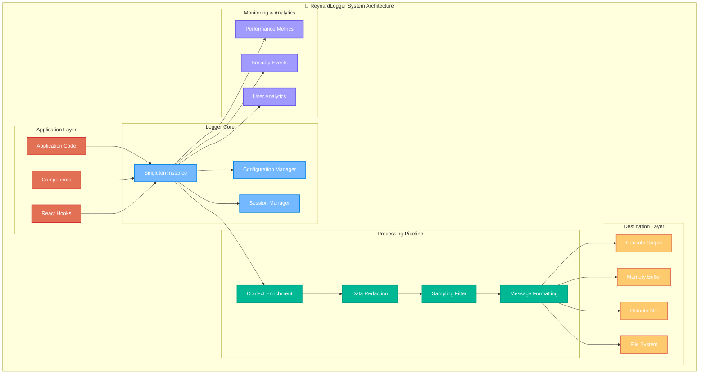
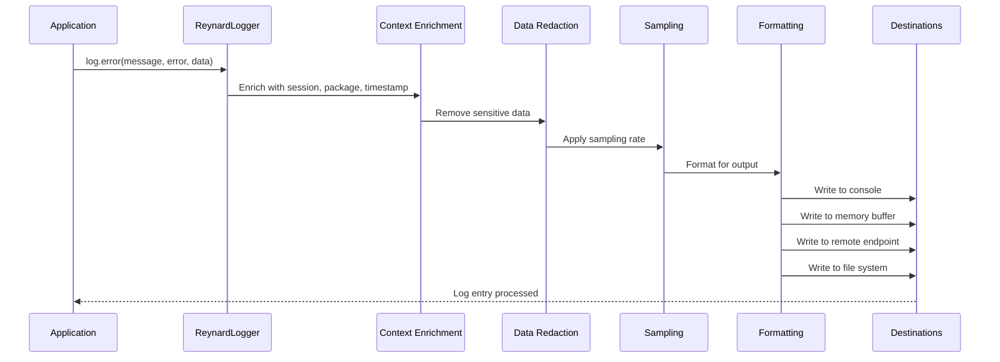
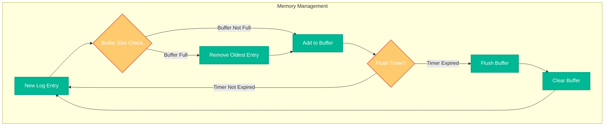

# ReynardLogger Technical Documentation

> **Comprehensive Technical Guide for the Reynard Logging System** 🦊

This document provides detailed technical information about the ReynardLogger system, its architecture, implementation details, and advanced usage patterns.

## Table of Contents

1. [System Architecture](#system-architecture)
2. [Core Components](#core-components)
3. [Data Flow](#data-flow)
4. [Configuration Management](#configuration-management)
5. [Performance Considerations](#performance-considerations)
6. [Security Features](#security-features)
7. [Integration Patterns](#integration-patterns)
8. [Troubleshooting](#troubleshooting)

## System Architecture

### High-Level Architecture



## Core Components

### 1. ReynardLogger Class

The main logger class implements the singleton pattern to ensure consistent logging across the application.

```typescript
export class ReynardLogger {
  private static instance: ReynardLogger;
  private config: LoggerConfig;
  private destinations: Map<string, LogDestination> = new Map();
  private memoryBuffer: LogEntry[] = [];
  private performanceMetrics: Map<string, number> = new Map();
  private sessionId: string;
  private flushTimer?: NodeJS.Timeout;

  private constructor() {
    this.sessionId = this.generateSessionId();
    this.config = this.getDefaultConfig();
    this.initializeDestinations();
    this.startFlushTimer();
  }

  public static getInstance(): ReynardLogger {
    if (!ReynardLogger.instance) {
      ReynardLogger.instance = new ReynardLogger();
    }
    return ReynardLogger.instance;
  }
}
```

### 2. Log Entry Structure

Each log entry follows a consistent structure for easy parsing and analysis:

```typescript
interface LogEntry {
  level: LogLevel;
  message: string;
  context: LogContext;
  data?: unknown;
  error?: {
    name: string;
    message: string;
    stack?: string;
    cause?: unknown;
  };
  performance?: {
    duration?: number;
    memoryUsage?: number;
    cpuUsage?: number;
  };
  metadata?: Record<string, unknown>;
}
```

### 3. Context Enrichment

The logger automatically enriches log entries with contextual information:

```typescript
interface LogContext {
  package: string;
  component?: string;
  function?: string;
  userId?: string;
  sessionId: string;
  requestId?: string;
  correlationId?: string;
  environment: string;
  version: string;
  timestamp: number;
  [key: string]: unknown;
}
```

## Data Flow

### Logging Process Flow



### Memory Management Flow



## Configuration Management

### Default Configuration

```typescript
private getDefaultConfig(): LoggerConfig {
  return {
    level: 'WARN',
    enableConsole: false,
    enableFile: false,
    enableRemote: false,
    enableMemory: true,
    enablePerformance: false,
    enableSecurity: true,
    enableAnalytics: false,
    package: 'unknown',
    environment: this.detectEnvironment(),
    version: '1.0.0',
    maxMemoryEntries: 1000,
    batchSize: 10,
    flushInterval: 30000,
    redactPatterns: [
      /password/i,
      /token/i,
      /secret/i,
      /auth/i,
      /credential/i,
      /api[_-]?key/i,
      /private[_-]?key/i,
      /access[_-]?token/i,
      /refresh[_-]?token/i
    ],
    samplingRate: 1.0
  };
}
```

### Environment Detection

```typescript
private detectEnvironment(): string {
  if (typeof window !== 'undefined' && window.location) {
    return window.location.hostname === 'localhost' ? 'development' : 'production';
  }
  return process.env.NODE_ENV || 'development';
}
```

### Configuration Updates

```typescript
public configure(config: Partial<LoggerConfig>): void {
  this.config = { ...this.config, ...config };
  this.initializeDestinations();
}
```

## Performance Considerations

### Memory Management

The logger implements several memory management strategies:

1. **Circular Buffer**: Fixed-size memory buffer with automatic old entry removal
2. **Batch Processing**: Configurable batch sizes for remote logging
3. **Sampling**: Configurable sampling rates to reduce log volume
4. **Lazy Initialization**: Destinations are only initialized when needed

### Performance Monitoring

```typescript
public performance(name: string, duration: number, context?: Partial<LogContext>): void {
  if (!this.config.enablePerformance) return;

  this.performanceMetrics.set(name, duration);
  this.log('INFO', `Performance: ${name}`, { duration }, context);
}
```

### Memory Usage Tracking

```typescript
private getMemoryUsage(): number {
  if (typeof performance !== 'undefined' && 'memory' in performance) {
    return (performance as any).memory.usedJSHeapSize;
  }
  return 0;
}
```

## Security Features

### Data Redaction

The logger automatically redacts sensitive information using configurable patterns:

```typescript
private redactSensitiveData(data: unknown): unknown {
  if (!data || typeof data !== 'object') return data;

  const redacted = JSON.parse(JSON.stringify(data));
  this.redactObject(redacted);
  return redacted;
}

private redactObject(obj: any): void {
  if (typeof obj !== 'object' || obj === null) return;

  for (const key in obj) {
    if (this.config.redactPatterns.some(pattern => pattern.test(key))) {
      obj[key] = '[REDACTED]';
    } else if (typeof obj[key] === 'object' && obj[key] !== null) {
      this.redactObject(obj[key]);
    }
  }
}
```

### Security Event Logging

```typescript
public security(event: string, data?: unknown, context?: Partial<LogContext>): void {
  if (!this.config.enableSecurity) return;

  this.log('WARN', `Security: ${event}`, data, context);
}
```

### API Key Protection

```typescript
// API keys are automatically redacted in log entries
logger.info("API request", {
  endpoint: "/api/users",
  apiKey: "sk-1234567890abcdef", // This will be redacted
});
```

## Integration Patterns

### Package-Specific Loggers

```typescript
import { createPackageLogger } from "reynard-error-boundaries";

const logger = createPackageLogger("my-package", {
  level: "INFO",
  enableConsole: true,
  enablePerformance: true,
  enableSecurity: true,
});
```

### Development vs Production

```typescript
// Development configuration
import { enableDebugLogging } from "reynard-error-boundaries";
enableDebugLogging("my-package");

// Production configuration
import { enableProductionLogging } from "reynard-error-boundaries";
enableProductionLogging("my-package");
```

### Custom Destinations

```typescript
logger.addDestination({
  name: "custom-destination",
  enabled: true,
  write: async entry => {
    // Custom logging logic
    await customLoggingService.send(entry);
  },
  flush: async () => {
    // Custom flush logic
    await customLoggingService.flush();
  },
});
```

## Troubleshooting

### Common Issues

#### 1. Memory Buffer Overflow

**Symptoms**: High memory usage, slow performance
**Solution**: Reduce `maxMemoryEntries` or increase `flushInterval`

```typescript
logger.configure({
  maxMemoryEntries: 500,
  flushInterval: 15000,
});
```

#### 2. Remote Logging Failures

**Symptoms**: Logs not appearing in remote service
**Solution**: Check network connectivity and API key

```typescript
logger.configure({
  enableRemote: true,
  remoteEndpoint: "https://your-logging-service.com/api/logs",
  apiKey: "your-api-key",
});
```

#### 3. Performance Impact

**Symptoms**: Application slowdown
**Solution**: Enable sampling and reduce log level

```typescript
logger.configure({
  level: "ERROR",
  samplingRate: 0.1, // Only log 10% of entries
});
```

### Debug Mode

Enable debug mode for troubleshooting:

```typescript
import { enableDebugLogging } from "reynard-error-boundaries";

enableDebugLogging("troubleshooting");
```

### Log Analysis

Access memory logs for analysis:

```typescript
const memoryLogs = logger.getMemoryLogs();
console.log("Recent logs:", memoryLogs);
```

### Performance Metrics

Monitor performance impact:

```typescript
const metrics = logger.getPerformanceMetrics();
console.log("Performance metrics:", metrics);
```

## Advanced Usage

### Custom Log Levels

```typescript
// Extend the logger with custom levels
class CustomLogger extends ReynardLogger {
  public trace(message: string, data?: unknown, context?: Partial<LogContext>): void {
    this.log("DEBUG", `TRACE: ${message}`, data, context);
  }
}
```

### Correlation ID Tracking

```typescript
// Set correlation ID for request tracking
logger.info("Processing request", data, {
  correlationId: "req-12345",
  requestId: "req-67890",
});
```

### Batch Processing

```typescript
// Manual batch processing
await logger.flush();

// Custom batch size
logger.configure({ batchSize: 50 });
```

### Error Context Enrichment

```typescript
// Enrich error logs with additional context
logger.error("Database error", error, {
  query: "SELECT * FROM users",
  connectionId: "conn-123",
  retryCount: 3,
});
```

---

**Built with ❤️ using TypeScript and the Reynard framework** 🦊
