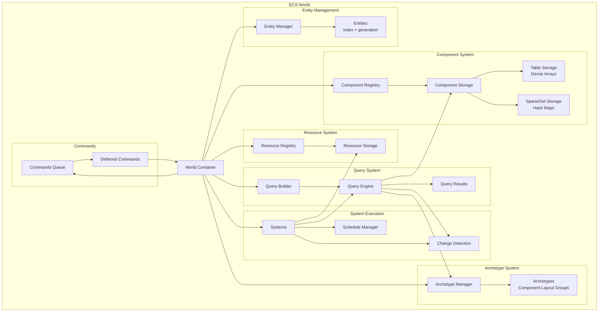
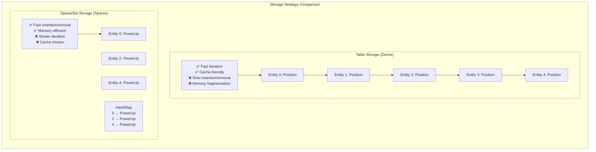
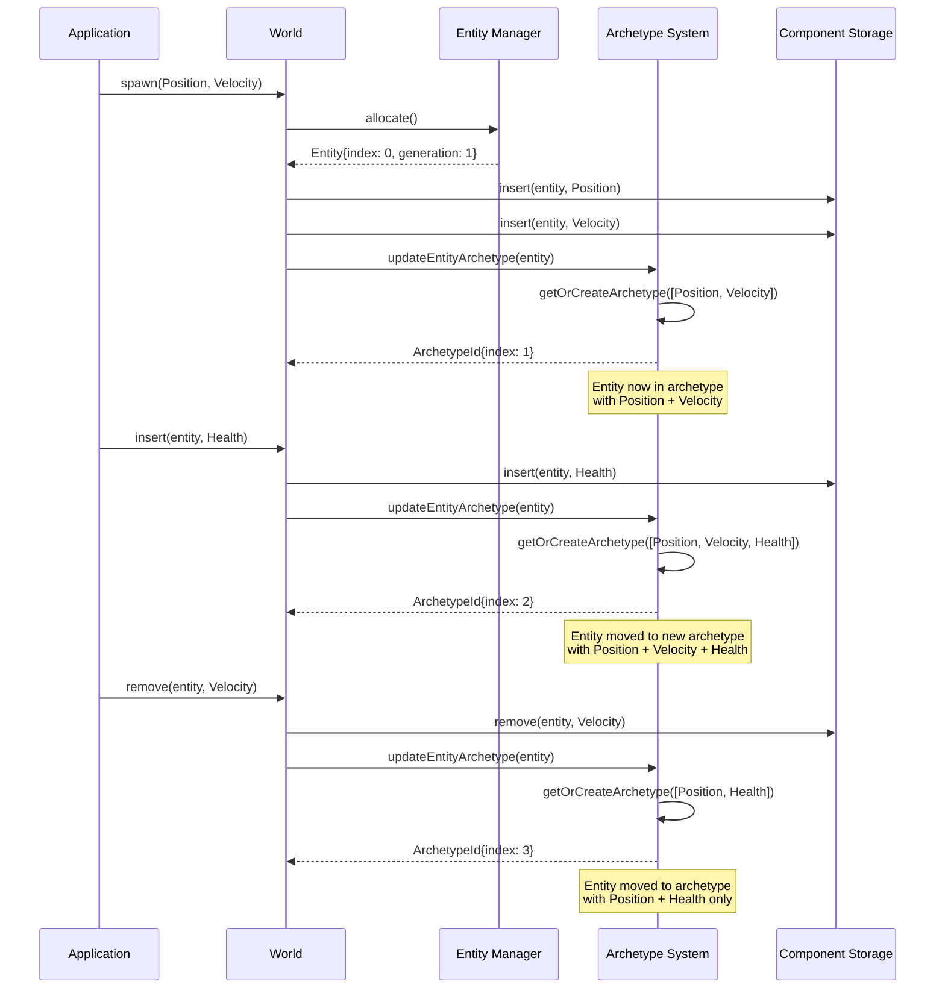
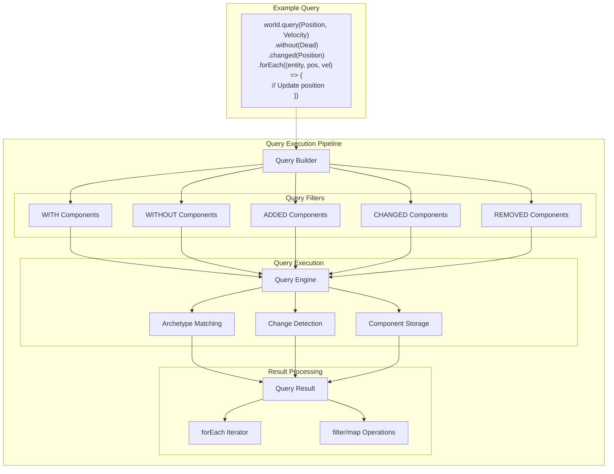
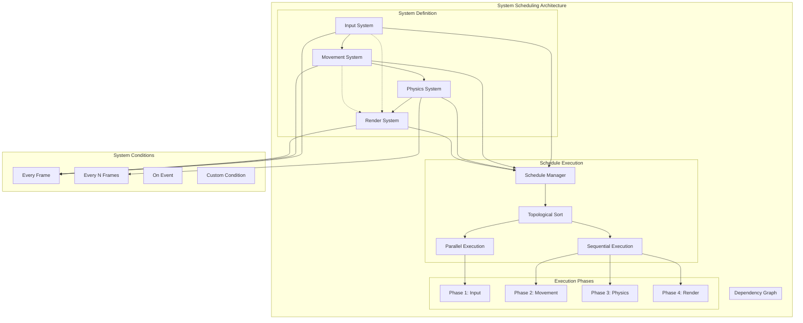
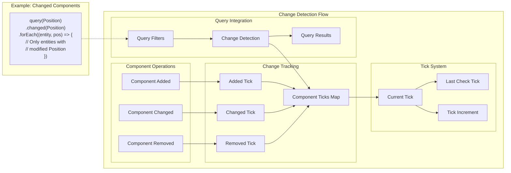
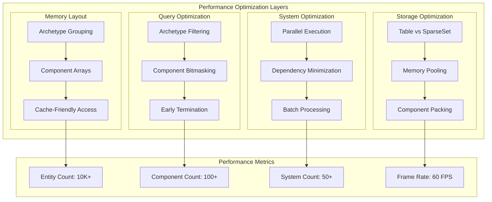
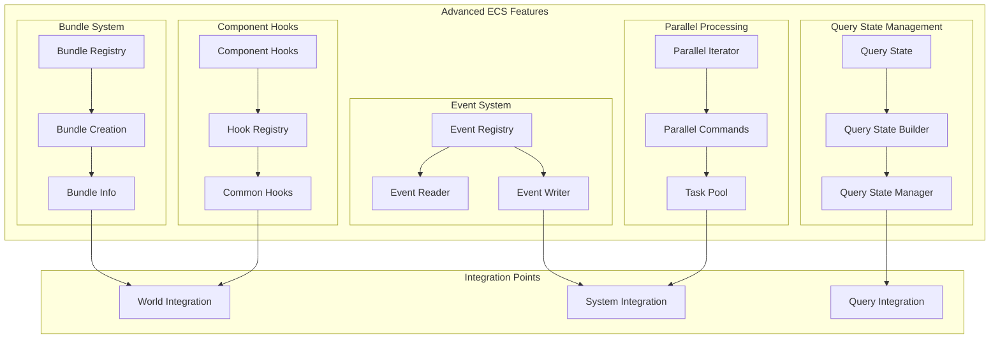

# Reynard ECS System

A complete Entity-Component-System (ECS) implementation for TypeScript,
inspired by Bevy ECS architecture. This system provides high-performance, type-safe entity management for games and
simulations.

## Features

- **Entity Management**: Generational indexing prevents use-after-free bugs
- **Component System**: Flexible component storage with Table and SparseSet strategies
- **Resource System**: Global singleton data management
- **Query System**: Type-safe component access with filtering
- **System Scheduling**: Dependency-based system execution
- **Change Detection**: Track component modifications
- **Commands**: Deferred world modifications

## Core Concepts

### Entities

Lightweight identifiers that group components together. Entities use generational indexing to prevent bugs when
reusing entity IDs.

```typescript
import { createEntity, entityToString } from "./ecs";

const entity = createEntity(0, 1);
console.log(entityToString(entity)); // "0v1"
```

### Components

Data containers that can be attached to entities. Components implement the `Component` interface.

```typescript
import { Component } from "./ecs";

class Position implements Component {
  readonly __component = true;
  constructor(
    public x: number,
    public y: number
  ) {}
}

class Velocity implements Component {
  readonly __component = true;
  constructor(
    public x: number,
    public y: number
  ) {}
}
```

### Resources

Global singleton data accessible to all systems. Resources implement the `Resource` interface.

```typescript
import { Resource } from "./ecs";

class GameTime implements Resource {
  readonly __resource = true;
  constructor(
    public deltaTime: number,
    public totalTime: number
  ) {}
}
```

### Systems

Functions that operate on components and resources. Systems are the behavior layer of the ECS.

```typescript
import { World } from "./ecs";

function movementSystem(world: World): void {
  const gameTime = world.getResource(GameTime);
  if (!gameTime) return;

  const query = world.query(Position, Velocity);
  query.forEach((entity, position, velocity) => {
    position.x += velocity.x * gameTime.deltaTime;
    position.y += velocity.y * gameTime.deltaTime;
  });
}
```

## Usage

### Basic Setup

```typescript
import { createWorld, ComponentType, ResourceType, StorageType, system, schedule } from "./ecs";

// Create world
const world = createWorld();

// Register component types
const registry = world.getComponentRegistry();
const positionType = registry.register("Position", StorageType.Table, () => new Position(0, 0));
const velocityType = registry.register("Velocity", StorageType.Table, () => new Velocity(0, 0));

// Register resource types
const resourceRegistry = world.getResourceRegistry();
const gameTimeType = resourceRegistry.register("GameTime", () => new GameTime(0, 0));

// Add systems
world.addSystem(system("movement", movementSystem).build());

// Create entities
const player = world.spawn(new Position(100, 100), new Velocity(50, 0));

// Add resources
world.insertResource(new GameTime(0.016, 0));

// Run systems
world.runSystem("movement");
```

### Advanced Features

#### Query Filtering

```typescript
import { QueryFilter } from "./ecs";

// Query entities with Position but without Velocity
const filter: QueryFilter = {
  with: [positionType],
  without: [velocityType],
};

const query = world.queryFiltered([positionType], filter);
```

#### System Dependencies

```typescript
// Create systems with dependencies
const movementSystem = system("movement", movementSystemFn).after("input").build();

const inputSystem = system("input", inputSystemFn).build();

// Systems will run in order: input -> movement
```

#### Commands for Deferred Operations

```typescript
function spawnBulletSystem(world: World): void {
  const commands = world.commands();

  // Deferred operations
  commands.spawn(new Position(100, 100), new Velocity(0, -300), new Bullet(300));

  // Commands are applied at the end of the system
}
```

## Storage Strategies

### Table Storage (Dense)

- Optimized for iteration
- Components stored in contiguous arrays
- Best for frequently accessed components

```typescript
const positionType = registry.register("Position", StorageType.Table, () => new Position(0, 0));
```

### SparseSet Storage (Sparse)

- Optimized for insertion/removal
- Components stored in hash maps
- Best for optional components

```typescript
const powerUpType = registry.register("PowerUp", StorageType.SparseSet, () => new PowerUp());
```

## Performance Considerations

1. **Use Table storage** for components that are frequently iterated
2. **Use SparseSet storage** for optional components
3. **Minimize system dependencies** to enable parallel execution
4. **Use queries efficiently** - avoid creating queries in hot paths
5. **Batch operations** using commands when possible

## Examples

See the `examples/` directory for complete game implementations:

- **Basic Game**: Simple player movement and enemy AI
- **Shooting Game**: Bullet physics and collision detection
- **Component Examples**: Various component patterns
- **System Examples**: Different system architectures

## API Reference

### Core Types

- `Entity`: Lightweight entity identifier
- `Component`: Base interface for all components
- `Resource`: Base interface for all resources
- `World`: Main ECS container
- `System`: Behavior functions
- `Query`: Component access patterns

### Storage Types

- `StorageType.Table`: Dense storage for frequent access
- `StorageType.SparseSet`: Sparse storage for optional components

### Query Filters

- `with`: Entities must have these components
- `without`: Entities must not have these components
- `added`: Entities that had these components added this frame
- `changed`: Entities that had these components changed this frame

## Architecture Diagrams

### High-Level ECS Architecture



### Component Storage Strategies



### Entity Lifecycle and Archetype Management



### Query System and Filtering



### System Execution and Scheduling



### Change Detection System



### Performance Optimization Strategies



### Advanced Features Integration



## Integration with Reynard

This ECS system is designed to integrate seamlessly with the Reynard framework:

- **SolidJS Integration**: Systems can be used in SolidJS components
- **Type Safety**: Full TypeScript support with strict typing
- **Performance**: Optimized for 60fps game loops
- **Modularity**: Can be used independently or as part of larger applications

## License

Part of the Reynard framework. See main project license for details.
