# 🧱 Reynard Primitives

**Dependency-free fundamental UI components for the Reynard ecosystem**

[](https://www.npmjs.com/package/reynard-primitives)
[](https://opensource.org/licenses/MIT)
[](http://www.typescriptlang.org/)

## Overview

`reynard-primitives` is a **dependency-free** package containing the fundamental UI building blocks for the Reynard ecosystem. Created to resolve circular dependencies and provide a stable foundation for all UI components.

## 🎯 Purpose

This package serves as the **foundation layer** in the Reynard UI architecture:

```mermaid
graph TB
    subgraph "🏗️ Reynard UI Architecture"
        PRIMITIVES[reynard-primitives<br/>🧱 Foundation Layer]
        COMPONENTS[reynard-components-core<br/>🎯 Higher-Level Components]
        CHARTS[reynard-charts<br/>📊 Data Visualization]
        APPS[Applications<br/>🚀 End Products]

        PRIMITIVES --> COMPONENTS
        PRIMITIVES --> CHARTS
        COMPONENTS --> APPS
        CHARTS --> APPS
    end

    classDef foundation fill:#e8f5e8,stroke:#1b5e20,stroke-width:3px
    classDef components fill:#fff3e0,stroke:#e65100,stroke-width:2px
    classDef apps fill:#f3e5f5,stroke:#4a148c,stroke-width:2px

    class PRIMITIVES foundation
    class COMPONENTS,CHARTS components
    class APPS apps
```



## ✨ Features

- **🚫 Zero Dependencies**: Only depends on `solid-js` (peer dependency)
- **🎨 Self-Contained Styling**: Includes all necessary CSS without external dependencies
- **📦 Tree-Shakable**: Import only what you need
- **🔧 TypeScript**: Full type safety and IntelliSense support
- **🎯 Focused**: Contains only truly primitive, reusable components

## 📦 Components

### Basic Components

- **`Button`** - Fundamental button component with variants
- **`Card`** - Container component for content grouping
- **`TextField`** - Basic text input component
- **`Text`** - Typography component for text rendering
- **`Container`** - Layout container component
- **`Flex`** - Flexbox layout component
- **`Grid`** - Grid layout component

### Form Components

- **`Input`** - Generic input component
- **`Label`** - Form label component
- **`Fieldset`** - Form fieldset component

## 🚀 Installation

```bash
# Install the package
pnpm add reynard-primitives

# Install peer dependencies
pnpm add solid-js
```

## 📖 Usage

### Basic Import

```typescript
import { Button, Card, TextField } from "reynard-primitives";
```

### Example Usage

```tsx
import { Button, Card, TextField, Text } from "reynard-primitives";

function MyComponent() {
  return (
    <Card>
      <Text size="lg" weight="bold">
        Welcome to Reynard
      </Text>
      <TextField placeholder="Enter your name" />
      <Button variant="primary" size="md">
        Submit
      </Button>
    </Card>
  );
}
```

## 🎨 Styling

The package includes self-contained CSS that provides:

- **CSS Variables**: Consistent design tokens
- **Component Styles**: Base styling for all components
- **Responsive Design**: Mobile-first responsive utilities
- **Accessibility**: Focus states and ARIA support

### CSS Variables

```css
:root {
  --reynard-color-primary: #007acc;
  --reynard-color-secondary: #6c757d;
  --reynard-color-success: #28a745;
  --reynard-color-danger: #dc3545;
  --reynard-color-warning: #ffc107;
  --reynard-color-info: #17a2b8;

  --reynard-spacing-xs: 0.25rem;
  --reynard-spacing-sm: 0.5rem;
  --reynard-spacing-md: 1rem;
  --reynard-spacing-lg: 1.5rem;
  --reynard-spacing-xl: 2rem;

  --reynard-border-radius: 0.375rem;
  --reynard-shadow: 0 1px 3px rgba(0, 0, 0, 0.1);
}
```

## 🏗️ Architecture

### Design Principles

1. **Dependency-Free**: No external dependencies except SolidJS
2. **Composable**: Components can be combined to create complex UIs
3. **Consistent**: Unified API and styling across all components
4. **Accessible**: Built with accessibility in mind
5. **Performant**: Optimized for minimal bundle size

### Component Structure

```
src/
├── components/          # Component implementations
│   ├── Button/
│   ├── Card/
│   ├── TextField/
│   └── ...
├── styles/             # Styling
│   ├── variables.css   # CSS custom properties
│   ├── components.css  # Component styles
│   └── utilities.css   # Utility classes
├── types/              # TypeScript definitions
└── index.ts           # Main export file
```

## 🔄 Migration Guide

### From `reynard-components-core`

If you were previously importing primitives from `reynard-components-core`:

```typescript
// ❌ Old way
import { Button, Card } from "reynard-components-core";

// ✅ New way
import { Button, Card } from "reynard-primitives";
```

### Update Package Dependencies

```json
{
  "dependencies": {
    "reynard-primitives": "^0.1.0"
  }
}
```

## 🧪 Development

### Building

```bash
# Build the package
pnpm run build

# Build with type declarations
pnpm run build:types

# Watch mode for development
pnpm run dev
```

### Testing

```bash
# Run tests
pnpm run test

# Run tests in watch mode
pnpm run test:watch
```

## 📋 API Reference

### Button

```typescript
interface ButtonProps {
  variant?: "primary" | "secondary" | "danger" | "success";
  size?: "sm" | "md" | "lg";
  disabled?: boolean;
  onClick?: () => void;
  children: JSX.Element;
}
```

### Card

```typescript
interface CardProps {
  padding?: "sm" | "md" | "lg";
  shadow?: boolean;
  children: JSX.Element;
}
```

### TextField

```typescript
interface TextFieldProps {
  placeholder?: string;
  value?: string;
  onChange?: (value: string) => void;
  disabled?: boolean;
  type?: "text" | "email" | "password";
}
```

## 🤝 Contributing

1. **Fork** the repository
2. **Create** a feature branch
3. **Make** your changes
4. **Test** thoroughly
5. **Submit** a pull request

### Guidelines

- Keep components **simple** and **focused**
- Maintain **zero dependencies** (except SolidJS)
- Follow **TypeScript** best practices
- Include **comprehensive tests**
- Update **documentation** for new features

## 📄 License

MIT License - see [LICENSE](../../LICENSE) for details.

## 🔗 Related Packages

- **`reynard-components-core`** - Higher-level components built on primitives
- **`reynard-themes`** - Theming system for styling
- **`reynard-fluent-icons`** - Icon library
- **`reynard-charts`** - Data visualization components

---

**🦊 Built with the cunning precision of the Reynard ecosystem**
