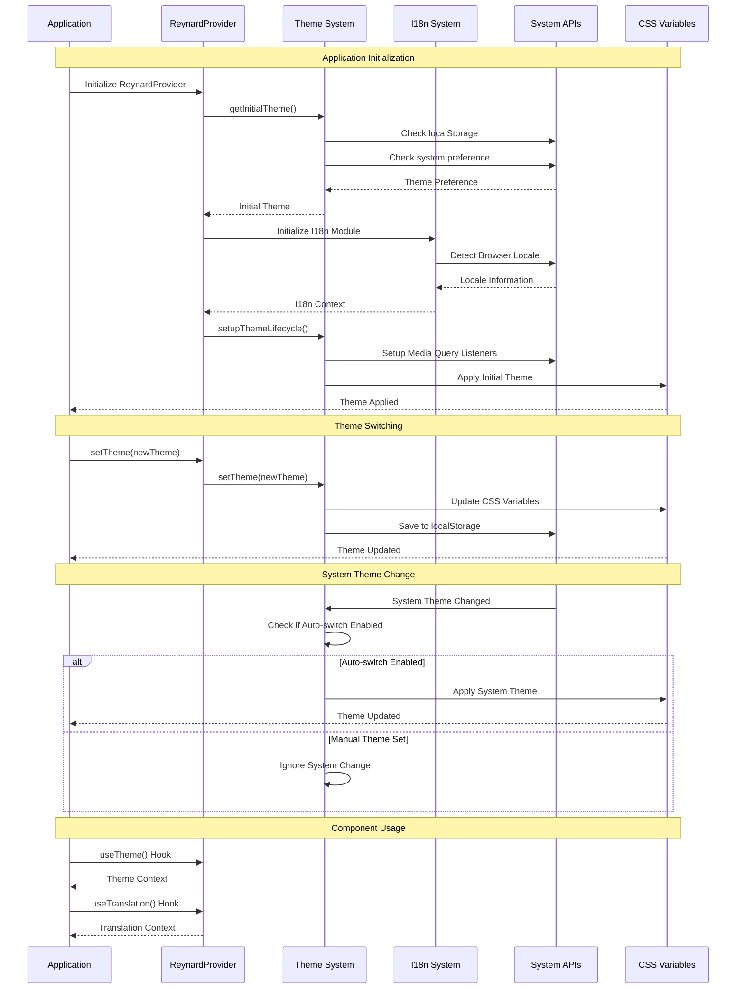
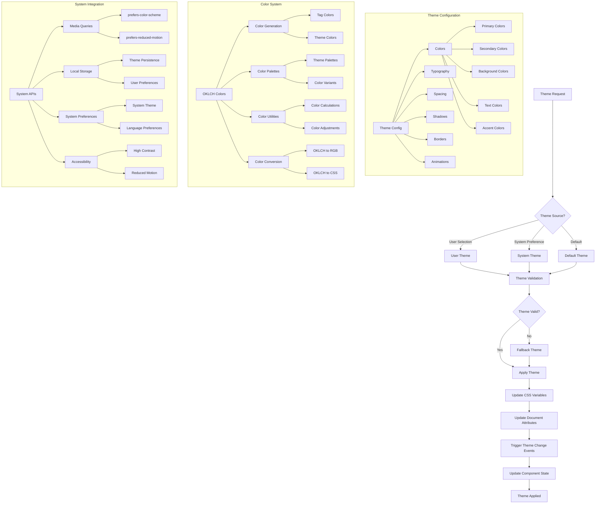

# reynard-themes

A comprehensive theming and internationalization system for Reynard applications, based on yipyap's proven architecture.

## Architecture

```mermaid
graph TB
    subgraph "🎨 Reynard Themes System"
        A[ReynardProvider] --> B[Theme System]
        A --> C[I18n System]
        A --> D[Context Management]
        A --> E[Lifecycle Management]

        subgraph "🎨 Theme System"
            B --> B1[Theme Registry]
            B --> B2[Theme Context]
            B --> B3[Theme Utilities]
            B --> B4[Color System]
            B --> B5[System Integration]
            B1 --> B6[8 Built-in Themes]
            B1 --> B7[Theme Configurations]
            B2 --> B8[Theme State Management]
            B2 --> B9[Theme Switching]
            B3 --> B10[Theme Calculations]
            B3 --> B11[CSS Generation]
            B4 --> B12[OKLCH Color Space]
            B4 --> B13[Color Palettes]
            B5 --> B14[System Theme Detection]
            B5 --> B15[Media Query Handling]
        end

        subgraph "🌍 I18n System"
            C --> C1[Translation Context]
            C --> C2[Language Management]
            C --> C3[Locale Detection]
            C --> C4[RTL Support]
            C1 --> C5[Translation Functions]
            C1 --> C6[Locale State]
            C2 --> C7[30+ Languages]
            C2 --> C8[Language Switching]
            C3 --> C9[Browser Locale]
            C3 --> C10[User Preferences]
            C4 --> C11[Text Direction]
            C4 --> C12[Layout Adaptation]
        end

        subgraph "🔄 Context Management"
            D --> D1[Reynard Context]
            D --> D2[Theme Context]
            D --> D3[Translation Context]
            D --> D4[Context Hooks]
            D1 --> D5[Combined Context]
            D1 --> D6[Context Provider]
            D2 --> D7[Theme State]
            D2 --> D8[Theme Actions]
            D3 --> D9[Translation State]
            D3 --> D10[Translation Actions]
            D4 --> D11[useReynard]
            D4 --> D12[useTheme]
            D4 --> D13[useTranslation]
        end

        subgraph "⚡ Lifecycle Management"
            E --> E1[Theme Initialization]
            E --> E2[System Theme Detection]
            E --> E3[Theme Application]
            E --> E4[Cleanup Management]
            E1 --> E5[Initial Theme Setup]
            E1 --> E6[Theme Persistence]
            E2 --> E7[Media Query Listeners]
            E2 --> E8[System Theme Changes]
            E3 --> E9[CSS Variable Updates]
            E3 --> E10[Document Attributes]
            E4 --> E11[Event Cleanup]
            E4 --> E12[Memory Management]
        end

        subgraph "🎨 Theme Registry"
            F[Theme Registry] --> F1[Light Theme]
            F --> F2[Dark Theme]
            F --> F3[Gray Theme]
            F --> F4[Banana Theme]
            F --> F5[Strawberry Theme]
            F --> F6[Peanut Theme]
            F --> F7[High Contrast Black]
            F --> F8[High Contrast Inverse]
            F1 --> F1A[Clean & Bright]
            F2 --> F2A[Dark & Modern]
            F3 --> F3A[Neutral Gray]
            F4 --> F4A[Warm Yellow]
            F5 --> F5A[Vibrant Red]
            F6 --> F6A[Rich Brown]
            F7 --> F7A[High Contrast Dark]
            F8 --> F8A[High Contrast Light]
        end

        subgraph "🌈 Color System"
            G[OKLCH Color System] --> G1[Color Generation]
            G --> G2[Color Palettes]
            G --> G3[Color Utilities]
            G --> G4[Color Conversion]
            G1 --> G5[Tag Color Generation]
            G1 --> G6[Theme Color Generation]
            G2 --> G7[Theme-specific Palettes]
            G2 --> G8[Color Variants]
            G3 --> G9[Color Calculations]
            G3 --> G10[Color Adjustments]
            G4 --> G11[OKLCH to RGB]
            G4 --> G12[OKLCH to CSS]
        end

        subgraph "🎯 Theme Configuration"
            H[Theme Config] --> H1[Colors]
            H --> H2[Typography]
            H --> H3[Spacing]
            H --> H4[Shadows]
            H --> H5[Borders]
            H --> H6[Animations]
            H1 --> H7[Primary Colors]
            H1 --> H8[Secondary Colors]
            H1 --> H9[Background Colors]
            H1 --> H10[Text Colors]
            H1 --> H11[Accent Colors]
            H2 --> H12[Font Families]
            H2 --> H13[Font Sizes]
            H2 --> H14[Font Weights]
            H3 --> H15[Spacing Scale]
            H3 --> H16[Margin/Padding]
            H4 --> H17[Shadow Definitions]
            H4 --> H18[Elevation Levels]
            H5 --> H19[Border Styles]
            H5 --> H20[Border Radius]
            H6 --> H21[Animation Durations]
            H6 --> H22[Easing Functions]
        end

        subgraph "🛠️ Theme Utilities"
            I[Theme Utilities] --> I1[Theme Application]
            I --> I2[Theme Calculations]
            I --> I3[Theme Generation]
            I --> I4[Theme Validation]
            I1 --> I5[applyTheme Function]
            I1 --> I6[CSS Variable Updates]
            I2 --> I7[Tag Style Calculations]
            I2 --> I8[Hover Style Calculations]
            I2 --> I9[Animation Calculations]
            I3 --> I10[CSS Generation]
            I3 --> I11[Theme Export]
            I4 --> I12[Theme Validation]
            I4 --> I13[Error Handling]
        end

        subgraph "🌐 System Integration"
            J[System Integration] --> J1[System Theme Detection]
            J --> J2[Media Query Management]
            J --> J3[Accessibility Support]
            J --> J4[Performance Optimization]
            J1 --> J5[prefers-color-scheme]
            J1 --> J6[System Theme Changes]
            J2 --> J7[Media Query Listeners]
            J2 --> J8[Event Cleanup]
            J3 --> J9[Reduced Motion]
            J3 --> J10[High Contrast]
            J4 --> J11[Theme Caching]
            J4 --> J12[Lazy Loading]
        end
    end

    subgraph "🌐 External Integration"
        K[SolidJS] --> K1[Reactive Signals]
        K --> K2[Context API]
        K --> K3[Component Integration]
        L[CSS] --> L1[Custom Properties]
        L --> L2[CSS Variables]
        L --> L3[Theme Switching]
        M[Browser APIs] --> M1[Media Queries]
        M --> M2[Local Storage]
        M --> M3[System Preferences]
    end

    A -->|Provides| N[Unified Theme & I18n]
    B -->|Manages| O[Theme State]
    C -->|Handles| P[Translation State]
    D -->|Coordinates| Q[Context State]
    E -->|Manages| R[Lifecycle Events]
```



## Theme Lifecycle Flow



## Theme Architecture Flow



## Component Integration Flow

```mermaid
graph TB
    subgraph "🎨 Component Integration"
        A[ReynardProvider] --> B[Theme Context]
        A --> C[Translation Context]
        A --> D[Combined Context]

        subgraph "🎯 Theme Context"
            B --> B1[Theme State]
            B --> B2[Theme Actions]
            B --> B3[Theme Utilities]
            B1 --> B4[Current Theme]
            B1 --> B5[Available Themes]
            B2 --> B6[setTheme]
            B2 --> B7[getTagStyle]
            B3 --> B8[isDark]
            B3 --> B9[isHighContrast]
        end

        subgraph "🌍 Translation Context"
            C --> C1[Translation State]
            C --> C2[Translation Actions]
            C --> C3[Translation Utilities]
            C1 --> C4[Current Locale]
            C1 --> C5[Available Languages]
            C2 --> C6[setLocale]
            C2 --> C7[Translation Function]
            C3 --> C8[isRTL]
            C3 --> C9[Language Detection]
        end

        subgraph "🔄 Combined Context"
            D --> D1[Reynard Context]
            D --> D2[Context Hooks]
            D --> D3[Context Provider]
            D1 --> D4[Theme + Translation]
            D2 --> D5[useReynard]
            D2 --> D6[useTheme]
            D2 --> D7[useTranslation]
            D3 --> D8[Context Provider]
            D3 --> D9[Context Consumer]
        end

        subgraph "🎨 Component Usage"
            E[Component] --> E1[Theme Hook]
            E --> E2[Translation Hook]
            E --> E3[Combined Hook]
            E1 --> E4[useTheme]
            E2 --> E5[useTranslation]
            E3 --> E6[useReynard]
            E4 --> E7[Theme State & Actions]
            E5 --> E8[Translation State & Actions]
            E6 --> E9[Combined State & Actions]
        end

        subgraph "🔄 Reactive Updates"
            F[Reactive System] --> F1[Theme Changes]
            F --> F2[Locale Changes]
            F --> F3[System Changes]
            F1 --> F4[Component Re-render]
            F2 --> F5[Component Re-render]
            F3 --> F6[Component Re-render]
            F4 --> F7[UI Update]
            F5 --> F8[UI Update]
            F6 --> F9[UI Update]
        end
    end

    subgraph "🎯 Hook Usage Examples"
        G[useTheme Hook] --> G1["const theme, setTheme = useTheme()"]
        G --> G2["const isDark, isHighContrast = useTheme()"]
        G --> G3["const getTagStyle = useTheme()"]

        H[useTranslation Hook] --> H1["const t, locale = useTranslation()"]
        H --> H2["const setLocale, isRTL = useTranslation()"]
        H --> H3["const languages = useTranslation()"]

        I[useReynard Hook] --> I1["const theme, translation = useReynard()"]
        I --> I2["const theme setTheme, translation t = useReynard()"]
        I --> I3["const context = useReynard()"]
    end

    A -->|Provides| J[Unified Context]
    B -->|Manages| K[Theme State]
    C -->|Manages| L[Translation State]
    D -->|Coordinates| M[Combined State]
    E -->|Uses| N[Context Hooks]
    F -->|Updates| O[Component State]
```



## Features

### 🎨 Theming System

- **8 Built-in Themes**: Light, Dark, Gray, Banana, Strawberry, Peanut, High Contrast Black, High Contrast Inverse
- **LCH Color Space**: Consistent color generation and manipulation
- **CSS Custom Properties**: Dynamic theme switching with CSS variables
- **System Theme Detection**: Automatic light/dark mode based on user preferences
- **Accessibility**: Reduced motion and high contrast support
- **Theme Utilities**: Helper functions for theme-specific calculations

### 🌍 Internationalization (i18n)

- **30+ Languages**: Comprehensive language support
- **Type-Safe Translations**: Full TypeScript support with autocomplete
- **Pluralization Rules**: Language-specific plural forms
- **RTL Support**: Right-to-left layout for Arabic, Hebrew, etc.
- **Dynamic Loading**: Lazy-loaded translation files
- **Browser Locale Detection**: Automatic language detection

### 🔧 Developer Experience

- **Unified Provider**: Single `ReynardProvider` for both theming and i18n
- **SolidJS Integration**: Optimized for SolidJS with reactive signals
- **TypeScript First**: Full type safety and IntelliSense support
- **Tree Shaking**: Optimized bundle sizes
- **Hot Reload**: Development-friendly with Vite

## Installation

```bash
npm install reynard-themes
```

## Quick Start

### Basic Setup

```tsx
import { ReynardProvider } from "reynard-themes";
import "reynard-themes/themes.css";

function App() {
  return (
    <ReynardProvider defaultTheme="light" defaultLocale="en">
      <YourApp />
    </ReynardProvider>
  );
}
```

### Using Themes

```tsx
import { useTheme } from "reynard-themes";

function ThemeToggle() {
  const { theme, setTheme, availableThemes } = useTheme();

  return (
    <select value={theme()} onChange={e => setTheme(e.target.value)}>
      {availableThemes.map(t => (
        <option key={t} value={t}>
          {t}
        </option>
      ))}
    </select>
  );
}
```

### Using Translations

```tsx
import { useTranslation } from "reynard-themes";

function WelcomeMessage() {
  const t = useTranslation();

  return (
    <div>
      <h1>{t("welcome.title")}</h1>
      <p>{t("welcome.message", { name: "John" })}</p>
    </div>
  );
}
```

## API Reference

### ReynardProvider

The main provider component that manages both theming and internationalization.

```tsx
interface ReynardProviderProps {
  defaultTheme?: ThemeName;
  defaultLocale?: LanguageCode;
  children: JSX.Element;
}
```

> _Props:_

- `defaultTheme`: Initial theme (default: "light")
- `defaultLocale`: Initial language (default: "en")
- `children`: Your application components

### useTheme Hook

Provides access to theme functionality.

```tsx
interface ThemeContext {
  theme: Accessor<ThemeName>;
  setTheme: (theme: ThemeName) => void;
  availableThemes: ThemeName[];
  isDark: Accessor<boolean>;
  isHighContrast: Accessor<boolean>;
}
```

> _Returns:_

- `theme`: Current theme signal
- `setTheme`: Function to change theme
- `availableThemes`: Array of all available themes
- `isDark`: Boolean signal indicating if current theme is dark
- `isHighContrast`: Boolean signal indicating if current theme is high contrast

### useTranslation Hook

Provides access to translation functionality.

```tsx
interface TranslationContext {
  t: TranslationFunction;
  locale: Accessor<LanguageCode>;
  setLocale: (locale: LanguageCode) => void;
  availableLocales: LanguageCode[];
  isRTL: Accessor<boolean>;
}
```

> _Returns:_

- `t`: Translation function with type safety
- `locale`: Current locale signal
- `setLocale`: Function to change language
- `availableLocales`: Array of all available languages
- `isRTL`: Boolean signal indicating if current language is RTL

### useI18n Hook

Provides access to internationalization utilities.

```tsx
interface I18nContext {
  formatNumber: (value: number, options?: Intl.NumberFormatOptions) => string;
  formatDate: (date: Date, options?: Intl.DateTimeFormatOptions) => string;
  formatCurrency: (amount: number, currency?: string) => string;
  formatRelativeTime: (date: Date) => string;
}
```

### useReynard Hook

Provides access to the complete Reynard context.

```tsx
interface ReynardContext {
  theme: ThemeContext;
  i18n: TranslationContext & I18nContext;
}
```

## Available Themes

| Theme                   | Description             | Use Case                    |
| ----------------------- | ----------------------- | --------------------------- |
| `light`                 | Clean, bright interface | Default, professional apps  |
| `dark`                  | Dark mode for low light | Night usage, modern apps    |
| `gray`                  | Neutral gray tones      | Minimal, monochrome designs |
| `banana`                | Warm yellow accents     | Playful, creative apps      |
| `strawberry`            | Pink/red accents        | Social, lifestyle apps      |
| `peanut`                | Brown/beige tones       | Natural, organic themes     |
| `high-contrast-black`   | High contrast dark      | Accessibility, low vision   |
| `high-contrast-inverse` | High contrast light     | Accessibility, low vision   |

## Supported Languages

The package supports 30+ languages including:

- **English** (en) - Default
- **Spanish** (es)
- **French** (fr)
- **German** (de)
- **Italian** (it)
- **Portuguese** (pt)
- **Russian** (ru)
- **Chinese** (zh)
- **Japanese** (ja)
- **Korean** (ko)
- **Arabic** (ar) - RTL
- **Hebrew** (he) - RTL
- And many more...

## CSS Custom Properties

Each theme provides a comprehensive set of CSS custom properties:

```css
:root {
  /* Colors */
  --color-primary: lch(60% 0.15 250);
  --color-secondary: lch(70% 0.1 200);
  --color-background: lch(98% 0.01 250);
  --color-surface: lch(100% 0 0);
  --color-text: lch(20% 0.01 250);

  /* Spacing */
  --spacing-xs: 0.25rem;
  --spacing-sm: 0.5rem;
  --spacing-md: 1rem;
  --spacing-lg: 1.5rem;
  --spacing-xl: 2rem;

  /* Typography */
  --font-size-sm: 0.875rem;
  --font-size-base: 1rem;
  --font-size-lg: 1.125rem;
  --font-size-xl: 1.25rem;

  /* Shadows */
  --shadow-sm: 0 1px 2px rgba(0, 0, 0, 0.05);
  --shadow-md: 0 4px 6px rgba(0, 0, 0, 0.1);
  --shadow-lg: 0 10px 15px rgba(0, 0, 0, 0.1);

  /* And many more... */
}
```

## Theme Utilities

### computeTagBackground

Generates background colors for tags based on theme.

```tsx
import { computeTagBackground } from "reynard-themes";

const bgColor = computeTagBackground("primary", "light");
// Returns: 'lch(95% 0.05 250)'
```

### computeTagColor

Generates text colors for tags based on theme.

```tsx
import { computeTagColor } from "reynard-themes";

const textColor = computeTagColor("primary", "light");
// Returns: 'lch(30% 0.2 250)'
```

### computeHoverStyles

Generates hover styles for interactive elements.

```tsx
import { computeHoverStyles } from "reynard-themes";

const hoverStyles = computeHoverStyles("primary", "light");
// Returns: { backgroundColor: 'lch(90% 0.1 250)', transform: 'translateY(-1px)' }
```

### computeAnimation

Generates animation properties based on user preferences.

```tsx
import { computeAnimation } from "reynard-themes";

const animation = computeAnimation("fadeIn");
// Returns: { animation: 'fadeIn 0.3s ease-in-out' } or {} if reduced motion
```

## Translation System

### Translation Files

Translations are organized by language and feature:

```json
{
  "welcome": {
    "title": "Welcome to Reynard",
    "message": "Hello, {name}! Welcome to our application."
  },
  "navigation": {
    "home": "Home",
    "about": "About",
    "contact": "Contact"
  }
}
```

### Pluralization

The system supports language-specific pluralization:

```json
{
  "items": {
    "zero": "No items",
    "one": "One item",
    "other": "{count} items"
  }
}
```

### RTL Support

For RTL languages, the system automatically:

- Detects RTL languages
- Provides RTL-aware utilities
- Handles text direction in CSS

## Advanced Usage

### Custom Theme Creation

```tsx
import { createTheme } from "reynard-themes";

const customTheme = createTheme({
  name: "custom",
  colors: {
    primary: "lch(60% 0.15 250)",
    secondary: "lch(70% 0.1 200)",
    // ... other colors
  },
});
```

### Custom Translation Loading

```tsx
import { loadTranslations } from "reynard-themes";

// Load custom translations
await loadTranslations("custom-lang", {
  welcome: {
    title: "Custom Welcome",
  },
});
```

### Theme-Aware Components

```tsx
import { useTheme } from "reynard-themes";

function ThemedButton() {
  const { theme, isDark } = useTheme();

  return (
    <button
      style={{
        backgroundColor: `var(--color-primary)`,
        color: isDark() ? "white" : "black",
      }}
    >
      Themed Button
    </button>
  );
}
```

## Performance

- **Tree Shaking**: Only import what you use
- **Lazy Loading**: Translations loaded on demand
- **CSS Variables**: Efficient theme switching
- **Memoization**: Optimized re-renders with SolidJS signals

## Browser Support

- **Modern Browsers**: Chrome 88+, Firefox 78+, Safari 14+, Edge 88+
- **CSS Custom Properties**: Required for theming
- **ES2022**: Modern JavaScript features
- **LCH Colors**: Progressive enhancement (falls back to HSL)

## Migration from yipyap

If you're migrating from yipyap's theme system:

1. Replace `ThemeProvider` with `ReynardProvider`
2. Update import paths from `yipyap/themes` to `reynard-themes`
3. Use the new unified hooks (`useTheme`, `useTranslation`)
4. Update CSS imports to `reynard-themes/themes.css`

## Contributing

1. Fork the repository
2. Create a feature branch
3. Add tests for new functionality
4. Ensure all tests pass
5. Submit a pull request

## License

MIT License - see LICENSE file for details.
