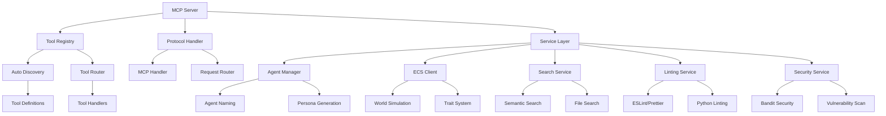

# 🦊 Reynard MCP Server

**The Legendary Model Context Protocol Server for AI Agent Development**

A comprehensive, production-ready MCP server that provides **80+ specialized tools** across 12 major categories, designed for AI agents working within the Reynard ecosystem. Built with automatic tool discovery, intelligent routing, and seamless integration with Cursor IDE.

## 🌟 Overview

The Reynard MCP Server is the apex predator of development tooling - a sophisticated, modular system that transforms complex development workflows into elegant, automated processes. With its revolutionary **single-decorator tool registration system**, it reduces manual configuration from 8 steps to 1, while providing comprehensive coverage of modern development needs.

### Key Features

- **🦊 80+ Specialized Tools**: Comprehensive coverage across 12 major categories
- **⚡ Automatic Discovery**: Single decorator registration with intelligent tool discovery
- **🎯 Smart Routing**: Async-first architecture with intelligent request handling
- **🔧 Cursor Integration**: Seamless IDE integration with hot-reload capabilities
- **🛡️ Security First**: Built-in security scanning and vulnerability detection
- **📊 Real-time Analytics**: Comprehensive metrics and performance monitoring
- **🌍 ECS World Simulation**: Advanced agent simulation with trait inheritance
- **🔍 Semantic Search**: RAG-powered intelligent code search and analysis

## 🏗️ Architecture

### Core Components



### Service Architecture

The server follows a **modular, service-oriented architecture** with clear separation of concerns:

- **Protocol Layer**: MCP protocol handling and request routing
- **Tool Registry**: Automatic tool discovery and registration system
- **Service Layer**: Specialized services for different tool categories
- **Integration Layer**: External tool integration and system interfaces

## 🛠️ Tool Categories

### 🦊 Agent Management (9 tools)

**Strategic agent lifecycle management with ECS world simulation**

- `generate_agent_name` - Generate robot names with animal spirit themes
- `assign_agent_name` - Assign names to agents with persistence
- `get_agent_name` - Retrieve current agent names
- `list_agent_names` - List all agents and their names
- `roll_agent_spirit` - Randomly select an animal spirit (weighted distribution)
- `get_spirit_emoji` - Get emoji for animal spirit types
- `agent_startup_sequence` - Complete agent initialization with random spirit selection
- `get_agent_persona` - Get comprehensive agent persona from ECS system
- `get_lora_config` - Get LoRA configuration for agent persona

### 🎭 Character System (8 tools)

**Advanced character creation and management with trait inheritance**

- `create_character` - Create a new character with detailed customization
- `get_character` - Get detailed character information by ID
- `list_characters` - List all characters with optional filtering
- `search_characters` - Search characters by name, description, or tags
- `update_character` - Update character information
- `delete_character` - Delete a character by ID
- `get_character_types` - Get available character types
- `get_personality_traits` - Get available personality traits
- `get_ability_traits` - Get available ability traits

### 🌍 ECS World Simulation (15 tools)

**Sophisticated entity-component system for agent simulation**

- `create_ecs_agent` - Create a new agent using the ECS system
- `create_ecs_offspring` - Create offspring agent from two parent agents
- `get_ecs_agent_status` - Get status of all agents in the ECS system
- `get_ecs_agent_positions` - Get positions of all agents in the ECS system
- `get_simulation_status` - Get comprehensive ECS world simulation status
- `accelerate_time` - Adjust time acceleration factor for world simulation
- `nudge_time` - Nudge simulation time forward (for MCP actions)
- `get_agent_distance` - Get the distance between two agents
- `get_agent_position` - Get the current position of a specific agent
- `get_agent_social_stats` - Get social interaction statistics for an agent
- `get_nearby_agents` - Get all agents within a certain radius of an agent
- `initiate_interaction` - Initiate an interaction between two agents
- `move_agent` - Move an agent to a specific position
- `move_agent_towards` - Move an agent towards another agent
- `send_chat_message` - Send a chat message from one agent to another

### 🔍 Linting & Formatting (6 tools)

**Comprehensive code quality assurance with auto-fix capabilities**

- `lint_frontend` - ESLint for TypeScript/JavaScript (with auto-fix)
- `lint_python` - Flake8, Pylint for Python (with auto-fix)
- `lint_markdown` - markdownlint validation (with auto-fix)
- `run_all_linting` - Execute entire linting suite (with auto-fix)
- `format_frontend` - Prettier formatting (with check-only mode)
- `format_python` - Black + isort formatting (with check-only mode)

### 🔍 Search & Discovery (12 tools)

**Advanced search capabilities with semantic understanding**

- `search_files` - Search for files by name pattern in the project
- `semantic_search` - Perform semantic search using vector embeddings and RAG backend
- `search_enhanced` - Enhanced BM25 search with query expansion and filtering
- `hybrid_search` - Perform hybrid search combining semantic and traditional text search
- `search_code_patterns` - Search for specific code patterns (functions, classes, imports)
- `search_content` - Search for content using BM25 with query expansion
- `list_files` - List files in a directory with optional filtering
- `clear_search_cache` - Clear search cache and temporary files
- `get_query_suggestions` - Get intelligent query suggestions based on project content
- `get_search_analytics` - Get search analytics and statistics
- `reindex_project` - Reindex the entire project for search

### 🛡️ Security & Analysis (4 tools)

**Comprehensive security scanning and code analysis**

- `scan_security` - Complete security audit (Bandit, audit-ci, type checking)
- `scan_security_fast` - Run fast security scanning (skips slow Bandit checks)
- `detect_monoliths` - Detect large monolithic files that violate the 140-line axiom
- `analyze_file_complexity` - Deep-dive analysis of a specific file's complexity metrics

### 📊 Visualization & Media (6 tools)

**Advanced visualization and media handling capabilities**

- `validate_mermaid_diagram` - Validate mermaid diagram syntax and check for errors
- `render_mermaid_to_svg` - Render mermaid diagram to SVG format
- `render_mermaid_to_png` - Render mermaid diagram to PNG format
- `get_mermaid_diagram_stats` - Get statistics and analysis of a mermaid diagram
- `test_mermaid_render` - Test mermaid diagram rendering with a simple example
- `open_image` - Open an image file with the imv image viewer

### 🔧 Version & System (3 tools)

**System information and version management**

- `get_versions` - Get versions of Python, Node.js, npm, pnpm, and TypeScript
- `get_python_version` - Get Python version information
- `get_current_time` - Get current date and time with timezone support

### 💻 VS Code Integration (5 tools)

**Seamless VS Code IDE integration and task management**

- `get_vscode_active_file` - Get currently active file path in VS Code
- `discover_vscode_tasks` - Discover all available VS Code tasks from tasks.json
- `execute_vscode_task` - Execute a VS Code task by name
- `get_vscode_task_info` - Get detailed information about a specific VS Code task
- `validate_vscode_task` - Validate that a VS Code task exists and is executable

### 🎭 Playwright Automation (2 tools)

**Browser automation and web interaction capabilities**

- `playwright_screenshot` - Take screenshots using Playwright browser automation
- `playwright_navigate` - Navigate to URLs and interact with web pages

### 🔐 Git Automation (8 tools)

**Comprehensive Git workflow automation**

- `git_add` - Add files to Git staging area
- `git_branch_info` - Get current branch information
- `git_commit` - Create a new commit
- `git_commit_history` - Get recent commit history
- `git_diff` - Get diff of current changes
- `git_pull` - Pull latest changes from remote repository
- `git_push` - Push commits to remote repository
- `git_status` - Get current Git repository status

### 🔑 Secrets Management (4 tools)

**Secure secrets and credential management**

- `check_secret` - Check if a secret is available and set
- `get_secret` - Retrieve a user secret by name
- `get_secret_info` - Get detailed information about a secret
- `list_secrets` - List all available secrets

### ⚙️ Tool Management (6 tools)

**Dynamic tool configuration and management**

- `disable_tool` - Disable a specific tool
- `enable_tool` - Enable a specific tool
- `get_tool_configs` - Get all tool configurations and statistics
- `get_tool_metadata` - Get metadata for a specific tool
- `get_tool_status` - Get status of a specific tool or all tools
- `list_tools_by_category` - List tools grouped by category

### 🌐 Utility Services (3 tools)

**General utility and system integration tools**

- `get_current_location` - Get location based on IP address
- `send_desktop_notification` - Send desktop notifications using libnotify
- `restart_mcp_server` - Restart the MCP server with different methods

## 🚀 Installation & Setup

### Prerequisites

- **Python 3.9+** with asyncio support
- **Node.js 18+** for frontend tooling
- **Git** for version control automation
- **System Tools**: ESLint, Prettier, Flake8, Black, isort, markdownlint, Bandit, imv, notify-send

### Quick Start

1. **Clone and Navigate**

   ```bash
   cd /home/kade/runeset/reynard/services/mcp-server
   ```

2. **Install Dependencies**

   ```bash
   # Install Python dependencies
   pip install -r requirements.txt

   # Install optional dependencies for full functionality
   pip install transformers torch
   ```

3. **Configure Cursor Integration**

   ```bash
   # The cursor-mcp-config.json is already configured
   # Ensure your Cursor IDE is configured to use this MCP server
   ```

4. **Start the Server**

   ```bash
   # Direct execution
   python3 main.py

   # With startup banner
   python3 main.py --banner

   # Using the provided script
   ./start-mcp-server.sh
   ```

### Advanced Configuration

#### Environment Variables

```bash
# Python path configuration
export PYTHONPATH="/home/kade/runeset/reynard/services/mcp-server:/home/kade/runeset/reynard/packages/ecs-world/src:$PYTHONPATH"

# Optional: Custom tool configuration
export MCP_TOOL_CONFIG_PATH="/path/to/custom/tool_config.json"

# Optional: Enable debug logging
export MCP_DEBUG=true
```

#### Tool Configuration

The server uses `tool_config.json` for tool management. You can:

- **Enable/Disable Tools**: Modify the `enabled` field for specific tools
- **Configure Dependencies**: Add custom dependencies for tools
- **Set Tool Parameters**: Configure tool-specific parameters

```json
{
  "tools": {
    "lint_frontend": {
      "enabled": true,
      "config": {
        "auto_fix": true,
        "strict_mode": false
      }
    }
  }
}
```

## 🔧 Usage Examples

### Basic Tool Usage

```python
# Example: Lint frontend code with auto-fix
{
  "method": "tools/call",
  "params": {
    "name": "lint_frontend",
    "arguments": { "fix": true }
  }
}

# Example: Generate agent name
{
  "method": "tools/call",
  "params": {
    "name": "generate_agent_name",
    "arguments": {
      "spirit": "fox",
      "style": "foundation"
    }
  }
}

# Example: Semantic search
{
  "method": "tools/call",
  "params": {
    "name": "semantic_search",
    "arguments": {
      "query": "authentication flow",
      "search_type": "hybrid",
      "top_k": 10
    }
  }
}
```

### Agent Startup Sequence

```python
# Complete agent initialization
{
  "method": "tools/call",
  "params": {
    "name": "agent_startup_sequence",
    "arguments": {
      "agent_id": "current-session",
      "preferred_style": "foundation"
    }
  }
}
```

### ECS World Simulation

```python
# Create an ECS agent
{
  "method": "tools/call",
  "params": {
    "name": "create_ecs_agent",
    "arguments": {
      "agent_id": "my-agent",
      "spirit": "wolf",
      "style": "exo"
    }
  }
}

# Get simulation status
{
  "method": "tools/call",
  "params": {
    "name": "get_simulation_status",
    "arguments": {}
  }
}
```

### Security Scanning

```python
# Comprehensive security scan
{
  "method": "tools/call",
  "params": {
    "name": "scan_security",
    "arguments": {}
  }
}

# Fast security scan
{
  "method": "tools/call",
  "params": {
    "name": "scan_security_fast",
    "arguments": {}
  }
}
```

## 🏗️ Development

### Architecture Principles

The server follows the **Reynard 140-line axiom** and modular architecture principles:

- **Single Responsibility**: Each module has a clear, focused purpose
- **Dependency Injection**: Services are injected for testability
- **Async-First**: All I/O operations are asynchronous
- **Error Boundaries**: Comprehensive error handling and recovery
- **Performance Monitoring**: Built-in timing and metrics collection

### Adding New Tools

The server uses a revolutionary **single-decorator registration system**:

```python
from protocol.tool_registry import register_tool

@register_tool(
    name="my_awesome_tool",
    description="Does something amazing",
    category="utility"
)
async def my_awesome_tool(param1: str, param2: int = 42) -> dict:
    """Tool implementation with automatic parameter validation."""
    return {"result": f"Processed {param1} with {param2}"}
```

That's it! The tool is automatically:

- ✅ Discovered and registered
- ✅ Added to the tool list
- ✅ Configured with proper validation
- ✅ Available via MCP protocol
- ✅ Included in documentation

### Testing

```bash
# Run all tests
python -m pytest

# Run specific test categories
python -m pytest tests/unit/
python -m pytest tests/integration/

# Run with coverage
python -m pytest --cov=services --cov=protocol
```

### Debugging

```bash
# Enable debug logging
export MCP_DEBUG=true
python3 main.py

# Test specific tools
python3 debug_mcp.py

# Test ECS integration
python3 debug_ecs_client.py
```

## 🔧 Configuration

### Cursor IDE Integration

The server is pre-configured for Cursor IDE integration via `cursor-mcp-config.json`:

```json
{
  "mcpServers": {
    "reynard-mcp": {
      "command": "bash",
      "args": [
        "-c",
        "source ~/venv/bin/activate && cd /home/kade/runeset/reynard/services/mcp-server && PYTHONPATH='/home/kade/runeset/reynard/services/mcp-server:/home/kade/runeset/reynard/packages/ecs-world/src:$PYTHONPATH' python3 main.py"
      ],
      "env": {
        "PYTHONPATH": "/home/kade/runeset/reynard/services/mcp-server:/home/kade/runeset/reynard/packages/ecs-world/src"
      }
    }
  }
}
```

### Tool Categories

Tools are organized into logical categories for better management:

- **agent**: Agent lifecycle and persona management
- **character**: Character creation and trait systems
- **ecs**: ECS world simulation and agent interactions
- **linting**: Code quality and formatting tools
- **search**: File and content search capabilities
- **security**: Security scanning and vulnerability detection
- **visualization**: Diagram rendering and image handling
- **version**: System information and version management
- **vscode**: VS Code integration and task management
- **playwright**: Browser automation capabilities
- **git**: Git workflow automation
- **secrets**: Secure credential management
- **management**: Tool configuration and management
- **utility**: General utility functions

## 🚨 Troubleshooting

### Common Issues

#### MCP Server Connection Problems

**Symptoms**: MCP tools not available or timing out

**Solutions**:

1. Check server is running: `python3 main.py`
2. Verify configuration in `cursor-mcp-config.json`
3. Test with: `python3 test_full_mcp.py`
4. Check Python virtual environment: `source ~/venv/bin/activate`
5. Verify PYTHONPATH configuration

#### Tool Registration Issues

**Symptoms**: Tools not appearing in tool list

**Solutions**:

1. Check tool decorator syntax
2. Verify tool is in correct directory
3. Run tool discovery: `python3 check_tool_names.py`
4. Check for import errors in tool modules

#### ECS Integration Problems

**Symptoms**: ECS tools failing or not available

**Solutions**:

1. Verify ECS service is running
2. Check PYTHONPATH includes ECS packages
3. Test ECS connection: `python3 debug_ecs_client.py`
4. Verify agent naming service availability

### Performance Optimization

#### Memory Usage

- **Tool Lazy Loading**: Tools are loaded on first use
- **Connection Pooling**: Reuse connections where possible
- **Cache Management**: Intelligent caching with TTL

#### Response Times

- **Async Operations**: All I/O is asynchronous
- **Parallel Processing**: Multiple tools can run concurrently
- **Smart Routing**: Efficient request routing and handling

### Logging and Monitoring

```bash
# Enable detailed logging
export MCP_LOG_LEVEL=DEBUG

# Monitor tool performance
python3 -c "
from services.metrics_aggregation_service import MetricsAggregationService
metrics = MetricsAggregationService()
print(metrics.get_tool_performance_stats())
"
```

## 📊 Performance Metrics

The server provides comprehensive performance monitoring:

- **Tool Execution Times**: Per-tool performance tracking
- **Memory Usage**: Real-time memory consumption monitoring
- **Request Throughput**: Requests per second metrics
- **Error Rates**: Tool failure and error tracking
- **Cache Hit Rates**: Search and discovery cache efficiency

## 🔒 Security Considerations

### Built-in Security Features

- **Input Validation**: All tool parameters are validated
- **Error Boundaries**: Graceful failure handling
- **Rate Limiting**: Protection against abuse
- **Audit Trail**: All tool executions are logged
- **Secret Management**: Secure credential handling

### Security Scanning

The server includes comprehensive security scanning:

- **Bandit**: Python security vulnerability detection
- **audit-ci**: Dependency vulnerability scanning
- **Type Checking**: Static analysis for type safety
- **Custom Rules**: Project-specific security rules

## 🤝 Contributing

### Development Workflow

1. **Fork and Clone**: Create your development environment
2. **Create Branch**: Use descriptive branch names
3. **Implement Changes**: Follow the 140-line axiom
4. **Add Tests**: Comprehensive test coverage required
5. **Update Documentation**: Keep README and docs current
6. **Submit PR**: Detailed description of changes

### Code Standards

- **Python**: Follow PEP 8 with Black formatting
- **Type Hints**: All functions must have type annotations
- **Documentation**: Comprehensive docstrings required
- **Testing**: Minimum 80% test coverage
- **Performance**: Tools must complete within reasonable timeouts

### Tool Development Guidelines

1. **Single Responsibility**: Each tool should do one thing well
2. **Error Handling**: Comprehensive error handling and recovery
3. **Parameter Validation**: Validate all input parameters
4. **Async Support**: Prefer async implementations
5. **Documentation**: Clear, comprehensive tool descriptions

## 📚 API Reference

### MCP Protocol Methods

#### `initialize`

Initialize the MCP server connection.

#### `tools/list`

Get list of all available tools with metadata.

#### `tools/call`

Execute a specific tool with provided arguments.

#### `notifications/*`

Handle various notification types.

### Tool Response Format

```json
{
  "jsonrpc": "2.0",
  "id": "request-id",
  "result": {
    "content": [
      {
        "type": "text",
        "text": "Tool execution result"
      }
    ]
  }
}
```

### Error Response Format

```json
{
  "jsonrpc": "2.0",
  "id": "request-id",
  "error": {
    "code": -32603,
    "message": "Internal error",
    "data": {
      "details": "Detailed error information"
    }
  }
}
```

## 📄 License

This project is part of the Reynard ecosystem and follows the same licensing terms.

## 🙏 Acknowledgments

- **Reynard Team**: For the visionary architecture and design principles
- **MCP Protocol**: For the standardized Model Context Protocol
- **Open Source Community**: For the excellent tools and libraries that make this possible

---

_Built with 🦊 fox cunning, 🦦 otter thoroughness, and 🐺 wolf determination - the apex predators of the code jungle!_

**Version**: 2.0.0  
**Last Updated**: 2025-01-15  
**Maintainer**: Reynard-Column-Space-24
