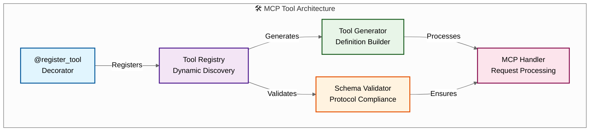

# 🦊 MCP Development Guide

_A Guide to Creating MCP Tools_

## Overview

This guide provides information about creating, validating, and maintaining MCP tools in the Reynard ecosystem. The system attempts to prevent schema breaks and ensure protocol compliance through automated validation.

## 🏗️ Architecture Overview

The MCP server uses a dynamic tool generation system that aims to reduce manual definition maintenance:



## 🚀 Quick Start

### 1. Create a New Tool

Use the provided template to create your tool:

```python
from protocol.tool_registry import register_tool

@register_tool(
    name="my_tool",
    category="utility",
    description="Performs a specific task",
    input_schema={
        "type": "object",
        "properties": {
            "param1": {
                "type": "string",
                "description": "Required parameter"
            }
        },
        "required": ["param1"]
    }
)
def my_awesome_tool(arguments):
    return {"type": "text", "text": "Success!"}
```

### 2. Validate Your Tool

```bash
# Validate tools
PYTHONPATH=. python3 cli/validate_tools.py validate

# Validate specific tool
PYTHONPATH=. python3 cli/validate_tools.py validate-tool --tool my_tool

# List tools
PYTHONPATH=. python3 cli/validate_tools.py list
```

### 3. Test Your Tool

```bash
# Start the MCP server
python3 main.py

# Your tool will be discovered and available
```

## 📋 Tool Creation Guidelines

### Schema Design

**✅ Good Schema:**

```python
input_schema={
    "type": "object",
    "properties": {
        "url": {
            "type": "string",
            "description": "URL to process (required)"
        },
        "timeout": {
            "type": "integer",
            "description": "Timeout in seconds (default: 30)",
            "default": 30
        },
        "verbose": {
            "type": "boolean",
            "description": "Enable verbose output (default: false)",
            "default": False
        }
    },
    "required": ["url"]
}
```

**❌ Bad Schema:**

```python
input_schema={
    "type": "object",
    "properties": {
        "param": {"type": "string"}  # Missing description
    }
    # Missing required field
}
```

### Error Handling

**✅ Good Error Handling:**

```python
def my_tool(arguments):
    try:
        # Validate required parameters
        url = arguments.get("url")
        if not url:
            raise ValueError("url parameter is required")

        # Your tool logic
        result = process_url(url)

        return {
            "type": "text",
            "text": f"Processed: {result}"
        }
    except ValueError as e:
        raise ValueError(f"Invalid input: {e}")
    except Exception as e:
        raise RuntimeError(f"Tool execution failed: {e}")
```

### Return Formats

**✅ Standard Return Format:**

```python
# Text response
return {"type": "text", "text": "Your message"}

# JSON response
return {"type": "json", "json": {"key": "value"}}

# Error response
return {"type": "error", "error": "Error message"}
```

## 🔧 Additional Features

### Custom Input Schemas

You can provide custom input schemas for tools with multiple parameters:

```python
@register_tool(
    name="complex_tool",
    category="utility",
    description="A tool with multiple parameters",
    input_schema={
        "type": "object",
        "properties": {
            "config": {
                "type": "object",
                "properties": {
                    "option1": {"type": "string"},
                    "option2": {"type": "integer"}
                }
            },
            "items": {
                "type": "array",
                "items": {"type": "string"}
            }
        },
        "required": ["config"]
    }
)
```

### Async Tools

For tools that need async operations:

```python
@register_tool(
    name="async_tool",
    category="async",
    description="An async tool",
    execution_type="async"
)
async def async_tool(arguments):
    import asyncio
    await asyncio.sleep(0.1)
    return {"type": "text", "text": "Async complete!"}
```

### Tool Dependencies

Tools can declare dependencies:

```python
@register_tool(
    name="dependent_tool",
    category="utility",
    description="A tool with dependencies",
    dependencies=["other_tool", "another_tool"]
)
```

### Tool Configuration

Tools can have configuration:

```python
@register_tool(
    name="configured_tool",
    category="utility",
    description="A tool with config",
    config={"timeout": 30, "retries": 3}
)
```

## 🛡️ Validation System

The system validates tools at registration time:

### Schema Validation

- ✅ Required fields present
- ✅ Valid inputSchema structure
- ✅ Proper property types
- ✅ Required parameters exist in properties

### Protocol Compliance

- ✅ MCP protocol compliance
- ✅ Proper tool metadata
- ✅ Valid execution types

### Error Prevention

- ❌ Catches invalid schemas before registration
- ❌ Prevents schema breaks
- ❌ Ensures protocol compliance

## 🧪 Testing Your Tools

### Unit Testing

```python
import pytest
from your_tool_module import your_tool_function

def test_your_tool():
    # Test valid input
    result = your_tool_function({"param": "value"})
    assert result["type"] == "text"

    # Test invalid input
    with pytest.raises(ValueError):
        your_tool_function({})
```

### Integration Testing

```python
# Test tool registration
from protocol.tool_registry import get_tool_registry
from protocol.tool_discovery import ToolDiscovery

registry = get_tool_registry()
discovery = ToolDiscovery(registry)
discovery.discover_and_import_tools('tools')

assert "your_tool" in registry.list_all_tools()
```

## 🚨 Troubleshooting

### Common Issues

**1. Import Errors**

```
ModuleNotFoundError: No module named 'protocol'
```

**Solution:** Run with `PYTHONPATH=. python3 your_script.py`

**2. Schema Validation Errors**

```
ValueError: Invalid tool schema for 'my_tool': ['Missing required field: description']
```

**Solution:** Check your schema against the validation rules

**3. Tool Not Found**

```
Tool 'my_tool' not found
```

**Solution:** Ensure your tool is in the `tools/` directory and uses `@register_tool`

### Debug Mode

Enable debug logging:

```python
import logging
logging.basicConfig(level=logging.DEBUG)
```

## 📚 API Reference

### @register_tool Decorator

```python
@register_tool(
    name: str,                    # Tool name (required)
    category: str,                # Tool category (required)
    description: str,             # Tool description (required)
    input_schema: dict = None,    # Input schema (optional)
    execution_type: str = "sync", # Execution type (optional)
    enabled: bool = True,         # Tool enabled (optional)
    dependencies: list = None,    # Dependencies (optional)
    config: dict = None          # Configuration (optional)
)
```

### Tool Function Signature

```python
def tool_function(arguments: dict[str, Any]) -> dict[str, Any]:
    """
    Tool implementation.

    Args:
        arguments: Dictionary containing tool arguments

    Returns:
        Dictionary with tool result

    Raises:
        ValueError: If required parameters are missing
        RuntimeError: If tool execution fails
    """
```

### Validation CLI

```bash
# Validate tools
python3 cli/validate_tools.py validate

# Validate specific tool
python3 cli/validate_tools.py validate-tool --tool tool_name

# List tools
python3 cli/validate_tools.py list
```

## 🎯 Migration Guide

### From Static Definitions

**Old Way (❌ Deprecated):**

```python
# tools/my_definitions.py
def get_my_tool_definitions():
    return {
        "my_tool": {
            "name": "my_tool",
            "description": "My tool",
            "parameters": {  # ❌ Wrong field name
                "type": "object",
                "properties": {}
            }
        }
    }
```

**New Way (✅ Recommended):**

```python
# tools/my_tools.py
from protocol.tool_registry import register_tool

@register_tool(
    name="my_tool",
    category="utility",
    description="My tool",
    input_schema={  # ✅ Correct field name
        "type": "object",
        "properties": {}
    }
)
def my_tool(arguments):
    return {"type": "text", "text": "Success!"}
```

## 🏆 Guidelines Summary

1. **Use `@register_tool`** - Avoid static definitions when possible
2. **Provide clear schemas** - Include descriptions and types
3. **Handle errors appropriately** - Use proper exception types
4. **Test your tools** - Both unit and integration tests
5. **Use the validation CLI** - Check your tools before deployment
6. **Follow naming conventions** - Use snake_case for tool names
7. **Document your tools** - Clear descriptions and parameter docs
8. **Keep tools focused** - One tool, one responsibility

## 🎉 Conclusion

The MCP server provides automated validation and tool management. The system:

- ✅ Validates schemas at registration time
- ✅ Generates definitions dynamically
- ✅ Helps prevent schema breaks
- ✅ Ensures protocol compliance
- ✅ Provides helpful error messages

You can create tools with the knowledge that the system will help catch issues before they become problems. Happy coding! 🦊

---

_"In the realm of code, there are few shortcuts to excellence. Primarily through systematic thinking, thorough analysis, and persistent pursuit of quality can we work toward mastery."_ - The Reynard Way
