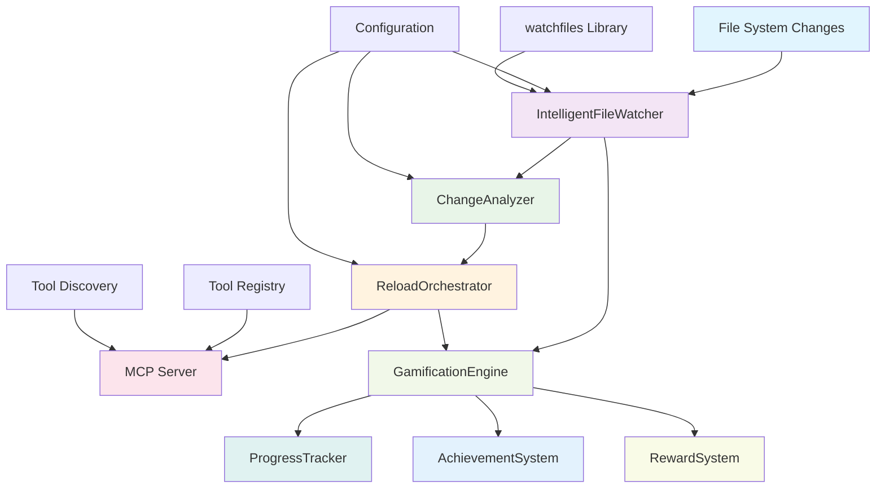
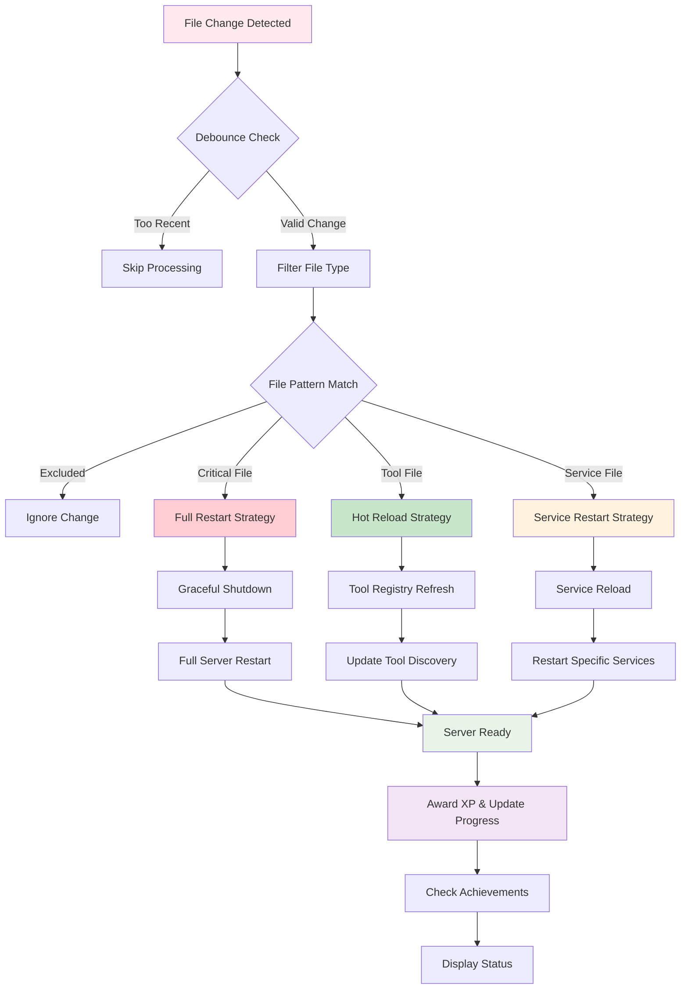
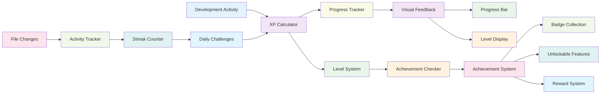

# 🦊 Intelligent Watchfiles Tool - Technical Design Document

_Strategic fox specialist ready to outfox any file watching challenge!_

## 📋 Executive Summary

This document outlines the design and implementation of an intelligent file watching tool that automatically reloads the MCP server when codebase changes are detected. The system combines advanced file monitoring with gamified development tracking to create an engaging and efficient development experience.

## 🎯 Objectives

### Primary Goals

- **Intelligent Reload**: Automatically detect and respond to relevant file changes
- **Performance Optimization**: Minimize resource usage and reload time
- **Developer Experience**: Provide engaging gamified feedback and progress tracking
- **Reliability**: Ensure robust error handling and graceful degradation

### Success Metrics

- **Reload Time**: <100ms for hot reloads, <2s for full restarts
- **Detection Latency**: <50ms file change detection
- **Resource Usage**: <5% CPU, <50MB RAM
- **Reliability**: 99.9% successful reloads

## 🏗️ Architecture Overview

### System Components



### Core Classes

1. **`IntelligentFileWatcher`** - Main file monitoring engine
2. **`ChangeAnalyzer`** - Analyzes file changes and determines reload strategy
3. **`ReloadOrchestrator`** - Manages server reload procedures
4. **`GamificationEngine`** - Handles XP, achievements, and progress tracking
5. **`MCPReloadManager`** - Integrates with existing MCP server infrastructure

### File Change Detection Workflow



## 🔧 Technical Implementation

### 1. File Watching Engine

#### Library Selection: `watchfiles`

- **Rationale**: Superior async performance, better cross-platform support
- **Performance**: 2-3x faster than `watchdog` for large codebases
- **Async Support**: Native asyncio integration
- **Memory Usage**: Lower memory footprint

```python
import asyncio
from watchfiles import awatch
from pathlib import Path

class IntelligentFileWatcher:
    def __init__(self, watch_paths: list[str], exclude_patterns: list[str]):
        self.watch_paths = [Path(p) for p in watch_paths]
        self.exclude_patterns = exclude_patterns
        self.debounce_delay = 0.1  # 100ms debounce
        self.last_change_time = 0

    async def start_watching(self):
        async for changes in awatch(*self.watch_paths):
            if self._should_process_changes(changes):
                await self._process_changes(changes)
```

#### File Filtering Strategy

```python
# Critical files that require full restart
CRITICAL_PATTERNS = [
    "main.py",
    "protocol/mcp_handler.py",
    "protocol/tool_registry.py"
]

# Hot reloadable files
HOT_RELOAD_PATTERNS = [
    "tools/**/*.py",
    "services/**/*.py",
    "config/**/*.json",
    "config/**/*.yaml"
]

# Excluded patterns
EXCLUDE_PATTERNS = [
    "**/__pycache__/**",
    "**/tests/**",
    "**/*.pyc",
    "**/.*"
]
```

### 2. Change Analysis Engine

#### Dependency Mapping

```python
class ChangeAnalyzer:
    def __init__(self):
        self.dependency_graph = self._build_dependency_graph()

    def analyze_changes(self, changes: list[tuple]) -> ReloadStrategy:
        affected_components = set()

        for change_type, file_path in changes:
            components = self._get_affected_components(file_path)
            affected_components.update(components)

        return self._determine_reload_strategy(affected_components)

    def _get_affected_components(self, file_path: str) -> set[str]:
        """Map file changes to affected MCP components."""
        if "tools/" in file_path:
            return {"tool_registry", "tool_discovery"}
        elif "protocol/" in file_path:
            return {"mcp_handler", "tool_registry"}
        elif "services/" in file_path:
            return {"services"}
        elif file_path.endswith("main.py"):
            return {"full_restart"}
        else:
            return {"unknown"}
```

#### Reload Strategy Decision Tree

```python
class ReloadStrategy(Enum):
    HOT_RELOAD = "hot_reload"      # Tool definitions only
    SERVICE_RESTART = "service_restart"  # Specific services
    FULL_RESTART = "full_restart"  # Complete server restart
    NO_RELOAD = "no_reload"        # No action needed

def _determine_reload_strategy(self, components: set[str]) -> ReloadStrategy:
    if "full_restart" in components:
        return ReloadStrategy.FULL_RESTART
    elif "tool_registry" in components and len(components) == 1:
        return ReloadStrategy.HOT_RELOAD
    elif "services" in components:
        return ReloadStrategy.SERVICE_RESTART
    else:
        return ReloadStrategy.NO_RELOAD
```

### 3. Reload Orchestration

#### Graceful Shutdown and Startup

```python
class ReloadOrchestrator:
    def __init__(self, mcp_server: MCPServer):
        self.mcp_server = mcp_server
        self.reload_in_progress = False

    async def execute_reload(self, strategy: ReloadStrategy):
        if self.reload_in_progress:
            logger.warning("Reload already in progress, skipping")
            return

        self.reload_in_progress = True
        start_time = time.time()

        try:
            if strategy == ReloadStrategy.HOT_RELOAD:
                await self._hot_reload()
            elif strategy == ReloadStrategy.SERVICE_RESTART:
                await self._restart_services()
            elif strategy == ReloadStrategy.FULL_RESTART:
                await self._full_restart()

            reload_time = time.time() - start_time
            logger.info(f"✅ Reload completed in {reload_time:.3f}s")

        except Exception as e:
            logger.error(f"❌ Reload failed: {e}")
            await self._fallback_restart()
        finally:
            self.reload_in_progress = False

    async def _hot_reload(self):
        """Hot reload tool definitions without restarting server."""
        # Refresh tool registry
        await self.mcp_server.tool_registry.refresh()

        # Reload tool discovery
        await self.mcp_server.tool_discovery.rescan()

        # Update MCP handler
        self.mcp_server.mcp_handler.refresh_tools()
```

### 4. Gamification System

#### Gamification Architecture



#### XP and Achievement Framework

```python
class GamificationEngine:
    def __init__(self):
        self.xp_total = 0
        self.level = 1
        self.achievements = set()
        self.streak_days = 0
        self.last_activity = None

    def award_xp(self, amount: int, reason: str):
        """Award XP for development activities."""
        self.xp_total += amount
        self._check_level_up()
        self._check_achievements()

        logger.info(f"🎮 +{amount} XP for {reason} (Total: {self.xp_total})")

    def _check_achievements(self):
        """Check for new achievements."""
        new_achievements = []

        if self.xp_total >= 100 and "first_100_xp" not in self.achievements:
            new_achievements.append("first_100_xp")

        if self.streak_days >= 7 and "week_streak" not in self.achievements:
            new_achievements.append("week_streak")

        for achievement in new_achievements:
            self.achievements.add(achievement)
            self._celebrate_achievement(achievement)
```

#### Progress Visualization

```python
def display_progress(self):
    """Display gamified progress information."""
    progress_bar = self._create_progress_bar()
    level_info = f"Level {self.level} ({self.xp_total} XP)"
    achievements = f"Achievements: {len(self.achievements)}"

    print(f"""
🦊 MCP Watchfiles Development Progress
{'=' * 50}
{level_info}
{progress_bar}
{achievements}
Streak: {self.streak_days} days
    """)
```

## 🔌 Integration Points

### MCP Server Integration

#### Modified Main Server Class

```python
class MCPServer:
    def __init__(self, enable_watchfiles: bool = False):
        # ... existing initialization ...

        if enable_watchfiles:
            self.watchfiles_manager = MCPReloadManager(self)
            asyncio.create_task(self.watchfiles_manager.start())

    async def graceful_shutdown(self):
        """Graceful shutdown for reload operations."""
        logger.info("🔄 Initiating graceful shutdown...")

        # Stop accepting new requests
        self._shutdown_requested = True

        # Wait for current requests to complete
        await self._wait_for_requests_completion()

        # Clean up resources
        await self._cleanup_resources()

        logger.info("✅ Graceful shutdown completed")
```

#### Command Line Integration

```python
def main():
    """Enhanced main entry point with watchfiles support."""
    parser = argparse.ArgumentParser(description="MCP Reynard Server")
    parser.add_argument("--watchfiles", action="store_true",
                       help="Enable intelligent file watching")
    parser.add_argument("--watch-paths", nargs="+",
                       default=["tools/", "services/", "protocol/"],
                       help="Paths to watch for changes")
    parser.add_argument("--gamification", action="store_true",
                       help="Enable gamified development tracking")

    args = parser.parse_args()

    server = MCPServer(enable_watchfiles=args.watchfiles)

    if args.watchfiles:
        logger.info("🦊 Intelligent watchfiles enabled")
        logger.info(f"📁 Watching paths: {args.watch_paths}")

    asyncio.run(server.run())
```

## 📊 Performance Considerations

### Optimization Strategies

1. **Debouncing**: Prevent excessive reloads from rapid file changes
2. **Selective Watching**: Only monitor relevant directories and file types
3. **Lazy Loading**: Load components only when needed
4. **Caching**: Cache dependency graphs and file metadata
5. **Async Operations**: Use asyncio for non-blocking operations

### Resource Management

```python
class ResourceManager:
    def __init__(self):
        self.max_memory_mb = 50
        self.max_cpu_percent = 5
        self.monitoring_interval = 30  # seconds

    async def monitor_resources(self):
        """Monitor and limit resource usage."""
        while True:
            memory_usage = self._get_memory_usage()
            cpu_usage = self._get_cpu_usage()

            if memory_usage > self.max_memory_mb:
                await self._optimize_memory()

            if cpu_usage > self.max_cpu_percent:
                await self._throttle_operations()

            await asyncio.sleep(self.monitoring_interval)
```

## 🧪 Testing Strategy

### Test Categories

1. **Unit Tests**: Individual component testing
2. **Integration Tests**: End-to-end workflow testing
3. **Performance Tests**: Load and stress testing
4. **Cross-Platform Tests**: OS compatibility testing

### Test Scenarios

```python
class WatchfilesTestSuite:
    async def test_file_change_detection(self):
        """Test basic file change detection."""
        # Create test file
        # Modify file
        # Verify change detection
        # Clean up

    async def test_reload_strategies(self):
        """Test different reload strategies."""
        # Test hot reload
        # Test service restart
        # Test full restart

    async def test_gamification_system(self):
        """Test gamification features."""
        # Test XP awarding
        # Test achievement unlocking
        # Test progress tracking
```

## 🚀 Deployment Strategy

### Development Mode

```bash
# Start MCP server with watchfiles
python main.py --watchfiles --gamification

# Or use the enhanced startup script
./start-mcp-server.sh --watchfiles
```

### Production Mode

```bash
# Standard production startup (no watchfiles)
python main.py
```

### Configuration

```yaml
# watchfiles_config.yaml
watchfiles:
  enabled: true
  watch_paths:
    - "tools/"
    - "services/"
    - "protocol/"
  exclude_patterns:
    - "**/__pycache__/**"
    - "**/tests/**"
  debounce_delay: 0.1
  max_reloads_per_minute: 10

gamification:
  enabled: true
  xp_multiplier: 1.0
  achievement_notifications: true
  progress_display: true
```

## 🔮 Future Enhancements

### Phase 2 Features

- **Machine Learning**: Predict optimal reload strategies
- **Collaborative Features**: Team-based gamification
- **Advanced Analytics**: Detailed development metrics
- **Plugin System**: Extensible watchfiles functionality

### Integration Opportunities

- **IDE Integration**: VS Code extension for watchfiles
- **CI/CD Integration**: Automated testing on file changes
- **Monitoring Integration**: Prometheus metrics export
- **Notification System**: Slack/Discord integration

## 📚 Dependencies

### Core Dependencies

```txt
watchfiles>=0.21.0
asyncio
pathlib
typing
dataclasses
enum
```

### Optional Dependencies

```txt
psutil>=5.9.0  # Resource monitoring
rich>=13.0.0   # Enhanced terminal output
pytest>=7.0.0  # Testing framework
```

## 🎯 Success Criteria

### Technical Success

- [ ] <100ms hot reload time
- [ ] <50ms file change detection
- [ ] <5% CPU usage during monitoring
- [ ] 99.9% successful reload rate
- [ ] Cross-platform compatibility

### User Experience Success

- [ ] Positive developer feedback
- [ ] Increased development velocity
- [ ] High gamification engagement
- [ ] Reduced manual restart frequency
- [ ] Improved development workflow

---

_🦊 "Every file change is an opportunity to outfox the old ways and embrace the new!" - Strategic Fox Specialist_

**Document Version**: 1.0  
**Last Updated**: 2025-01-15  
**Status**: 🟡 Design Phase  
**Next Review**: Implementation Phase
