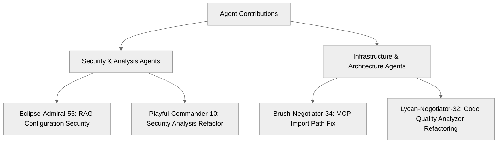

# Simple Test Diagram

```mermaid
%%{init: {'theme': 'neutral'}}%%
graph TD
    A[Agent Contributions] --> B[Security & Analysis Agents]
    A --> C[Infrastructure & Architecture Agents]

    B --> B1["Eclipse-Admiral-56: RAG Configuration Security"]
    B --> B2["Playful-Commander-10: Security Analysis Refactor"]
    C --> C1["Brush-Negotiator-34: MCP Import Path Fix"]
    C --> C2["Lycan-Negotiator-32: Code Quality Analyzer Refactoring"]
```
